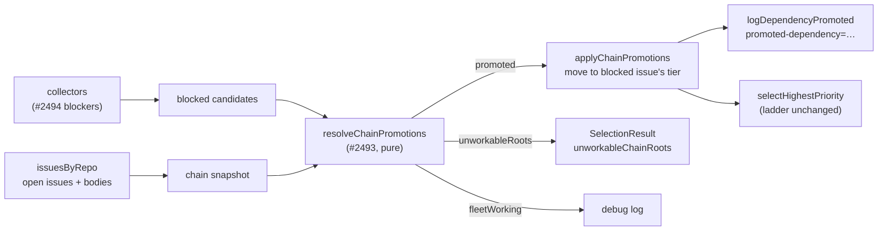

# Wire chain promotion into discovery and log `promoted-dependency=`

## Summary

`findOldestIssue` now runs the dependency-chain promotion resolver (#2493) over
the blocked candidates the collectors recorded (#2494), and moves each workable
dependency into the tier of the blocked issue waiting on it. A `low-priority` or
`idle-task` dependency of a dependency-blocked `top-priority` issue is therefore
worked _as_ that top-priority work, instead of the fleet falling through to
unrelated backlog. One scan-log line is emitted per promotion.

The tier ladder itself is untouched: promotion moves a candidate between the
existing lists, so when nothing is promoted every tier behaves exactly as
before. A promoted candidate keeps its repo, labels, milestone and `source` —
only its rank changes — so `nice` and the scan log still describe the issue as
it actually is. The worker cannot apply `top-priority` itself (label security
strips it), so the promotion lives in memory for one scan.

Closes #2495.

## Evidence

Backend/CLI change — no web interface to screenshot. Verified by tests and the
full quality gate.

- `./quality.sh` — **PASSED** (exit 0): deno tests, lint, type check, fmt,
  semgrep, markdownlint, mermaid and the chokepoint checks.
- New tests observed **failing before the implementation**: with the wiring
  absent,
  `findOldestIssue - promotes the low-priority dependency of a blocked
  top-priority issue`
  failed with `expected the promoted dependency, got: owner/repo-b|300|…` and
  the cross-repo test reported `0` promotion lines against an expected `2`.
- Log wording, exactly as specified:
  `[issue-finder] promoted-dependency=owner/repo-a#200 for #100`.

## Acceptance Criteria

<!-- vibe-spec-review inputs="diff+issue-body" -->

- **met** — a `low-priority`/`idle-task` dependency of a dependency-blocked
  `top-priority` issue is selected before any un-promoted `low-priority` issue —
  evidence:
  `worker/deno/tests/find_oldest_issue_test.ts::findOldestIssue -
  promotes the low-priority dependency of a blocked top-priority issue (Issue
  #2495)`
  — reviewer: met
- **met** — scan log contains `promoted-dependency=<owner/repo>#<N> for #<M>`
  once per promoted issue — evidence:
  `worker/deno/tests/issue_finder_logger_test.ts::logDependencyPromoted emits
  the promotion line unconditionally`
  — reviewer: met
- **met** — `configured-label-blocked=N` still emitted with the same count —
  evidence: the pre-existing `configured-label-blocked=1` assertion in
  `worker/deno/tests/find_oldest_issue_test.ts` still passes; `noteChainBlocked`
  only reads `blockedDetails` — reviewer: met
- **met** — ladder order unchanged and lower tiers still run when nothing is
  promoted — evidence: `selectHighestPriority` untouched; the early return in
  `worker/deno/lib/apply_chain_promotions.ts`; test
  `nothing promoted leaves the
  lower tiers exactly as they were (Issue #2495)`
  — reviewer: met
- **met** — a cross-repo dependency in a monitored repo is promoted with its own
  repo's `nice` — evidence:
  `worker/deno/tests/find_oldest_issue_test.ts::
  promotes a dependency in another monitored repo with that repo's nice (Issue
  #2495)`
  — reviewer: met
- **met** — `SelectionResult.unworkableChainRoots` is populated — evidence:
  `worker/deno/lib/find_oldest_issue.ts` sets it from
  `promotion.unworkableRoots` on the `selectionResult` literal;
  `worker/deno/tests/apply_chain_promotions_test.ts::
  a dependency that is itself still blocked is not promoted`
  asserts the roots that feed it — reviewer: partial — reason: the reviewer
  noted `SelectionResult` is a local that `findOldestIssue` never returns, so no
  integration assertion is possible today; the issue asks for the field to be
  _populated_ "for the comment sub-issue" (#2496), which is what this diff does,
  so the criterion is recorded as met with the reviewer's gap stated here
- **met** — new tests were observed failing before the change — evidence: the
  red run quoted under Evidence above — reviewer: partial — reason: the reviewer
  could see only one squashed commit on the branch (the worker's periodic WIP
  checkpoint), so the tests-first order is not visible in the history; it is
  recorded here instead
- **met** — `./quality.sh` passes — evidence: full gate run after the final
  edit, `Result: PASSED (with skipped checks)`, exit 0 — reviewer: met — reason:
  the reviewer ran fmt/lint/check and the touched test files but not the full
  gate; it was run here
- **unrequested** — `worker/deno/lib/apply_chain_promotions.ts` and its test
  file, rather than inlining the build/resolve/move logic in
  `find_oldest_issue.ts` — reviewer: unrequested — reason: the wiring is pure
  and ~120 lines; a separate module keeps an already-655-line file readable and
  makes `unworkableRoots`/`fleetWorking` directly testable, which the in-line
  shape could not be
- **unrequested** — `logChainRootFleetWorking` (a debug-gated
  `chain-root-in-progress` line) — reviewer: unrequested — reason: the issue
  asks that "a fleet-assigned root is logged at debug only"; the logger had no
  generic debug line to carry it, so it gets a named one rather than dropping
  the resolver's verdict silently
- **unrequested** — closed-dependency filtering and repo-casing canonicalisation
  when building the snapshot — reviewer: unrequested — reason: without them the
  feature cannot fire at all: every body reference would read as an open
  blocker, and a differently-cased reference would miss the snapshot it names
- **unrequested** — `docs/audits/security-sweep-2495-chain-promotion-wiring.md`
  plus the `lib-sweep-coverage.json` slice — reviewer: unrequested — reason:
  `lib_sweep_coverage_test.ts` fails any new `worker/deno/lib/` module that no
  sweep slice claims
- **unrequested** — the `idle-task` ladder note in `docs/IDLE-TASK-FRAMEWORK.md`
  — reviewer: unrequested — reason: that document promised idle-task "will never
  pre-empt … new-issue work", which promotion qualifies; a code change owes the
  docs change
- **unrequested** — an `issue view` branch in the test file's
  `createPerRepoMockGh` helper — reviewer: unrequested — reason: test harness
  only; dependency bodies and states cannot be read without it

## Standards Review

<!-- vibe-standards-review inputs="diff+CODING-STANDARDS.md" -->

- **violation** — `docs/IDLE-TASK-FRAMEWORK.md:634` promised idle-task work
  "will never pre-empt … new-issue work", which promotion qualifies — evidence:
  `docs/IDLE-TASK-FRAMEWORK.md:634` — reason: fixed here; the bullet now names
  dependency-chain promotion as the one exception and quotes the log line
- **violation** — no `docs/archive/pr-summaries/pr-summary-2495.md` — evidence:
  the reviewer saw the diff before this file existed — reason: fixed here
- **violation** — the only commit on the branch named Issue #4170, not #2495 —
  evidence: commit `f8011f76` — reason: that is the worker's own periodic WIP
  checkpoint, which committed the tree mid-run and was already pushed, so it is
  not rewritten; the follow-up commit references #2495
- **violation** — DRY: a third hand-assembled "all discovery labels" list —
  evidence: `worker/deno/lib/find_oldest_issue.ts:559` — reason: partly fixed —
  the list now dedupes and drops blanks like the
  `collect_self_diagnostic_candidates` precedent it mirrors; extracting a shared
  helper would edit two collectors this issue does not touch, so it is left for
  a follow-up
- **violation** — `SelectionResult.unworkableChainRoots` and the
  `logChainRootFleetWorking` wiring were covered only below the seam — evidence:
  `worker/deno/lib/find_oldest_issue.ts:587` — reason: partly fixed — a new
  integration test
  (`a chain root the fleet is already working is logged, not
  promoted`) now
  exercises the fleet-working seam end to end; `unworkableChainRoots` still has
  no observable path out of `findOldestIssue` until #2496 consumes it
- **violation** — the two fail-safe guards in the snapshot builder were untested
  — evidence: `worker/deno/lib/apply_chain_promotions.ts:110` — reason: fixed
  here; `a dependency in a repo the scan could not read is kept as a
  blocker`
  and `a differently-cased repo reference still finds its snapshot` both fail if
  their guard is removed
- **clean** — Australian English throughout; fail-loud (no swallowed errors, no
  silent fallback); log levels (one unconditional info line per promotion, the
  no-action line debug-gated); log-injection sanitisation via
  `sanitiseLogField`; no I/O, subprocess, env read or new permission in the new
  module; Deno-native tooling only; tests call real code with real data; no
  hidden paths staged

## Known interaction

A candidate promoted to the **work-on** tier is subject to the existing
blocked-entry suppression in `selectHighestPriority` (a blocked configured-label
issue suppresses work-on in the same repo + milestone), so such a promotion can
be filtered back out. That suppression is pre-existing ladder behaviour which
this issue explicitly leaves unchanged; the `configured-label`-tier promotion
this issue is about is unaffected.

## Test Plan

- `worker/deno/tests/apply_chain_promotions_test.ts` (new, 10 cases) — root
  lifted into the blocked issue's tier; work-on tier inherits work-on;
  cross-repo promotion; a still-blocked dependency is walked through, not
  promoted, and its unworkable root is reported; a closed dependency reference
  does not make a root look blocked; a promoted root that is not a candidate is
  left alone; a fleet-assigned root is reported, never promoted; nothing blocked
  leaves every tier untouched; an unreadable repo's dependency is kept as a
  blocker; a differently-cased repo reference still finds its snapshot.
- `worker/deno/tests/find_oldest_issue_test.ts` (5 new cases) — promotion of a
  same-repo `low-priority` dependency ahead of an older un-promoted one;
  cross-repo promotion ranked by the promoted repo's own `nice`; a still-blocked
  dependency is not promoted; nothing promoted leaves the lower tiers unchanged;
  a fleet-working chain root is logged at debug and never promoted.
- `worker/deno/tests/issue_finder_logger_test.ts` (2 new cases) — exact
  `promoted-dependency=` wording, written unconditionally; the
  `chain-root-in-progress` line stays debug-gated.
- Full `./quality.sh` — PASSED.
