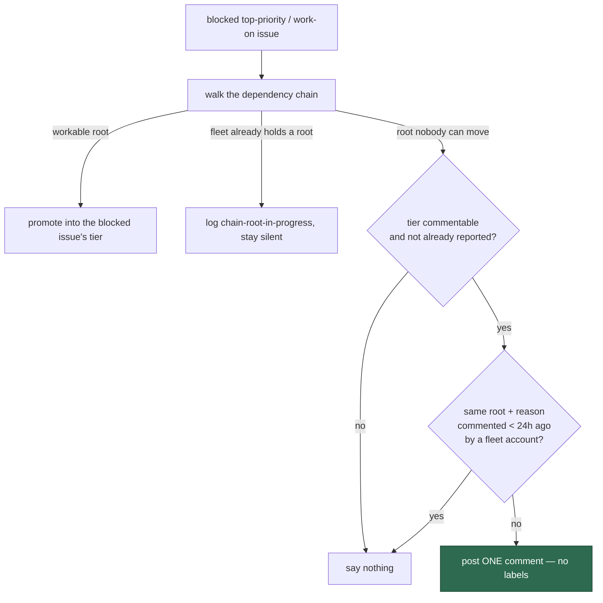

# Post a 24-hour-deduped chain-root-unworkable comment, without labels

## Summary

When dependency-chain promotion (#2495) walks the chain behind a blocked
`top-priority`/`work-on` issue and reaches a root the fleet cannot work, there
was nothing to promote — and nothing said either. A human saw an urgent label
and no activity, with no way to tell a stalled chain from a stalled fleet.

`worker/deno/lib/chain_root_comment.ts` now posts one plain comment on the
**blocked** issue naming the root and the reason
(`assigned` / `no-discovery-label` / `needs-human` / `cross-repo-unmonitored`).
It is deliberately not an escalation: no label is applied or removed, the
module imports neither `escalateToHuman`, `escalateUnworkableWorkOn` nor
`addLabelToIssue`, and a hidden `vibe-chain-root-unworkable` marker keyed on
blocked issue + root + reason holds it to at most once per 24 hours — a changed
root or reason posts again at once.

`findOldestIssue` also hands the chain classifier the fleet **maintenance**
author set (`resolveFleetMaintenanceAuthorSet`) instead of the PR-owner set,
which folds `allowed_authors` in. Without that change a root assigned to a
trusted human read as "the fleet already has it" and stayed silent — the
#2473 trusted-human gap this milestone closes.

Closes #2496.

## Evidence

Backend/CLI change with no web interface to screenshot. The evidence is the
tests below, all run with `< /dev/null` on this branch, plus a full
`./quality.sh` run.

Observed red before the change:

- `tests/chain_root_comment_test.ts` — `TS2307: Cannot find module … chain_root_comment.ts`
  against the unfixed tree.
- With the wiring loop removed:
  `FAILED | 3 passed | 3 failed` in `tests/find_oldest_issue_test.ts` (the
  three positive comment tests).
- With the classifier still on the PR-owner author set, the trusted-human test
  alone failed: `FAILED | 1 passed | 1 failed | 35 filtered out`.

Green after: `78 passed | 0 failed` across `tests/find_oldest_issue*.ts` and
`tests/chain_root_comment_test.ts`, and `./quality.sh` → `Result: PASSED (with
skipped checks)` (only the pre-existing `config integration` SKIPPED).

## Acceptance Criteria

<!-- vibe-spec-review inputs="diff+issue-body" -->

- **met** — a blocked `top-priority` issue whose root is assigned to a non-fleet
  login receives one comment naming the root and `@<login>`, and no label is
  added or removed — evidence:
  `worker/deno/tests/find_oldest_issue_test.ts::findOldestIssue - comments once on a blocked top-priority issue whose chain root is human-assigned (Issue #2496)`
  (asserts the target, the `waiting on @carol…` wording, and
  `labelMutations(calls) === []`) — reviewer: met
- **met** — a blocked `work-on` issue whose dependency is assigned to a trusted
  human receives the same comment (#2473 gap) — evidence:
  `worker/deno/tests/find_oldest_issue_test.ts::findOldestIssue - comments on a blocked work-on issue whose dependency a trusted human holds (Issues #2496, #2473)`,
  which is green only because of the author-set change at
  `worker/deno/lib/find_oldest_issue.ts:250` — reviewer: met
- **met** — no comment while the root is assigned to a fleet author, or while
  the root was promoted — evidence:
  `worker/deno/tests/find_oldest_issue_test.ts::findOldestIssue - says nothing while the fleet is working the chain root (Issue #2496)`
  and `…says nothing when the chain root was promoted instead (Issue #2496)`;
  structurally, both cases leave `unworkableRoots` empty
  (`dependency_chain_promotion.ts:219-259`) — reviewer: met
- **met** — a second scan inside 24 h with the same root and reason posts
  nothing; a different root or reason posts again — evidence:
  `worker/deno/tests/chain_root_comment_test.ts::postChainRootUnworkableComment - skips a same-key comment inside 24 hours`,
  `…posts again once the window has passed`, `…a changed reason posts inside the window`,
  `…a changed root posts inside the window`, plus the end-to-end
  `find_oldest_issue_test.ts::…a chain-root comment posted within 24 hours is not repeated` —
  reviewer: met
- **met** — each blocked issue in a chain gets its own comment — evidence:
  `worker/deno/tests/find_oldest_issue_test.ts::findOldestIssue - every blocked member of a chain gets its own comment (Issue #2496)` —
  reviewer: met
- **met** — no new `needs-human` call site — evidence: the gate's
  `needs-human chokepoint` check PASSED and
  `worker/deno/tests/needs_human_direct_label_check_test.ts` is green —
  reviewer: partial — reason: the reviewer could not find
  `tests/needs_human_helper_only_test.ts`; that file does not exist in this
  repo — the guard the criterion names is
  `needs_human_direct_label_check_test.ts`, which passes, and the new module
  imports only `fleet_authors.ts` and `marker_comment_pages.ts`
- **met** — new tests were observed failing before the change — evidence: the
  three red runs quoted under **Evidence**; the reviewer independently
  reverted `find_oldest_issue.ts` to the base and reproduced
  `FAILED | 3 passed | 3 failed` — reviewer: met
- **met** — `./quality.sh` passes — evidence: full gate run after the final
  edit, `Result: PASSED (with skipped checks)` — reviewer: partial — reason:
  the reviewer's run predated the semgrep fix and it did not re-run the gate
  afterwards; the gate was run here and passed
- **unrequested** — `postChainRootUnworkableComment` takes a **required**
  `fleetAuthors` parameter (the issue's signature is
  `{repo, issueNumber, comment, ghFn, now?}`), so only a marker a fleet account
  wrote can suppress a repeat — reviewer: unrequested — reason: a comment body
  is writable by anyone and only its author is authenticated;
  `worker/deno/tests/marker_dedup_author_cap_test.ts` caps exactly this class
  tree-wide, so an unverified dedup lookup would fail the gate
- **unrequested** — the chain classifier's author set moves from
  `resolveFleetPrAuthorSet` to `resolveFleetMaintenanceAuthorSet`
  (`worker/deno/lib/find_oldest_issue.ts:250`) — reviewer: unrequested —
  reason: required for the trusted-human criterion above; it also narrows
  #2495's `fleetWorking` classification, which is the point — an
  `allowed_authors` human is not a fleet account
- **unrequested** — `safeRepo` / `safeLogin` sanitisation, the "an unnamed
  account" fallback and their three injection tests
  (`worker/deno/lib/chain_root_comment.ts:81-119`) — reviewer: unrequested —
  reason: the repo reference and the login are parsed from attacker-writable
  issue bodies and are interpolated into the marker's `key="…"` attribute and
  an `@mention`; input validation at a trust boundary is not a corner this
  repo cuts
- **unrequested** — explicit tier and fleet-held-chain gates plus one comment
  per blocked issue per scan (`worker/deno/lib/find_oldest_issue.ts:730-770`) —
  reviewer: unrequested — reason: raised by the Spec reviewer as three risks
  (an unpinned tier invariant, a chain with one fleet-held and one unworkable
  root still commenting, and unbounded multi-root fan-out); each is now a gate
  with a test
- **unrequested** — `docs/INTERNALS.md` section with a Mermaid diagram —
  reviewer: unrequested — reason: a new user-visible behaviour owes a docs
  change
- **unrequested** — `docs/audits/lib-sweep-coverage.json` slice `top-up-2496`
  and `docs/audits/security-sweep-2496-chain-root-comment.md` — reviewer:
  unrequested — reason: gate-required; every new `worker/deno/lib/` module must
  be claimed by a sweep slice with a written record, exactly as #2493 and #2495
  did

## Standards Review

<!-- vibe-standards-review inputs="diff+CODING-STANDARDS.md" -->

- **violation** — the new `lib/` module was claimed by no sweep slice, so
  `deno task check:manifests` failed — evidence:
  `worker/deno/lib/chain_root_comment.ts:1` — reason: fixed here — slice
  `top-up-2496` added to `docs/audits/lib-sweep-coverage.json` with its written
  record in `docs/audits/security-sweep-2496-chain-root-comment.md`
- **violation** — the report loop's `catch` was untested, so nothing pinned
  that a failed comment still leaves the scan its selection — evidence:
  `worker/deno/lib/find_oldest_issue.ts:772` — reason: fixed here —
  `find_oldest_issue_test.ts::findOldestIssue - a failed chain-root comment never costs the scan its selection (Issue #2496)`
- **violation** — the empty-login fallback and the `safeRepo` sanitiser had no
  tests, despite the docstring naming the latter as the marker-attribute
  defence — evidence: `worker/deno/lib/chain_root_comment.ts:81` — reason:
  fixed here — two tests added
  (`…names no mention when the assignee is unusable`,
  `…strips markup from a crafted repository reference`)
- **violation** — `CHAIN_ROOT_COMMENT_WINDOW_MS` was exported but used
  nowhere — evidence: `worker/deno/lib/chain_root_comment.ts:50` — reason:
  fixed here — the window tests now derive their boundaries from the constant
  instead of retyping 23 h / 25 h
- **violation** — no commit referenced #2496 (the branch carried only the
  harness's WIP checkpoint) — evidence: commit `a48714b9` — reason: fixed here
  — the work is committed as "Report an unworkable chain root on the blocked
  issue (#2496)"
- **violation** — the PR summary file was missing — evidence:
  `docs/archive/pr-summaries/pr-summary-2496.md` — reason: fixed here (this
  file)
- **clean** — Australian English throughout; fail-loud error handling (an
  unreadable thread throws rather than degrading to "no marker", pinned by a
  test, and the caller logs at WARNING with full context); test quality (real
  function calls, injected `now` seam, no sleeps, no source-text grepping); the
  `gh` call is an argv array, so there is no shell-injection surface; marker
  dedup is author-authenticated; no label mutation, asserted negatively; DRY —
  pagination is reused from `marker_comment_pages.ts`; commit safety — no
  hidden paths or key material staged; Deno-native tooling only

### Known trade-offs

- **One paginated comment read per blocked candidate per scan.** A long-lived
  stalled chain costs one extra `gh` call every scan. Accepted: the read is the
  only way to honour the 24-hour window without local state, and it is the same
  primitive the branch-lock and PR-claim markers use.
- **The dedup key interpolates the sanitised repo**, not the raw string the
  issue's formula names. Identical for every real GitHub repository; it differs
  only for a reference that could not name one.

## Test Plan

Added:

- `worker/deno/tests/chain_root_comment_test.ts` (18 tests) — body wording for
  each of the four reasons, the `dedupKey` shape, the hidden marker, no label
  wording, login and repo sanitisation, the empty-login fallback, posting with
  no prior marker, the 24-hour skip and re-post either side of the window
  boundary, re-post on a changed reason and on a changed root, a marker found
  on a later `--paginate` page, a marker from outside the fleet failing to
  suppress, a fleet-authored marker suppressing, and a failed read throwing.
- `worker/deno/tests/find_oldest_issue_test.ts` (8 new tests) — one comment for
  a human-assigned root with no label mutation, the trusted-human `work-on`
  case, silence for a fleet-assigned root, silence for a promoted root, silence
  for a chain with a fleet-held root alongside an unworkable one, one comment
  per blocked issue when two roots are unworkable, one comment per blocked
  member of a shared chain, and a failed comment not costing the scan its
  selection.

No existing test was modified or removed.
