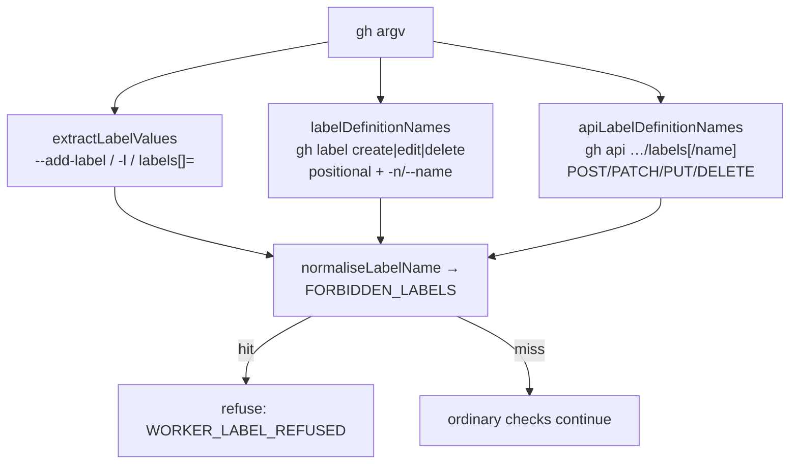

# PR Summary — Close the reserved-label **definition** bypass in the agent `gh` guard

## Summary

`extractLabelValues` only ever read labels being *applied* — `--add-label`,
`--label`, `-l`, and `labels[]=` on `gh api`. Every `gh label` verb carries its
target **positionally** (`gh label delete top-priority`), so the denylist saw an
empty list and the call fell through to the `if (!info.repo) return { allowed:
true }` tail. An agent could therefore delete, rename or redefine every reserved
workflow label in the claimed repo — `top-priority`, `work-on`, `planning`,
`refine-issue`, `question`, `best-model`, `quorum`, … — and, worse, destroy
`needs-human` itself, withdrawing the escalation route from every later run. That
is the classic CWE-184 incomplete-denylist shape: the guard enumerated one
spelling of the capability and missed the others.

Two new scanners feed the **same** `FORBIDDEN_LABELS` set through the same
`normaliseLabelName` folding as the flag path, and share its single
`WORKER_LABEL_REFUSED` refusal:

- `labelDefinitionNames` — the CLI route. Reads the positional `<name>` of
  `gh label create|edit|delete` plus `gh label edit`'s `-n`/`--name` rename
  target in all five pflag spellings (`-n X`, `--name X`, `--name=X`, `-n=X`,
  `-nX`). Values of `-c`/`--color`, `-d`/`--description` and `-R`/`--repo` are
  skipped, so a *description* that merely mentions a reserved label stays
  allowed; `--` is honoured as end-of-flags.
- `apiLabelDefinitionNames` — the REST spelling of the identical capability.
  `gh api -X DELETE repos/o/r/labels/top-priority` is a one-line rewrite of the
  attack, so the guard reads `repos/{owner}/{repo}/labels[/{name}]` on
  POST/PATCH/PUT/DELETE: the `{name}` path segment (percent-decoded), `name=` on
  a create, and `new_name=` on a rename. The issue/PR sub-resource
  (`…/issues/5/labels`) is deliberately excluded — that is label *application*,
  already covered by `extractLabelValues`.

`isPermittedEscalation` is deliberately **not** extended to the definition path:
applying `needs-human` to the run's own issue is the sanctioned ask for a human,
but deleting or renaming the label is not.

Closes #2518.

### Deviation from the issue's literal wording — `gh label clone`

The issue asked for `create/edit/delete/clone`. `clone` is excluded on purpose,
and `worker/deno/tests/label_denylist_union_test.ts` asserts
`gh label clone owner/other-repo` stays allowed. Verified against `gh label
clone --help`: its positional is a `<source-repository>`, never a label name, and
it only creates labels the destination lacks — labels absent from the source are
neither deleted nor modified. So `clone` can neither rename nor destroy a
reserved label, and comparing a repo slug against the denylist would refuse
legitimate clones while protecting nothing.

## Evidence

Backend guard change with no web surface, so no screenshot applies — the
evidence is test output. Run from `worker/deno`.

**Each regression test reproduces the flaw: it fails against the unfixed code
and passes after the fix.**

- CLI route, `lib/gh_guard_decision.ts` reverted to `HEAD`:
  `FAILED | 10 passed | 5 failed (12ms)` — exactly the five new refusal tests.
  The union sweep's diff enumerated what the agent could delete outright before
  the fix: `needs-failure-detection-repair`, `top-priority`, `work-on`,
  `low-priority`, `planning`, `refine-issue`, `question`, `answered`,
  `needs-revision`, `best-model`, `quorum`.
- REST route, with the lib reverted again after the CLI fix landed:
  `FAILED | 16 passed | 1 failed (15ms)`, the sole failure
  `tests/label_denylist_union_test.ts:337`.
- After the fix:
  `deno test --allow-read --allow-env --allow-write --allow-run tests/label_denylist_union_test.ts tests/gh_guard_decision_test.ts tests/gh_pflag_spellings_test.ts < /dev/null`
  → **`ok | 101 passed | 0 failed (149ms)`**.
- In both directions the *permitted* tests passed with the fix reverted as well,
  so the new refusals introduce no false positives.

Added the regression test
`worker/deno/tests/label_denylist_union_test.ts::"label denylist - gh label create/edit/delete cannot target a reserved label (Issue #2518)"`,
which reproduces the CLI flaw, fails against the unfixed code and passes after
the fix; and the regression test
`worker/deno/tests/label_denylist_union_test.ts::"label denylist - gh api cannot define, rename or destroy a reserved label (Issue #2518)"`,
which reproduces the REST flaw, fails against the unfixed code and passes after
the fix. Both are declared in this branch's added lines.

### The original trigger is closed, with no trivial bypass

`gh label edit any-label -n top-priority`, `gh label edit any-label
--name=top-priority` and `gh label delete top-priority` — the three vectors the
issue named — are all refused with `WORKER_LABEL_REFUSED`, and so is every
neighbouring spelling a one-line rewrite would reach:

- all three positional verbs (`create`, `edit`, `delete`);
- all five rename spellings (`-n X`, `--name X`, `--name=X`, `-n=X`, `-nX`);
- case and zero-width folding (`TOP-PRIORITY`) via `normaliseLabelName`;
- a flag placed before the positional, `--` end-of-flags, boolean `-f`/`--yes`
  (which must not swallow the positional), and attached `-Rowner/repo`;
- **every** entry of `FORBIDDEN_LABELS`, asserted by sweeping the whole union and
  requiring an empty list of survivors;
- the REST spelling: `DELETE …/labels/<name>`, `POST …/labels -f name=`,
  `PATCH …/labels/<n> -f new_name=`, percent-encoded names (`best%2Dmodel`),
  `gh api`'s own `{owner}/{repo}` placeholder form, and the attached-value
  spellings `--method=POST` / `-fname=`.

Residues are documented in code and all fail **closed** (a false refusal, never
a waved-through definition): an unrecognised separated flag's value may be read
as a positional on the next pass, and `API_LABEL_ENDPOINT`'s origin-tolerant
prefix could over-match a contrived path ending in `repos/x/y/labels`.

## Test Plan

- `deno test --allow-read --allow-env --allow-write --allow-run tests/label_denylist_union_test.ts tests/gh_guard_decision_test.ts tests/gh_pflag_spellings_test.ts < /dev/null`
  — 101 passed.
- `deno fmt`, `deno lint`, `deno check` on both edited files — clean.
- `./quality.sh < /dev/null` from the repo root — full gate.

Reserved labels are unaffected for humans: the guard is agent-side only, so
`label_security.ts` and the worker's own label management are untouched.
