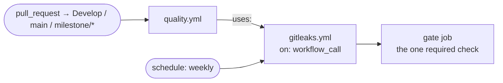

# Teach the gitleaks drift scanner about reusable workflows (#2522)

## Summary

Closes #2522.

The reported gap does not exist — **the finding was a false positive, and the
suggested YAML change was rejected as a regression.** The defect is in the
scanner that produced it, and that is what this PR fixes.

`.github/workflows/gitleaks.yml` is a **reusable** workflow
(`on: workflow_call`, plus a weekly `schedule:` and `workflow_dispatch:`). It is
invoked by `quality.yml`'s `gitleaks:` job, and `quality.yml` runs on
`pull_request: branches: [Develop, main, milestone/*]`. `quality.yml`'s `gate`
job `needs: [gitleaks]` and is the single check the `main` ruleset requires. So
gitleaks already scans **every** pull request and already blocks merges — via
`gate`. Adding the `pull_request` trigger the issue suggested would run gitleaks
a second time per PR, collide with `quality.yml`'s concurrency group (a called
workflow inherits `github.workflow` from its caller), add an un-required check
context, and reverse the deliberate consolidation of Issues #3360 and #3940 that
`gitleaks.yml`'s own comments record. `.github/workflows/` is therefore
unchanged.

The real defect: `scanGitleaksDrift` decided PR coverage purely from the
gitleaks workflow's own `on:` block, with no `workflow_call` awareness — so any
repo running gitleaks through a caller reads as "never runs on pull requests".
`pullRequestCheckContexts` in `pr_check_contexts.ts` already encodes the correct
rule for required-check derivation; this PR reuses its `calledWorkflowPath`
parser rather than duplicating it.



Changes:

- `worker/deno/lib/gitleaks_drift_scanner.ts` — new `pullRequestCalledWorkflows`
  helper collects the workflow paths that any `pull_request`-triggered workflow
  in the scanned file set invokes with `uses:`. A gitleaks workflow now counts as
  PR-scanned when it carries a `pull_request` trigger itself **or** appears in
  that set. The `no-pr-trigger` finding's `whyItMatters`, `evidence` and
  `suggestedFix` now state both routes, so a genuine finding says what was
  checked and offers the reusable-workflow option alongside the trigger.
- `worker/deno/lib/pr_check_contexts.ts` — `calledWorkflowPath` exported
  (handles `./`, `$/` and bare `.github/workflows/...`, with any `@ref`
  stripped). No import cycle: that module imports only
  `workflow_branch_glob.ts`, `workflow_scan_common.ts` and
  `workflow_trigger_scanner.ts`.

The test is deliberately weaker than the aggregate-gate derivation in
`pullRequestCheckContexts`: gitleaks *runs* on the PR whether or not the caller's
gate job is a perfect aggregate, and running is the whole of what
`no-pr-trigger` claims. The lenient scanner also stays free of that module's
throwing `reject()` path.

Out of scope, deliberately:

- **Rulesets are unchanged.** Requiring additional check contexts is a
  human-only action, as the issue itself states; `gate` is already required and
  already gates gitleaks.
- **The pre-PR changed-workflow gate keeps its changed-files-only scope.**
  `changed_workflow_gate.ts` passes only the branch's changed workflow files, so
  a branch that touches `gitleaks.yml` without touching its caller could still
  see this finding locally. That narrowing is a documented, intentional
  limitation of that module (its module doc forbids reading the whole tree
  there), and Issue #2043's baseline diffing already drops findings that exist at
  base. The audit path is unaffected — `runTask` passes every workflow file, so
  `quality.yml` is always in scope there.

## Evidence

No screenshot applies: this is a backend scanner change with no visual surface.
Verified by executing the code instead.

Regression linkage — the four new tests were written first and failed against
the unfixed scanner:

```
FAILED | 19 passed | 2 failed (26ms)
```

Both failures were the positive cases
(`scanGitleaksDrift - reusable gitleaks called by a PR-triggered workflow is
scanned` and `... counts however the caller spells the path`), each asserting
`[]` and receiving `["BP-GITLEAKS-NO-PR-TRIGGER-gitleaks"]`. After the fix:

```
ok | 21 passed | 0 failed (41ms)
```

Run against this repository's real workflow tree (11 workflow files read with
`readWorkflowFiles`, then `scanGitleaksDrift`): `findings: []` — the finding
that produced #2522 no longer reproduces. The scratch script used for that check
was deleted.

Related suites, all green:

```
tests/gitleaks_drift_scanner_test.ts, tests/pr_check_contexts_test.ts,
tests/gitleaks_template_conformance_test.ts        ok | 44 passed | 0 failed
tests/changed_workflow_gate_test.ts, tests/completion_phase_changed_workflow_gate_test.ts,
tests/github_actions_audit_template_test.ts, tests/gitleaks_pr_coverage_scanner_test.ts,
tests/workflow_file_checks_test.ts                ok | 143 passed | 0 failed
```

`deno fmt`, `deno lint` and `deno check` were run on the three touched files
only; `./quality.sh` was run once in the foreground.

## Test Plan

New tests in `worker/deno/tests/gitleaks_drift_scanner_test.ts`, all using a
`workflow_call`-only gitleaks fixture plus a `quality.yml`-shaped caller:

1. **Reusable gitleaks called by a PR-triggered workflow is scanned** — no
   finding (the case that produced #2522).
2. **However the caller spells the path** — `./.github/workflows/gitleaks.yml`,
   `.github/workflows/gitleaks.yml` and an `@main`-suffixed ref all count.
3. **Caller that never runs on PRs** (`on: push`) — `no-pr-trigger` is still
   emitted, `kind === "no-pr-trigger"`. This also proves the caller fixture is
   not itself misclassified as a gitleaks workflow: exactly one finding, not
   two (`collectSteps` walks only `jobs.<job>.steps[]`, never a job-level
   `uses:`).
4. **PR-triggered caller invoking a different workflow** — `no-pr-trigger`
   still emitted, so the new path cannot be satisfied by an unrelated call.

The 13 pre-existing drift-scanner tests are unchanged and still pass, including
`scanGitleaksDrift - schedule-only gitleaks workflow leaves PRs unscanned` and
`- the canonical current template yields no findings` (the `WORKFLOW_SPECS`
gitleaks template still declares its own `pull_request` trigger and was not
touched).
