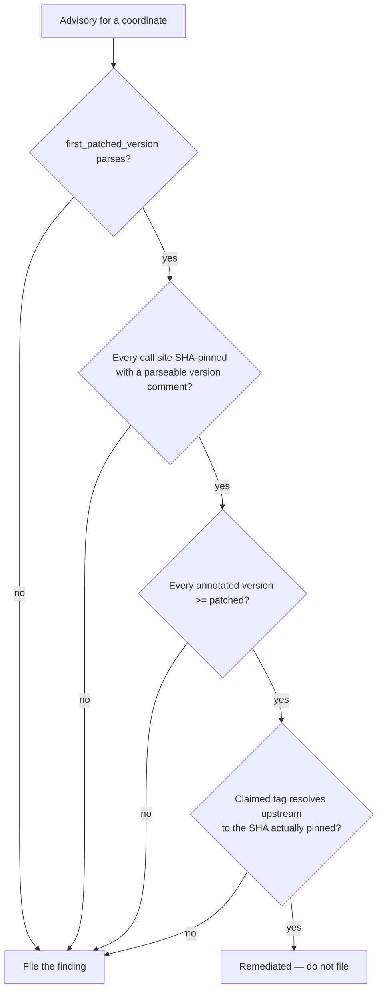

# Stop re-filing GitHub Actions advisories that are already patched

Closes #2523

## The report, and what it turned out to be

Issue #2523 says `aquasecurity/trivy-action` is pinned at
`.github/workflows/dependency-audit.yml:186` with a disclosed advisory
(GHSA-69fq-xp46-6x23 / CVE-2026-33634, vulnerable `< 0.35.0`, first patched
`0.35.0`).

That call site is **already remediated** and is left unchanged by this PR:

```yaml
- name: Generate CycloneDX SBOM
  # aquasecurity/trivy-action@v0.36.0
  uses: aquasecurity/trivy-action@ed142fd0673e97e23eac54620cfb913e5ce36c25
```

`gh api repos/aquasecurity/trivy-action/commits/v0.36.0 --jq .sha` resolves, in
this run, to exactly `ed142fd0673e97e23eac54620cfb913e5ce36c25` — so the pin is
genuinely `v0.36.0`, which is at or after the first patched `0.35.0`, and the
version comment beside it is accurate. It is the only `trivy-action` call site
in the repo.

The real defect is in the pre-filer that raised the issue:
`scanActionAdvisories` read `first_patched_version` only to quote it in the
finding prose, and never compared it against the version actually pinned. So
every advisory against a coordinate was re-filed on every scan, forever, no
matter how long ago it was fixed — noise that buries live findings.

## The fix

`worker/deno/lib/action_advisory_scanner.ts` now suppresses an advisory only
when it is provably fixed at **every** call site. The bar is deliberately high,
because suppressing on a weak signal would turn a live advisory into a silent
pass:



Every arm fails **towards filing**: a missing comment, an unparseable version, a
site lagging below the patched version, a `gh` call that fails or is rate
limited, or a tag that resolves to a different SHA all keep the finding. The
tag→SHA check matters because a version comment is a human annotation — trusting
one unverified would let a typo, or a deliberately wrong comment, silence a real
advisory.

Supporting detail:

- The tag is validated against `^[A-Za-z0-9][A-Za-z0-9._-]{0,99}$` and rejected
  if it contains `..` before it is interpolated into a `gh api` path — input
  validation at the trust boundary, since the tag is read off a workflow
  comment.
- Tag resolution is memoised per `coordinate@tag`, so a coordinate used at many
  sites costs one extra API call, not one per site.
- Pin parsing reuses `collectActionPins` from `workflow_hygiene_check.ts` and
  the semver helpers from `software_updates.ts` rather than adding a second
  parser. Where `collectActionPins` reports a drifted pin as two entries, all of
  them must clear the patched version.

## Test Plan

Five new behavioural tests in
`worker/deno/tests/action_advisory_scanner_test.ts`, all calling the real
`scanActionAdvisories` with a stubbed `gh`:

| Scenario | Expected |
| --- | --- |
| Pin at `v0.36.0`, tag resolves to the pinned SHA (the #2523 case) | no finding; tag resolved exactly once |
| Pin annotated `v0.34.0`, below the patched `0.35.0` | finding filed |
| Pin with no version comment | finding filed |
| Comment claims `v0.36.0` but the tag resolves elsewhere, or cannot be resolved | finding filed |
| Advisory with no `first_patched_version` | finding filed |
| Two call sites, one lagging | finding filed, evidence names the lagging site |

Regression linkage: the first test fails against the unfixed scanner
(`expected [] , actual [ … one finding … ]`) and passes with the fix. The other
five are guards — they pass both before and after, and would catch a
suppression that reached too far.

## Evidence

This is a backend/CI change with no web interface, so there is no page to
screenshot; command output is the evidence.

Targeted tests, with the fix in place:

```text
running 11 tests from ./tests/action_advisory_scanner_test.ts
...
ok | 11 passed | 0 failed (10ms)
```

The same suite against the pre-fix scanner (`git show origin/main:…`):

```text
scanActionAdvisories - an advisory already patched at every call site is not
filed, and the tag is resolved once (Issue #2523) => FAILED
FAILED | 10 passed | 1 failed (20ms)
```

`deno fmt`, `deno lint` and `deno check` are clean on both touched files, and
`./quality.sh` was run in full.

## Security self-check

- Input validation: the tag read from a workflow comment is allowlist-validated
  and `..`-rejected before it reaches a `gh api` path.
- Injection surface: the `gh` call is argv-based (`ghCommandFn(string[])`), not
  a shell string.
- Fail-loud: every failure mode of the new gate files the finding; none can
  report a vulnerable pin as clean.
- No secrets, no new dependencies, no workflow file changed.
