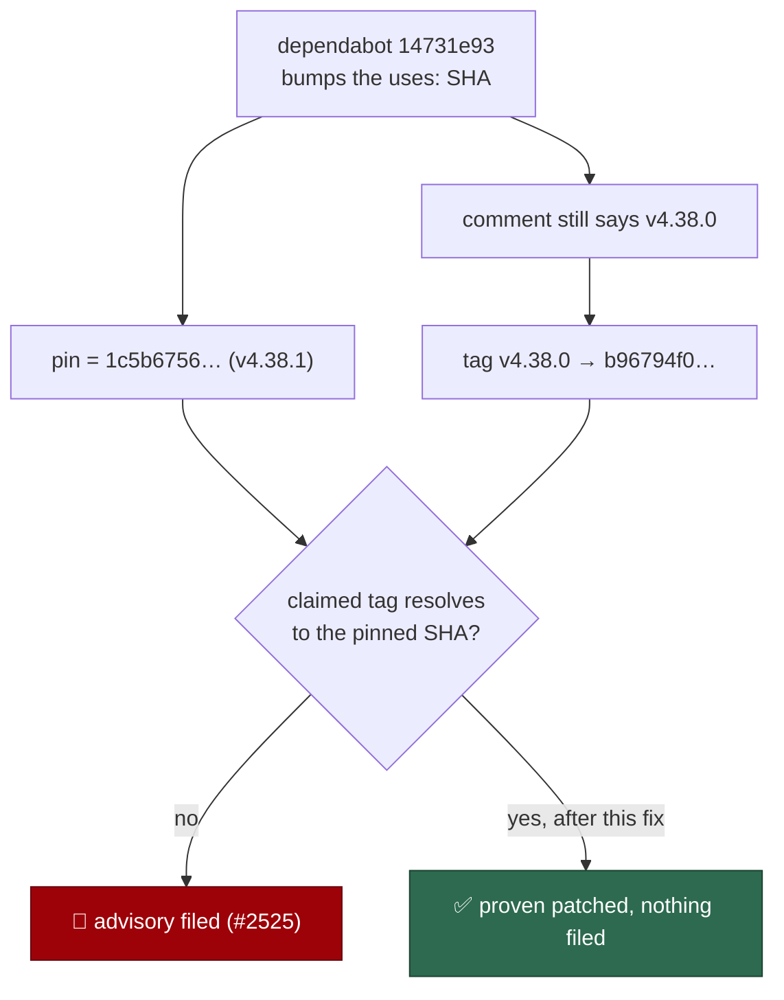

# PR Summary — Issue #2525

## Summary

Closes #2525.

The advisory the audit filed — GHSA-vqf5-2xx6-9wfm / CVE-2025-24362, a GitHub PAT
written to CodeQL debug artefacts — does **not** apply to this repository. Its
vulnerable range is `>= 3.26.11, <= 3.28.2`, first patched in **3.28.3**, and
both `github/codeql-action` call sites in
`.github/workflows/security-tree-sweep.yml` are pinned to
`1c5b675653bb5c22dbe9b12b556ec555138e09fd`, which upstream tags **v4.38.1** —
far beyond the patched version. No re-pinning was needed, and none was done.

The real defect is the **stale version comment above each pin**, and that is what
made the audit fire. Dependabot commit `14731e93` ("chore(actions): bump the
github-actions group with 2 updates (#2467)", 2026-09-21) rewrote the two `uses:`
SHAs from `b96794f0…` to `1c5b6756…` and left the two
`# github/codeql-action/<sub>@v4.38.0` comment lines above them untouched. It
regenerated `docs/audits/dependency-inventory.md` with the same stale `v4.38.0`.

`advisoryIsRemediated` (added for #2523) suppresses an advisory only when the tag
a comment claims **resolves upstream to the SHA actually pinned**. `v4.38.0`
resolves to `b96794f0…`, not to the pinned `1c5b6756…`, so the annotation proved
nothing and the scanner filed the finding loudly — exactly the behaviour it is
supposed to have. Correcting the comments to `v4.38.1` makes the pin provable and
the finding disappears.



No scanner change is made. PR #2529 deliberately chose "the comment must resolve
to the pin" as the remediation bar; reversing that by resolving the pinned SHA
back to a tag is out of scope for this issue.

`findVersionCommentDrift` cannot catch this class on its own: it flags one SHA
annotated with two *different* versions across the repo, and here both comments
were consistently wrong.

### Changes

- `.github/workflows/security-tree-sweep.yml` — the `init` and `analyze` version
  comments now read `v4.38.1`, matching the pinned SHA. The pins themselves are
  unchanged.
- `docs/audits/dependency-inventory.md` — both `github/codeql-action` rows
  corrected to `v4.38.1` (a code change owes a docs change).
- `worker/deno/tests/action_advisory_scanner_test.ts` — two tests locking in the
  behaviour this issue exercised.

## Evidence

This is a CI/workflow-metadata change with no visual surface, so **no screenshot
applies**. What was tested instead:

**Upstream tag resolution** (`gh api repos/github/codeql-action/tags`) — never a
SHA from memory:

| tag | SHA |
| --- | --- |
| `v4.38.1` (newest) | `1c5b675653bb5c22dbe9b12b556ec555138e09fd` |
| `v4.38.0` | `b96794f015dfd88f77b49b1c93e0fa7110f94c63` |

The pinned commit is dated `2026-09-18T13:09:51Z` — five days old, so the 24h
quarantine is satisfied.

**Red → green against the real repository.** The real `scanActionAdvisories` was
run over this worktree's real workflow files with real `gh` lookups:

- before the fix — `repos/github/codeql-action/commits/v4.38.0 -> b96794f0…`,
  `findings: 1`, titled exactly as issue #2525;
- after the fix — `repos/github/codeql-action/commits/v4.38.1 ->
  1c5b675653bb5c22dbe9b12b556ec555138e09fd`, `findings: 0`.

**Repo-wide pin audit.** Every one of the 45 annotated SHA pins in
`.github/` was resolved against its claimed upstream tag: all 45 now match
(`actions/cache@v6.1.0`, `actions/checkout@v7.0.1`,
`actions/dependency-review-action@v5.0.0`, `actions/setup-node@v7.0.0`,
`actions/upload-artifact@v7.0.1`, `aquasecurity/trivy-action@v0.36.0`,
`denoland/setup-deno@v2.0.5`, `gitleaks/gitleaks-action@v3.0.0`, and
`github/codeql-action@v4.38.1` at `security-tree-sweep.yml:72` and `:81`). No
other drift exists, so nothing beyond this issue's scope was touched. The
throwaway scripts used for these two runs were deleted before committing.

## Test Plan

Two new tests in `worker/deno/tests/action_advisory_scanner_test.ts`, both
calling the real `scanActionAdvisories` over a CodeQL-shaped fixture with a
stubbed `gh`:

1. *"sub-path call sites are proven patched against the parent repository's
   tags"* — accurate `v4.38.1` comments yield `findings === []`, and the only
   resolution issued is `repos/github/codeql-action/commits/v4.38.1`. This pins
   down that a sub-path action (`github/codeql-action/init`) is resolved under
   its **repository** coordinate, once for both call sites.
2. *"a comment a bump left behind is filed even though the pin itself is
   patched"* — the exact #2525 shape: pins at v4.38.1, comments still claiming
   `v4.38.0` (which resolves elsewhere) produce one
   `GHSA-vqf5-2xx6-9wfm` finding whose evidence names the call sites.

```
deno test --allow-read --allow-env --allow-write --allow-run \
  tests/action_advisory_scanner_test.ts
ok | 13 passed | 0 failed
```

No existing test was removed, commented out or weakened. Targeted `deno fmt`,
`deno lint` and `deno check` were run on the touched file, and `./quality.sh` was
run once in the foreground.
