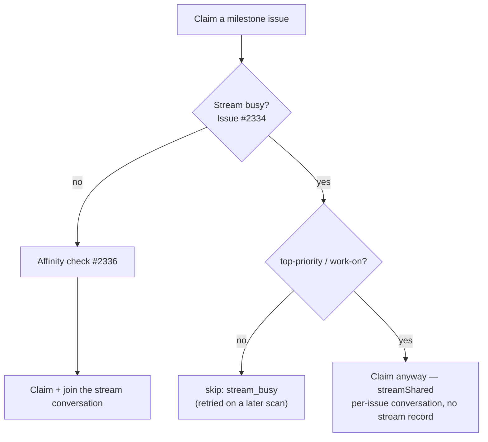

# Let top-priority/work-on claims share a busy milestone stream

## Summary

A `top-priority` or `work-on` issue no longer waits for a milestone stream
another host is already running. The fleet-wide stream lock (Issue #2334) still
reports the stream busy, but the claim path now treats that as *shareable* for
those two tiers: the claim proceeds, the result carries
`streamShared: { holderIssue, holderHost, streamLabel }`, and the setup phase
skips `primeStreamSession` so the run keeps its **own per-issue conversation**.
The stream's shared transcript therefore still carries exactly one run, and the
second holder writes back neither the stream session record nor the
`vibe-stream-holder` marker. `low-priority` and `idle-task` issues keep today's
`stream_busy` skip, byte for byte. Closes #2530.

The Issue #2336 affinity head start is skipped for a shared claim — a second
holder has no conversation to take over — and is untouched for a first holder.

## Evidence

Backend/CLI change with no web interface, so no screenshot applies. Verified by
tests that drive the real `claimIssue` and the real setup phase through injected
fakes:

- `deno test worker/deno/tests/claim_issue_test.ts tests/setup_branch_resume_test.ts tests/issue_filter_test.ts tests/stream_lock_blank_test.ts tests/stream_holder_test.ts`
  → `ok | 181 passed | 0 failed`.
- `./quality.sh` → `Result: PASSED (with skipped checks)` (only `config
  integration`, which needs credentials, is skipped); re-run after the review
  fixes below.

## Acceptance Criteria

<!-- vibe-spec-review inputs="diff+issue-body" -->

- **met** — a `top-priority` milestone issue with a live sibling heartbeat on
  another host is claimed, carries `streamShared`, and runs per-issue —
  evidence: `worker/deno/lib/claim_issue.ts` check 3 shareable branch,
  `worker/deno/tests/claim_issue_test.ts::claim issue - a shareable tier claims
  into a busy stream and reports the holder (Issue #2530)` and
  `worker/deno/tests/setup_branch_resume_test.ts::#2530 - a shared stream keeps
  this run on a per-issue session` (asserts `streamSession` and
  `sessionResumeState` both unset against a pre-seeded stream record). No
  `vibe-stream-holder` marker follows, because both write-backs in
  `execute_phase.ts` are gated on `state.streamSession`
  (`worker/deno/tests/stream_holder_test.ts::recordStreamHolderForRun - a run
  that joined no stream writes nothing`) — reviewer: met
- **met** — a `low-priority` issue is still refused `stream_busy` with the
  existing log line — evidence: `worker/deno/tests/claim_issue_test.ts::claim
  issue - a non-shareable tier still waits for the busy stream (Issue #2530)`,
  plus the unchanged #2334 test `refuses a claim while a sibling of the
  milestone stream is beating` — reviewer: met
- **met** — `checkStreamAffinity` is not called for a shared claim and is
  unchanged for a first holder — evidence: the shareable branch returns before
  check 4; the shared test asserts the tracking issue is never read
  (`issues/2319/comments`) and `claim issue - a first holder of a free stream
  shares nothing and still checks affinity (Issue #2530)` asserts it **is** read
  for a first holder — reviewer: partial — reason: the reviewer saw the
  first-holder half as resting on pre-existing #2336 tests only; a positive
  assertion for it was added after the review
- **met** — `deno task test` and `./quality.sh` pass and both doc surfaces are
  updated in this PR — evidence: full suite `24275 passed / 0 failed` and
  `./quality.sh` PASSED (run by the Spec reviewer and here),
  `docs/CONFIGURATION.md` and `DESIGN-PRINCIPLES.md` §F2b — reviewer: met
- **unrequested** — the docs originally asserted in-stream parallelism
  end-to-end, which discovery's fleet-wide occupancy filter still prevents until
  Issue #2532 — reviewer: unrequested — reason: both bullets now say the
  exception applies at claim time only and name #2532, so no doc claims
  behaviour this diff does not deliver
- **unrequested** — exported `SharedStream = Omit<StreamBusy, "busy">` and the
  `isStreamSharingTier` extra case for operator-configured tier labels —
  reviewer: unrequested — reason: the alias names the value the issue specified
  on `ClaimResult` without restating its three fields, and the extra case pins
  the helper to configuration rather than to the hardwired default

## Standards Review

<!-- vibe-standards-review inputs="diff+CODING-STANDARDS.md" -->

- **violation** — the module header of the stream lock still stated the
  one-run-per-stream rule unqualified — evidence: `worker/deno/lib/stream_lock.ts:12`
  — reason: fixed here; the header now names the Issue #2530 exception and says
  the module itself is unchanged
- **violation** — the `CONFIGURATION.md` quote of the new log line omitted its
  `(Issue #2527)` suffix — evidence: `docs/CONFIGURATION.md:3437` — reason:
  fixed here; the quoted line now matches the emitted string exactly. The
  `#2527` in the log line itself is the wording the issue specified, so it
  stands
- **violation** — docs promised an end-to-end outcome discovery still blocks —
  evidence: `DESIGN-PRINCIPLES.md:110`, `docs/CONFIGURATION.md:3443` — reason:
  fixed here; both now scope the exception to claim time and point at #2532
- **violation** — a test asserted the flag was passed rather than the outcome —
  evidence: `worker/deno/tests/setup_branch_resume_test.ts:479` — reason: fixed
  here; the stub now models the busy lock and the test asserts the observable
  result (shared tier continues with no stream session, `low-priority` exits
  early holding no claim)
- **violation** — a redundant second `import type` from `stream_lock.ts` and a
  dead `applied.size === 0` guard — evidence: `worker/deno/lib/claim_issue.ts:43`,
  `worker/deno/lib/issue_filter.ts:155` — reason: both fixed here
- **violation** — the tier-label set is now expressed in three places
  (`issue_filter.ts`, `merged_pr_precheck_phase.ts:314`, `diagnose_issue.ts:265`)
  — evidence: `worker/deno/lib/issue_filter.ts:150` — reason: stands. The issue
  adds the helper precisely so later sub-issues converge on it; folding the two
  existing call sites in is adjacent refactoring this issue did not ask for
- **violation** — the public option is `streamShareable`, not the `shareable`
  the issue named — evidence: `worker/deno/lib/claim_issue.ts:158` — reason:
  stands. The internal `streamLock.shareable` matches the spec; the caller-side
  name is prefixed so it reads beside `streamLockEnabled` at its single call
  site
- **clean** — Australian English throughout; tests call the real `claimIssue`
  and the real setup phase through injected fakes (no source-grepping);
  fail-loud preserved (the share path is an explicit positive decision that logs
  the holder before proceeding); no hidden paths staged; `deno fmt`, `deno lint`
  and `deno check` clean

## Test Plan

- `worker/deno/tests/issue_filter_test.ts` — six cases for
  `isStreamSharingTier`: each sharing label, the non-sharing tiers, empty
  labels, blank/absent configured tiers, case and whitespace, and
  operator-configured tier labels.
- `worker/deno/tests/claim_issue_test.ts` — four cases: busy + shareable ⇒
  claimed with `streamShared` and no affinity read; busy + non-shareable ⇒
  `stream_busy` with no assignee; blank stream + shareable ⇒ claimed with no
  `gh issue list`; free stream ⇒ nothing shared and affinity still consulted.
- `worker/deno/tests/setup_branch_resume_test.ts` — a shared claim keeps the
  per-issue session (no `streamSession`, no `sessionResumeState`, one log line
  naming the holder), and only a sharing tier gets past a busy stream.
