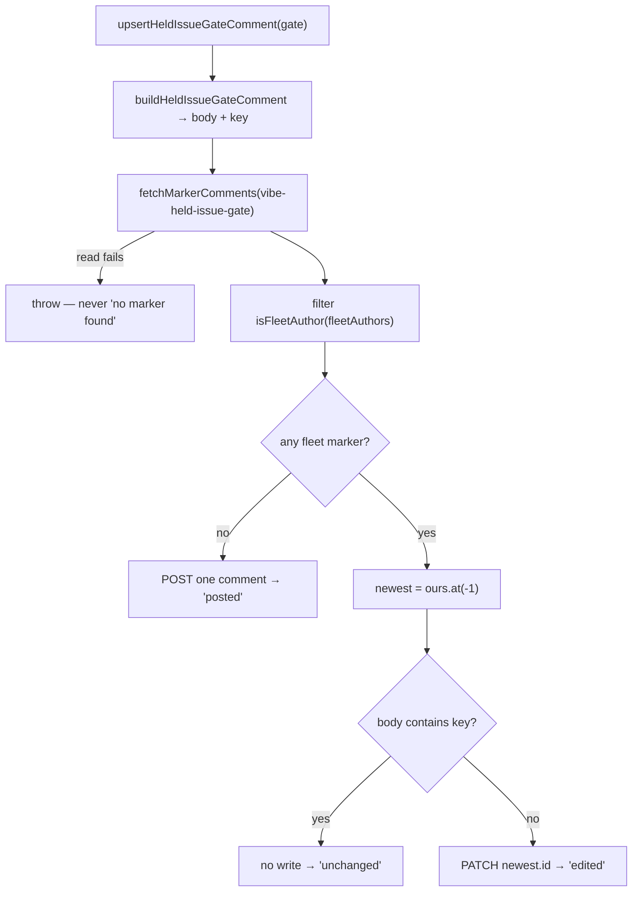

# Held-issue gate comment: builder and edit-in-place upsert

Closes #2531

## Summary

A held issue now carries **one** comment naming the gate that holds it, and that
comment is edited in place when the gate moves rather than joined by a second
one.

- **`worker/deno/lib/held_issue_gate_comment.ts`** (new) — pure builder plus
  injectable upsert:
  - `buildHeldIssueGateComment(gate)` renders the Markdown body and the gate
    key for the three gate kinds the fleet can actually report: `pr-open`
    ("PR #N is open on this stream; this issue is worked once it lands"),
    `milestone-wait` ("waits on milestone M — #N is closed but its code only
    reaches the default branch when M merges") and `dependency` ("waits on
    dependency #N", plus the unworkable-root sentence when the chain ends at a
    root nobody can work).
  - The hidden marker is `<!-- vibe-held-issue-gate key="<kind + refs>" -->`.
    Every interpolated value is fleet-controlled (a `number`, a
    `ChainRootReason` union member) or sanitised: refs go through
    `chain_root_comment.ts`'s own `safeRepo` (via the newly exported
    `renderRef`), a milestone title through `safeMilestone`
    (`[A-Za-z0-9._/ -]`, 120 chars — spaces and slashes survive because real
    milestone names use them), and a root detail through `safeDetail`
    (`[A-Za-z0-9._/-]`, 60 chars) for the key.
  - `upsertHeldIssueGateComment({ repo, issueNumber, gate, ghFn, fleetAuthors })`
    reads the thread with `fetchMarkerComments`, keeps only fleet-authored hits
    via `isFleetAuthor`, and returns `"unchanged"` (newest fleet marker already
    names this gate), `"edited"` (it named a different one → PATCH on that
    comment id) or `"posted"` (none → POST).
  - `reasonSentence` is **reused** from `chain_root_comment.ts`, not copied — it
    and `renderRef` were promoted to exports for this.
- **`worker/deno/lib/marker_comment_pages.ts`** — added `updateIssueComment(repo,
  commentId, body, ghFn)` beside `deleteIssueComment`, issuing
  `gh api -X PATCH repos/{repo}/issues/comments/{id} -f body=…` as argv.
- **`docs/audits/`** — the new module is claimed by the `top-up-2496` sweep slice
  in `lib-sweep-coverage.json`, and
  `security-sweep-2496-chain-root-comment.md` carries its actual sweep reading
  (a per-input Input/Decision/Handling table, the label boundary, and the blast
  radius of a wrong verdict).

This is the builder only. No scan wiring: `find_oldest_issue.ts` is untouched
and the old chain-root poster is not retired — both belong to the wiring
sub-issue. "Held by #N in flight on the same stream" is deliberately not a gate
kind, per the issue.



### Why an edit-in-place upsert

`chain_root_comment.ts`'s poster is POST-only and keyed by root+reason, so when
the gate moved on the old comment simply stayed — which is why the stale "#832"
comments on GRQ-AutoTrader #830/#831/#846 were never replaced. A changed gate
here rewrites the comment the fleet already wrote.

Two boundaries the upsert does not soften:

- **Only a fleet-authored marker counts.** A comment body is text anyone who can
  comment may write; only the author is authenticated. A stranger's marker
  neither suppresses the post nor — the sharper harm, new to this module — hands
  the fleet a comment id to overwrite. An empty `fleetAuthors` trusts nothing and
  posts, so the failure direction is a duplicate rather than an edit of someone
  else's comment.
- **An unreadable thread throws.** A blind read passing as "no marker found" is
  how the branch-lock and PR-claim markers papered their threads (#2265/#2266).
  A refused PATCH throws too: a swallowed edit would leave the stale gate reading
  as current.

## Evidence

Backend/CLI change — no visual surface, so no screenshot applies. The evidence is
the test and gate output below.

Targeted suites, from `worker/deno`:

```
$ deno test --allow-read --allow-env --allow-write --allow-run \
    tests/held_issue_gate_comment_test.ts tests/marker_comment_pages_test.ts
ok | 25 passed | 0 failed (102ms)
```

Sweep-coverage ledger gate:

```
$ deno task check:manifests
ok | 672 passed | 0 failed (6s)
check:manifests: PASSED in 7.1s
```

Full gate (`./quality.sh < /dev/null`, foreground): **PASSED** — including
`deno tests`, `deno lint`, `deno type check`, `deno fmt`, `markdownlint`,
`semgrep`, `needs-human chokepoint`, `gh spawn chokepoint` and
`completeness checks`.

## Acceptance Criteria

<!-- vibe-spec-review inputs="diff+issue-body" -->

- Two upserts with the same gate make one POST and no PATCH; a third with a
  different gate makes one PATCH on the existing comment id and no POST — **met**
  (`tests/held_issue_gate_comment_test.ts`: the same-key case asserts the second
  call returns `"unchanged"` with no further `gh` write, and the changed-gate case
  asserts exactly one `PATCH …/issues/comments/<id>` on the fleet comment's own
  id and zero POSTs).
- A marker comment by a non-fleet author is neither trusted for dedup nor edited
  — **met** (a stranger-authored marker produces `"posted"`, and the recorded
  argv is a POST, never a PATCH against that comment's id; empty `fleetAuthors`
  posts for the same reason).
- `deno task test` and `./quality.sh` pass — **met** (full gate green above;
  `deno task check:manifests` 672 passed).

Requirements stated in the issue prose:

- `held_issue_gate_comment.ts` with the three gate kinds and their wording —
  **met**.
- Hidden `vibe-held-issue-gate` marker with a stable key over kind + refs,
  sanitised as `chain_root_comment.ts` does — **met** (`renderRef` reuses that
  module's `safeRepo`; `safeMilestone`/`safeDetail` mirror it for the two values
  `chain_root_comment.ts` has no sanitiser for).
- `reasonSentence` exported and reused rather than copied — **met**.
- `updateIssueComment` added to `marker_comment_pages.ts` beside
  `deleteIssueComment` — **met**, with a `marker_comment_pages_test.ts` case
  asserting the PATCH argv.
- Unreadable thread throws rather than reporting "no marker found" — **met**.
- No scan wiring, no retirement of the old poster, no "held by #N in flight"
  gate kind — **met** (all absent by design).

Two behaviours in the diff go slightly beyond the literal issue text and are
recorded here rather than left silent:

- Optional `root?: ChainIssueRef` on the `dependency` gate — **unrequested**.
  reason: the issue says the reason sentence comes from the chain root, and a
  chain is often more than one hop, so naming the dependency there would state
  something untrue of it; the field defaults to the dependency for a one-hop
  chain.
- `rootReason`/`root`/`rootDetail` folded into the gate key — **unrequested**.
  reason: the issue requires the key to change when the gate changes; without
  this an assignee moving from `alice` to `bob` would leave the comment naming
  `alice` for ever.

## Standards Review

<!-- vibe-standards-review inputs="diff+CODING-STANDARDS.md" -->

Verdict on the first pass was **changes requested**; four findings were fixed and
three declined with reasoning.

Violations, and what happened to each:

- **HIGH — fixed.** `worker/deno/lib/held_issue_gate_comment.ts:1` — a new module
  under `worker/deno/lib/` must be claimed by exactly one sweep slice
  (`CODING-STANDARDS.md:458`). Both validators are now satisfied: the path is in
  the `top-up-2496` slice's `paths` (`docs/audits/lib-sweep-coverage.json`) **and**
  the slice's record file names it and reads it
  (`docs/audits/security-sweep-2496-chain-root-comment.md:12,57`). Adding the
  path alone would have made `diffCoverage` green and the record false.
- **MEDIUM — fixed.** `worker/deno/lib/held_issue_gate_comment.ts:140` — the
  unworkable-root sentence named the dependency, which is wrong for a multi-hop
  chain. Now `reasonSentence` receives `renderRef(gate.root ?? gate.dependency)`;
  pinned by "names the chain root, not the dependency, when they differ".
- **MEDIUM — fixed.** `worker/deno/lib/held_issue_gate_comment.ts:171` — the key
  ignored the root ref and detail, so a changed assignee read as an unchanged
  gate and the comment was never edited. Both are folded in; pinned by "a changed
  assignee changes the key".
- **LOW — fixed.** `worker/deno/lib/held_issue_gate_comment.ts:9,33` — docstring
  wording overstated the guarantee ("never a second comment" for a thread the
  module does not own). Softened to what the module actually guarantees: that
  *the fleet* writes no second one.
- **MEDIUM-LOW — declined.** `worker/deno/lib/held_issue_gate_comment.ts:242` —
  extract a shared `postIssueComment` helper with `chain_root_comment.ts`. Two
  copies of a six-element argv array is under the DRY threshold worth an
  indirection, and the wiring sub-issue retires the other caller outright; a
  helper introduced now would be deleted then.
- **LOW — declined.** `worker/deno/lib/held_issue_gate_comment.ts:49` — a local
  `type GhFn` duplicating the same alias elsewhere. Exporting one shared alias
  would couple two otherwise independent modules for three words; the structural
  type is identical, so nothing can drift.
- **LOW — declined.** `worker/deno/tests/marker_comment_pages_test.ts` — argv
  assertions read as implementation-shape assertions
  (`CODING-STANDARDS.md:172-184`). Building the correct argv *is* this module's
  observable behaviour — the `gh` call is its only output — so asserting it is
  asserting a result, not a source pattern.

Clean:

- **DRY** — `reasonSentence`/`renderRef` reused from `chain_root_comment.ts`
  rather than copied; `fetchMarkerComments`/`isFleetAuthor` reused for the dedup
  read.
- **Never fail silently** — an unreadable thread and a refused PATCH both throw;
  `updateIssueComment` returns `Promise<void>` rather than an ignorable
  `Error | null`.
- **Injection surface** — every value reaching `key="…"` or visible Markdown
  passes `safeRepo` (via `renderRef`), `safeMilestone` or `safeDetail`, each of
  which strips `"`, `<`, `>` and newlines; `gh` is invoked as argv with no shell,
  and `-f body=` is a raw field with no `@file` expansion, so a body beginning
  `@` cannot read a local file. Secret redaction is inherited at the
  `gh_spawn.ts` chokepoint.
- **Least privilege** — no labelling helper is imported; the only GitHub state
  changed is one comment on the held issue.
- **Trust boundary** — `fleetAuthors` is required, not optional, and the empty
  set trusts nothing; `marker_dedup_author_cap_test.ts` caps this class
  tree-wide and both manifests stay `[]`.
- **Deno-native tooling, Australian English, no wall-clock sleeps in tests**
  (every test stubs `gh` and runs in milliseconds).

## Test Plan

`worker/deno/tests/held_issue_gate_comment_test.ts` (20 tests, new):

- Body and key for each of the three gate kinds, including the
  unworkable-root sentence and its absence when `rootReason` is unset.
- Sanitisation: a crafted repo ref, a milestone title with quotes/angle
  brackets/newlines, and a crafted root detail cannot close the marker's
  `key="…"` attribute or open a second HTML comment; the body carries exactly
  one `<!--`/`-->` pair and exactly two `"` characters.
- Key stability: the same gate yields the same key; a changed milestone, a
  changed root ref and a changed assignee each change it.
- Upsert outcomes: no marker ⇒ one POST and `"posted"`; same key ⇒ **no `gh`
  write** and `"unchanged"`; different key ⇒ exactly one PATCH on the fleet
  comment's id, no POST, and `"edited"`.
- Trust boundary: a non-fleet marker is neither trusted for dedup nor edited
  (the call posts instead); an empty `fleetAuthors` posts; with several fleet
  markers the newest (`ours.at(-1)`) is the one edited.
- Fail loud: an unreadable thread rejects rather than returning `"posted"`.

`worker/deno/tests/marker_comment_pages_test.ts` (5 tests, 1 new): asserts
`updateIssueComment` issues `api -X PATCH repos/<repo>/issues/comments/<id> -f
body=<body>` and propagates a `gh` failure.

Regression linkage: the `"edited"` path is the direct fix for the class of stale
gate comment the issue cites — a POST-only keyed poster leaving the old comment
in place once the gate moved.
