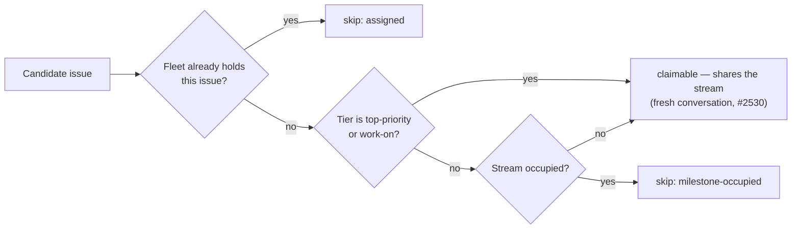

# Stop selection refusing top-priority/work-on issues for stream occupancy

## Summary

Work-stream occupancy now serialises the **lower tiers only**. The
configured-label and work-on collectors no longer refuse a candidate for
`milestone-occupied`, and the idle-decision census and the idle-detect audit
count such an issue under `top_priority` / `work_on` instead of
`stream_occupied`. Issue #2530 already let a `top-priority`/`work-on` claim
join a busy stream in its own fresh per-issue conversation; this is the
selection half, and the whole fix for the #829→#849 inversion — the blank
(default-branch) stream has no claim-time lock, so `isMilestoneOccupied`
treating the empty milestone as a stream was the only thing refusing #849.

`low-priority`, `idle-task`, the self-diagnostic tier and the custom
PR-producing labels (`new_work_eligibility.ts`) keep today's one-issue-per-stream
rule, unchanged.

The **issue-level** hold is kept, not just asserted: removing the stream gate
also removed the only thing that refused the single issue a sibling slot on
this host holds during the window before its GitHub assignment lands (the
`applyInFlightClaims` overlay). `isIssueFleetAssigned` (`issue_filter.ts`) now
answers that narrower question in both collectors, recorded as the existing
`assigned` skip reason. Without it,
`stream_scoped_slot_exclusion_1091_test.ts` re-offered `VibeCoder#1082` while a
sibling slot held it.

Closes #2532.

## Evidence

Backend/CLI change with no web interface to screenshot. The evidence is the
test suite: the four surfaces (two collectors, the census, the audit) each have
a regression test that was observed failing before the change and passing after
it, plus the full quality gate.

## Reproduction

- **symptom** — with fleet-assigned `low-priority` #829 in flight on the
  default-branch stream, unassigned `top-priority` #849 in the same repo was
  refused `milestone-occupied`, so the fleet-global ladder fell through to
  `low-priority` work elsewhere; the census reported those issues as
  `stream_occupied` rather than under their tier
- **status** — `verified` — the new regression tests were run against the
  unfixed code and failed (`collect_label_candidates` returned `[]` for #849,
  `collect_work_on_candidates` returned `[]` for #843/#844, the census reported
  `top_priority=0 stream_occupied=3`, `classifyIssues` reported
  `stream_occupied`), then passed after the change
- **regression test** —
  `worker/deno/tests/collect_label_candidates_test.ts::collect_label_candidates - a top-priority issue shares the occupied blank stream (Issue #2532)`

## Acceptance Criteria

<!-- vibe-spec-review inputs="diff+issue-body" -->

PLACEHOLDER

## Standards Review

<!-- vibe-standards-review inputs="diff+CODING-STANDARDS.md" -->

PLACEHOLDER

## Test Plan

Added:

- `worker/deno/tests/collect_work_on_candidates_stream_sharing_test.ts` (new) —
  a work-on issue shares an occupied milestone stream; the issue a sibling slot
  holds is still refused `assigned`; a `low-priority` sibling is still refused
  `milestone-occupied`; `BlankStreamLockRegistry` still refuses a second
  no-milestone issue of the same repo.
- `collect_label_candidates_test.ts` — top-priority shares the occupied blank
  stream (#829/#849) and an occupied milestone stream (#837/#824).
- `idle_decision_census_test.ts` — `top_priority=3 stream_occupied=1` for a
  milestone holding #837 in flight plus a `low-priority` sibling; a `work-on`
  issue in the occupied blank stream counts under its tier.
- `idle_detect_diagnostics_test.ts` — `classifyIssues` agrees with the scan on
  both shapes.
- `find_oldest_issue_test.ts` — `findOldestIssue` selects #849 over the
  `low-priority` backlog of another repo.

Modified (business-logic change, documented in each file):

- `idle_decision_census_test.ts`, `idle_detect_diagnostics_test.ts`,
  `census_occupancy_drift_1071_test.ts`, `idle_detect_stream_occupancy_1050_test.ts`,
  `idle_audit_wiring_1050_test.ts`, `idle_filing_composition_1050_test.ts`,
  `stream_scoped_slot_exclusion_1091_test.ts`,
  `human_assignment_never_occupies_test.ts` — occupancy fixtures restated in
  `low-priority`, the tier the gate still binds, so each keeps its
  discriminating power. No test was deleted or commented out.
- `idle_claimable_drift_1050_test.ts` — the audit and the scan still agree; both
  now take the work-on backlog behind an occupied stream, so the expectations
  move together.
- `find_oldest_issue_test.ts` — two selection-reasoning tests used milestone
  occupancy to hold a `top-priority` issue; they now use the dependency gate,
  which still holds it. What they assert (the reasoning line names the blocked
  top-priority) is unchanged.
- `tests/fixtures/claim_path_incidents/neat-ai-2026-08-23.json` — the recorded
  state is unchanged; what the fleet should do with it is not, so `expect` now
  says all four are claimable. The corpus still pins census-versus-scan
  agreement.
- `claim_path_monotonicity_test.ts` + `fixtures/claim_path_state.ts` —
  `STREAM_SHARING_EXEMPT_GATES` records that `milestone-occupied` cannot hold a
  `work-on` issue any more, so the sweep asks the gate's contract at the tier it
  binds.

Unchanged and verified: `issue_priority_test.ts` (77 tests) — the tier ladder is
not touched.
