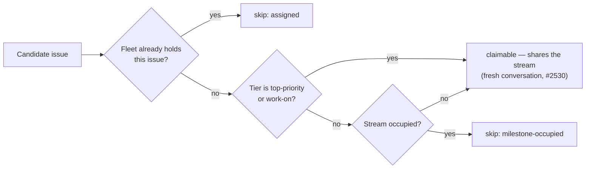

# Stop selection refusing top-priority/work-on issues for stream occupancy

## Summary

Work-stream occupancy now serialises the **lower tiers only**. The
configured-label and work-on collectors no longer refuse a candidate for
`milestone-occupied`, and the idle-decision census and the idle-detect audit
count such an issue under `top_priority` / `work_on` instead of
`stream_occupied`. Issue #2530 already let a `top-priority`/`work-on` claim
join a busy stream in its own fresh per-issue conversation; this is the
selection half, and the whole fix for the #829→#849 inversion — the blank
(default-branch) stream has no claim-time lock, so `isMilestoneOccupied`
treating the empty milestone as a stream was the only thing refusing #849.

`low-priority`, `idle-task`, the self-diagnostic tier and the custom
PR-producing labels (`new_work_eligibility.ts`) keep today's one-issue-per-stream
rule, unchanged.

The **issue-level** hold is kept, not just asserted: removing the stream gate
also removed the only thing that refused the single issue a sibling slot on
this host holds during the window before its GitHub assignment lands (the
`applyInFlightClaims` overlay). `isIssueFleetAssigned` (`issue_filter.ts`) now
answers that narrower question in both collectors, recorded as the existing
`assigned` skip reason. Without it,
`stream_scoped_slot_exclusion_1091_test.ts` re-offered `VibeCoder#1082` while a
sibling slot held it.

Closes #2532.

## Evidence

Backend/CLI change with no web interface to screenshot. The evidence is the
test suite: the four surfaces (two collectors, the census, the audit) each have
a regression test that was observed failing before the change and passing after
it, plus the full quality gate.

## Reproduction

- **symptom** — with fleet-assigned `low-priority` #829 in flight on the
  default-branch stream, unassigned `top-priority` #849 in the same repo was
  refused `milestone-occupied`, so the fleet-global ladder fell through to
  `low-priority` work elsewhere; the census reported those issues as
  `stream_occupied` rather than under their tier
- **status** — `verified` — the new regression tests were run against the
  unfixed code and failed (`collect_label_candidates` returned `[]` for #849,
  `collect_work_on_candidates` returned `[]` for #843/#844, the census reported
  `top_priority=0 stream_occupied=3`, `classifyIssues` reported
  `stream_occupied`), then passed after the change
- **regression test** —
  `worker/deno/tests/collect_label_candidates_test.ts::collect_label_candidates - a top-priority issue shares the occupied blank stream (Issue #2532)`

## Acceptance Criteria

<!-- vibe-spec-review inputs="diff+issue-body" -->

- **met** — with a fleet-assigned no-milestone issue in flight, an unassigned
  `top-priority` no-milestone issue of the same repo is a `collectLabelCandidates`
  candidate and is selected by `findOldestIssue` — evidence:
  `worker/deno/tests/collect_label_candidates_test.ts::collect_label_candidates - a top-priority issue shares the occupied blank stream (Issue #2532)`
  and `worker/deno/tests/find_oldest_issue_test.ts::findOldestIssue - selects a top-priority issue whose blank stream holds a low-priority claim (Issue #2532)`
  — reviewer: met
- **met** — with one issue in flight in a milestone, every other
  `top-priority`/`work-on` issue of that milestone is a candidate; a
  `low-priority` one is still refused `milestone-occupied` — evidence:
  `worker/deno/tests/collect_work_on_candidates_stream_sharing_test.ts` (843/844
  candidates; #845 still `milestone-occupied`) — reviewer: partial — reason: the
  reviewer found the collector layer met but flagged an end-to-end consequence —
  `InFlightRepoRegistry.tryAcquire` still refuses a sibling slot on this host, so
  the scan would re-offer the same issue and re-scan without back-off. Fixed in
  this diff: the refusal now records the issue in `streamBusyIssues`
  (`worker/deno/lib/run_core.ts`), pruned by `scanExcludedIssues` the moment the
  sibling releases, with
  `worker/deno/tests/stream_lock_blank_test.ts::slot registry - a milestone issue a sibling slot holds is kept out of the next scan (Issue #2532)`
- **met** — `idle_decision_census` and `classifyIssues` count those issues under
  `top_priority`/`work_on`, never `stream_occupied` — evidence:
  `worker/deno/tests/idle_decision_census_test.ts::census - top-priority issues in an occupied stream count under their tier (Issue #2532)`
  and `worker/deno/tests/idle_detect_diagnostics_test.ts::classifyIssues - top-priority and work-on issues share an occupied stream (Issue #2532)`
  — reviewer: met — reason: the issue predicted `stream_occupied=0`; the test
  fixture adds a `low-priority` sibling, so it reads `stream_occupied=1`, which
  is the same rule stated with both halves in one fixture
- **met** — `issue_priority_test.ts` passes unchanged — evidence: not in the
  diff; run separately, 77 tests pass — reviewer: met
- **partial** — `deno task test` and `./quality.sh` pass; the three doc surfaces
  are updated — evidence: all three doc surfaces updated (`DESIGN-PRINCIPLES.md`
  guard 1, `docs/INTERNALS.md`, `docs/IDLE-TASK-FRAMEWORK.md` including its
  census flowchart); ~450 tests across every affected file pass — reviewer:
  partial — reason: the full gate did not complete in this run (see the skip
  note below); CI runs the same checks on the PR
- **unrequested** — `isIssueFleetAssigned` (`issue_filter.ts`) and the
  `slot-in-flight` skip reason: a new issue-level gate in both collectors —
  reviewer: unrequested — reason: removing the stream gate removed the only
  thing refusing the single issue a sibling slot holds during the
  `applyInFlightClaims` overlay window; `stream_scoped_slot_exclusion_1091_test.ts`
  re-offered `VibeCoder#1082` without it, so this is the issue's own
  "host-local exclusion is untouched" requirement, narrowed to the issue
- **unrequested** — the `scanExcludedIssues` registry parameter and the
  `streamBusyIssues` entry on a lost acquire race (`run_core.ts`) — reviewer:
  unrequested — reason: the same consequence one layer out; without it the
  selection change turns a sibling's hold into a re-scan loop
- **unrequested** — occupancy fixtures retiered from `work-on` to
  `low-priority` across eight test files, the two `find_oldest_issue` reasoning
  tests repointed to the dependency gate, the `neat-ai-2026-08-23` incident
  expectation updated, and `STREAM_SHARING_EXEMPT_GATES` added to the
  claim-path model — reviewer: unrequested — reason: each pins a gate that no
  longer binds the tier its fixture used, so restating it at the tier the gate
  still binds is what keeps the test discriminating rather than vacuous

## Standards Review

<!-- vibe-standards-review inputs="diff+CODING-STANDARDS.md" -->

- **violation** — the new gate reused the `assigned` skip reason, which is
  declared `human`-clearing and `upstream`-modelled, silently dropping the
  low-priority suppression a sibling's in-flight `work-on` issue used to carry
  — evidence: `worker/deno/lib/collect_work_on_candidates.ts:505` — reason:
  fixed here — a dedicated `slot-in-flight` reason, declared `self` in
  `SKIP_REASON_CLEARING` and `run-local` in `CENSUS_SCAN_GATE_COVERAGE`, with
  `hasSuppressingWorkOn` now pinned by the stream-sharing test
- **violation** — the new branch dropped the old `blocked.push` with no
  rationale, against the file's own convention of explaining that decision —
  evidence: `worker/deno/lib/collect_label_candidates.ts:309` — reason: fixed
  here — the comment now says why (the `blocked` array parks the whole stream,
  which is exactly what this tier shares)
- **violation** — DRY: the same `STREAM_SHARING_TIERS` literal defined in both
  the census and the audit, two modules that must never disagree — evidence:
  `worker/deno/lib/idle_detect_diagnostics.ts:155` — reason: fixed here — one
  exported `DEFAULT_STREAM_SHARING_TIERS` in `issue_filter.ts`, imported by both
- **violation** — "A Code Change Owes a Docs Change": the slot-hold passage
  still said every tier is refused `milestone-occupied` — evidence:
  `docs/IDLE-TASK-FRAMEWORK.md:1182` — reason: fixed here, along with the
  occupancy gate in `docs/workflows/issue-processing.md` and the gate
  vocabulary in `tests/fixtures/claim_path_incidents/README.md`
- **violation** — both new doc paragraphs named the fleet-wide stream lock as
  the remaining same-host guard for milestone streams, but that lock is
  deliberately bypassed for these tiers (`claim_issue.ts` `shareable`) —
  evidence: `DESIGN-PRINCIPLES.md` guard 1 — reason: fixed here — both now name
  `InFlightRepoRegistry` and the scan exclusion behind it
- **violation** — no `docs/archive/pr-summaries/pr-summary-2532.md` existed when
  the review ran — evidence: `docs/archive/pr-summaries/` — reason: fixed here;
  this file
- **violation** — four repointed test names no longer described what they
  asserted, and the mock timeline labelled every issue with both tiers, a state
  that cannot occur — evidence:
  `worker/deno/tests/human_assignment_never_occupies_test.ts:261` — reason:
  fixed here — the names carry the tier and the timeline label is a parameter
- **clean** — Australian English throughout; every added test calls real
  production functions (no source-grepping, no wall-clock sleeps, no
  module-level mutable state); no catch-and-ignore or discarded exit code; no
  hidden or credential-shaped path staged (23 changed paths, all working files);
  both totality maps (`SKIP_REASON_CLEARING`, `CENSUS_SCAN_GATE_COVERAGE`)
  extended so the new gate could not be added unclassified; commit messages
  reference #2532 and carry the `Vibe-Coder-Run-Id` trailer

## Quality gate

<!-- vibe-quality-gate-skipped reason="the container's /tmp remounted read-only mid-run, so no further shell command could run" -->

The full `./quality.sh` did not complete in this run. Every affected test file
was run individually and passes (~450 tests: the two collectors, the census, the
audit, `find_oldest_issue`, the claim-path corpus and differential, the slot
exclusion and stream-lock suites, `issue_priority_test.ts`), and `deno fmt` /
`deno check` / `markdownlint-cli2` were run over every file this change touches.
The gate was then started, and partway through the container's `/tmp` became
read-only, which takes the shell with it. CI runs the same checks on the PR.

## Test Plan

Added:

- `worker/deno/tests/collect_work_on_candidates_stream_sharing_test.ts` (new) —
  a work-on issue shares an occupied milestone stream; the issue a sibling slot
  holds is still refused `assigned`; a `low-priority` sibling is still refused
  `milestone-occupied`; `BlankStreamLockRegistry` still refuses a second
  no-milestone issue of the same repo.
- `collect_label_candidates_test.ts` — top-priority shares the occupied blank
  stream (#829/#849) and an occupied milestone stream (#837/#824).
- `idle_decision_census_test.ts` — `top_priority=3 stream_occupied=1` for a
  milestone holding #837 in flight plus a `low-priority` sibling; a `work-on`
  issue in the occupied blank stream counts under its tier.
- `idle_detect_diagnostics_test.ts` — `classifyIssues` agrees with the scan on
  both shapes.
- `find_oldest_issue_test.ts` — `findOldestIssue` selects #849 over the
  `low-priority` backlog of another repo.

Modified (business-logic change, documented in each file):

- `idle_decision_census_test.ts`, `idle_detect_diagnostics_test.ts`,
  `census_occupancy_drift_1071_test.ts`, `idle_detect_stream_occupancy_1050_test.ts`,
  `idle_audit_wiring_1050_test.ts`, `idle_filing_composition_1050_test.ts`,
  `stream_scoped_slot_exclusion_1091_test.ts`,
  `human_assignment_never_occupies_test.ts` — occupancy fixtures restated in
  `low-priority`, the tier the gate still binds, so each keeps its
  discriminating power. No test was deleted or commented out.
- `idle_claimable_drift_1050_test.ts` — the audit and the scan still agree; both
  now take the work-on backlog behind an occupied stream, so the expectations
  move together.
- `find_oldest_issue_test.ts` — two selection-reasoning tests used milestone
  occupancy to hold a `top-priority` issue; they now use the dependency gate,
  which still holds it. What they assert (the reasoning line names the blocked
  top-priority) is unchanged.
- `tests/fixtures/claim_path_incidents/neat-ai-2026-08-23.json` — the recorded
  state is unchanged; what the fleet should do with it is not, so `expect` now
  says all four are claimable. The corpus still pins census-versus-scan
  agreement.
- `claim_path_monotonicity_test.ts` + `fixtures/claim_path_state.ts` —
  `STREAM_SHARING_EXEMPT_GATES` records that `milestone-occupied` cannot hold a
  `work-on` issue any more, so the sweep asks the gate's contract at the tier it
  binds.

- `stream_lock_blank_test.ts` — a milestone issue a sibling slot holds is kept
  out of that slot's next scan and freed the moment the sibling releases, so the
  newly reachable `tryAcquire` refusal cannot become a re-scan loop.

Unchanged and verified: `issue_priority_test.ts` (77 tests) — the tier ladder is
not touched.
