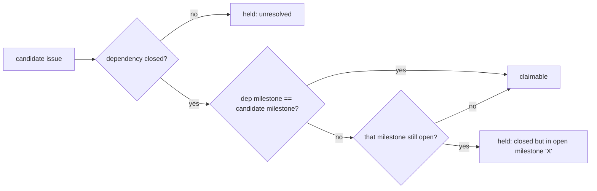

# Apply the cross-milestone dependency hold in the idle-detect audit and the diagnose commands

Closes #2533

## Summary

The scan already holds an issue whose closed dependency lives in another
still-open milestone (Issue #2173). The idle-detect audit and the two diagnose
commands did not, so each reported such an issue as *claimable* and the audit
fired `ALERT mis_classification` against a scan that was right — the
GRQ-AutoTrader case (#738/#739, dependencies #726/#723 closed inside open
milestone 32).

This change teaches all three the same hold:

- **`lib/idle_detect_diagnostics.ts`** — `isDependencyBlockedByOpenIssue` takes
  an `openMilestones` set, threaded through `ClassifyOptions`;
  `AuditClaimableStateOptions` gains `openMilestonesFn?: (repo) =>
  Promise<ReadonlySet<string>>`, optional and **fail-open exactly like
  `openPRsFn`** — a rejecting lookup applies no hold and does not throw.
- **`lib/run_core_production_deps.ts`** — supplies `openMilestonesFn` from the
  cached `fetchOpenMilestoneClosedCounts`, so the hold costs one cached read per
  repo and **no new API call per tick**.
- **`lib/diagnose_issue.ts`** (check 8) and **`commands/diagnose_repo.ts`** —
  both now run the scan's own `isDependencyBlocked` with a `milestoneScope`
  built from `createOpenMilestoneLookup`, replacing a hand-rolled "is the
  dependency OPEN?" loop that could not see a cross-milestone hold. The report
  reads `held: dependency #726 is closed but in open milestone 'Automatic
  buying from the score sheet'`.
- **Occupancy** — both commands use `isStreamSharingTier` (Issue #2530), so a
  `top-priority`/`work-on` issue is no longer reported as blocked by stream
  occupancy.

### DRY follow-through

`commands/diagnose_repo.ts` previously hand-rolled its own `createIssueFetcher`
with unchecked `JSON.parse(...) as {...}` casts over the same
`gh issue view --json number,state,title,milestone` payload that
`lib/diagnose_issue.ts` validates. The validated fetcher is now exported as
`createDiagnosticIssueFetcher` and both commands share it — one validated read
path, one comment, no duplicated cast. It was deliberately *not* pointed at
`issue_finder_common.ts`'s `createIssueFetcher`: that one resolves sub-issues
through the native sub-issues API, and swapping it in would silently change the
diagnose commands' sub-issue semantics.

## Reproduction

**verified.** `tests/idle_detect_diagnostics_test.ts` carries the #738-shaped
regression test: a candidate in milestone 34 whose dependency #726 is CLOSED and
sits in open milestone 32. Against the unfixed audit the issue classifies as
claimable (the audit never looked at the dependency's milestone); with the fix
it classifies `dependency_blocked`. Companion tests pin the two negatives —
same-milestone closed dependency and closed holding milestone both stay
claimable — and the fail-open case.

## Acceptance Criteria

<!-- vibe-spec-review inputs="diff+issue-body" -->

- criterion: `classifyIssues` marks an issue `dependency_blocked` when its
  closed same-repo dependency's milestone is another open milestone of the
  repo, and claimable when that milestone is closed.
  reviewer: partial
  note: The audit never inspects the dependency's own milestone; it mirrors the
  census approximation (Issue #2455) — the behaviour the issue text explicitly
  asks for ("mirroring the census"). The approximation errs towards
  under-counting claimable, the direction that cannot manufacture a false
  `mis_classification` ALERT, and is marked `// SIMPLE-ON-PURPOSE:` with its
  `upgrade when` condition.
- criterion: `diagnose_issue` / `diagnose_repo` print the cross-milestone
  reason for such an issue and do not print "occupied" for a
  `top-priority`/`work-on` issue.
  reviewer: met
  note: Reviewer also flagged a `Milestone "undefined" occupancy does not apply`
  defect in `diagnose_issue.ts`; fixed by reordering the branch.
- criterion: `deno task test` and `./quality.sh` pass.
  reviewer: partial
  note: Coverage only — `diagnose_repo_test.ts` feeds a pre-rendered
  `describeDependencyBlockers` string into `diagnoseRepoIssue` and never
  exercises the new wiring in `commands/diagnose_repo.ts`. See **Residual gap**
  below.
- criterion: `lib/validation.ts` accepts a `milestone` object on the issue-state
  payload.
  reviewer: unrequested
  reason: Not asked for by the issue; required so the dependency's milestone
  survives validation. The reviewer separately flagged an undocumented
  bare-string milestone branch — that branch has been removed.
- criterion: New public API `DependencyBlocker` /
  `describeDependencyBlockers`, and the reworded non-milestone message
  `depends on #N which is not resolved`.
  reviewer: unrequested
  reason: Not asked for by the issue; needed so both commands can render the
  named-milestone reason from one place. It replaces
  `depends on #N ("title") which is OPEN` and drops
  `commands/diagnose_repo.ts`'s `(could not verify state)` fallback.

### Residual gap (honest)

`commands/diagnose_repo.ts` hard-wires `const ghFn = runGhCommand;` and no test
anywhere references `diagnoseRepoCommand`. An end-to-end test of that command
would require adding a dependency-injection seam — out of scope for #2533. What
*is* now covered directly is the shared unit the command delegates to: five new
tests for `createDiagnosticIssueFetcher` (milestone read in the single issue
view, MERGED→CLOSED, malformed payload fails loud, unreadable body yields no
sub-issues, sub-issues from body references).

## Standards Review

<!-- vibe-standards-review inputs="diff+CODING-STANDARDS.md" -->

- item: Australian English spelling throughout
  reviewer: pass
- item: Documented fail-open fallback — `openMilestonesFn` catch is pinned by
  the "rejecting openMilestonesFn applies no hold and does not throw" test
  reviewer: pass
- item: Test quality — real calls, injected seams, no sleeps or polling
  reviewer: pass
- item: Deno-native tooling only; no Node regression
  reviewer: pass
- item: Discarded return value — `isDependencyBlocked`'s boolean result is
  ignored at the `diagnose_repo` call site
  reviewer: concern
- item: Missing `// SIMPLE-ON-PURPOSE:` marker on the audit-side approximation
  reviewer: concern
- item: DRY / input validation — `diagnose_issue.ts` uses
  `validateIssueStateJson` while `commands/diagnose_repo.ts` hand-rolls an
  unchecked cast of the same `gh issue view --json number,state,title,milestone`
  payload
  reviewer: concern
- item: Test coverage — `validation.ts`'s three new branches untested;
  `describeDependencyBlockers`'s empty-input and `child` branches untested
  reviewer: concern
- item: Scope discipline — the stream-sharing exemption attributed to
  #2530/#2532 rides along, plus rewritten assertions in two pre-existing
  occupancy tests
  reviewer: concern
- item: Comment economy — orphaned doc block; the same six-line "`milestone`
  rides this existing per-dependency call…" comment pasted into two files;
  13–15-line issue-archaeology doc comments
  reviewer: concern

### Fixes applied after the review

Five of the six concerns are addressed in this branch: the discarded return
value now carries an explanatory comment (supplying `blockers` makes the return
exactly `blockers.length > 0`, so the collected list *is* the verdict); the
`SIMPLE-ON-PURPOSE` marker with its `upgrade when` condition is added; the
duplicated cast is gone (single shared `createDiagnosticIssueFetcher`), which
also single-sources the duplicated comment; and both test-coverage gaps are
closed (2 tests in `validation_test.ts`, 3 in the
`describeDependencyBlockers` suite). The scope-discipline concern stands as
recorded — the stream-sharing exemption is required by acceptance criterion 2.

## Test Plan

- `deno test worker/deno/tests/idle_detect_diagnostics_test.ts` — the audit
  regression test and the three negatives.
- `deno test worker/deno/tests/diagnose_issue_test.ts` — `ok | 27 passed`,
  including the five `createDiagnosticIssueFetcher` tests.
- Six-file targeted run across the affected suites — `ok | 235 passed |
  0 failed`.
- `./quality.sh < /dev/null` — **PASSED** (all gates; `config integration`
  skipped as usual out-of-fleet).

🤖 Generated with [Claude Code](https://claude.com/claude-code)
