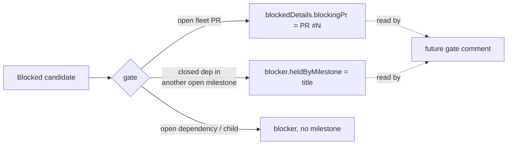

# Record the concrete gate on every blocked top-priority/work-on candidate

## Summary

A blocked candidate now records _what_ holds it, so a later gate comment can
name the gate instead of re-deriving it. Two optional fields, both additive:

- `DependencyBlocker.heldByMilestone` — set to the **dependency's** milestone
  title on the Issue #2173 cross-milestone hold (a closed dependency sitting in
  another still-open milestone), on both the held path and the unreadable-lookup
  fail-safe path. Left unset for an open dependency, an open child, or a
  dependency satisfied on close, so `undefined` reads as "not a cross-milestone
  hold".
- `BlockedCandidateInfo.blockingPr` — the open PR number from
  `getBlockingPRForIssue`, recorded on the `pr-blocked` entry by the
  configured-label and work-on collectors only. Every other writer of that
  reason is untouched, so `undefined` reads as "not recorded".

No verdict changes: which candidates are blocked, and the selection-reasoning
log line, are byte-for-byte what they were. Closes #2534.

## Evidence

Backend-only change to the worker's Deno libraries — there is no web interface
to screenshot. The evidence is the test suite and the full quality gate.

- Targeted run:
  `deno test -A tests/cross_milestone_dependency_gate_test.ts tests/collect_label_candidates_test.ts tests/collect_work_on_candidates_escalation_test.ts`
  → **44 passed, 0 failed**.
- Red-before-green: with `worker/deno/lib` stashed, the same run fails with
  `error: Type checking failed` (neither field exists), confirming the tests pin
  new behaviour rather than restating the old.
- Full gate: `./quality.sh` → `Result: PASSED (with skipped checks)` — deno
  tests, lint, type check, fmt, semgrep, markdownlint, mermaid all PASSED.

## Acceptance Criteria

<!-- vibe-spec-review inputs="diff+issue-body" -->

- **met** — a `pr-blocked` entry from either collector carries the blocking PR
  number — evidence:
  `worker/deno/tests/collect_label_candidates_test.ts::collect_label_candidates - a pr-blocked candidate records the blocking PR number`
  and
  `worker/deno/tests/collect_work_on_candidates_escalation_test.ts::collectWorkOnCandidates - a pr-blocked candidate records the blocking PR number`
  — reviewer: met
- **met** — a cross-milestone `dependency-blocked` entry's blocker carries the
  dependency's milestone title; an open-dependency blocker carries none —
  evidence:
  `worker/deno/tests/cross_milestone_dependency_gate_test.ts::a cross-milestone hold records the milestone holding the dependant`,
  `::an unreadable open-milestone lookup still names the dependency's milestone`
  and `::an open dependency's blocker names no milestone` — reviewer: met
- **met** — `deno task test` and `./quality.sh` pass — evidence: full gate run
  after the final edit, `Result: PASSED (with skipped checks)` — reviewer: met
- **unrequested** — `noteBlocked` in `collect_work_on_candidates.ts` took its
  optional `blockers` argument inside a `gate?: { blockers?, blockingPr? }`
  object rather than gaining a fifth positional parameter — reviewer:
  unrequested — reason: a fifth positional would force
  `noteBlocked(n, m, "pr-blocked", undefined, prNumber)` at the new call site;
  the object keeps both gates named at every call site and is
  behaviour-identical (keys still omitted, never set to `undefined`)
- **unrequested** — `isDependencyBlocked`'s `blockers` parameter changed from a
  re-typed inline structural type to the imported `DependencyBlocker[]` —
  reviewer: unrequested — reason: necessary; the inline literal would reject the
  new `heldByMilestone` property, and it removes a duplicated type definition
- **unrequested** — the `collect()` test helper gained a `repoPRs` parameter
  defaulting to `[]` — reviewer: unrequested — reason: necessary to inject the
  open PR the new `pr-blocked` test needs; no existing call site changed

## Standards Review

<!-- vibe-standards-review inputs="diff+CODING-STANDARDS.md" -->

- **violation** — the `noteBlocked` signature was re-shaped into a `gate` object
  where a fifth optional parameter would do (KISS / smallest-change ladder) —
  evidence: `worker/deno/lib/collect_work_on_candidates.ts:397` — reason:
  stands; the rung below forces an `undefined` placeholder argument at the
  `pr-blocked` call site, which reads worse than the named object for no
  behaviour difference
- **violation** — two idioms for the same "omit the key when absent" rule three
  lines apart — evidence: `worker/deno/lib/collect_work_on_candidates.ts:412` —
  reason: fixed in this diff; both spreads now use the same truthiness form
- **violation** — a comment narrating the line beneath it, already covered by
  the field's own doc comment — evidence:
  `worker/deno/lib/collect_label_candidates.ts:401` — reason: fixed in this
  diff; the redundant comment was removed
- **violation** — the `blockingPr` absence contract was asserted in prose with
  no test, while the parallel `heldByMilestone` contract was pinned — evidence:
  `worker/deno/lib/issue_finder_logger.ts:166` — reason: fixed in this diff; the
  `dependency-blocked` test now asserts `blockingPr` is absent
- **clean** — Australian English throughout ("dependant" as a noun used
  correctly); tests call the real `collectLabelCandidates`,
  `collectWorkOnCandidates` and `isDependencyBlocked` with fakes and assert on
  returned values, with no source-grepping, sleeps or wall-clock thresholds; no
  new catch-and-ignore — the two touched `catch` blocks keep their fail-safe
  "treat as blocked" behaviour; no hidden path staged; both changes are additive
  optional fields, so nothing is removed, renamed or repurposed; no documented
  surface renamed, so no docs edit is owed.

## Test Plan

Added to `worker/deno/tests/cross_milestone_dependency_gate_test.ts`:

- `a cross-milestone hold records the milestone holding the dependant`
- `an unreadable open-milestone lookup still names the dependency's milestone`
- `an open dependency's blocker names no milestone`

Added to `worker/deno/tests/collect_label_candidates_test.ts`:

- `collect_label_candidates - a pr-blocked candidate records the blocking PR number`

Added to `worker/deno/tests/collect_work_on_candidates_escalation_test.ts`:

- `collectWorkOnCandidates - a pr-blocked candidate records the blocking PR number`
- extended the existing `dependency-blocked` case to assert `blockingPr` is
  absent on a non-`pr-blocked` skip
