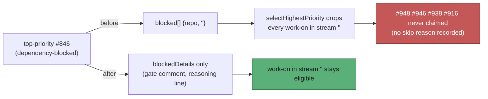

# A dependency-blocked top-priority issue no longer parks the work-on issues in its stream

## Summary

Closes #2563.

The idle-decision census reported four claimable `work-on` issues in
stSoftwareAU/GRQ-AutoTrader (#948, #946, #938, #916) on three consecutive
cycles. The claim scan claimed none of them and recorded no skip reason for
any of them. The census was right and the scan was wrong.

**Root cause.** In `collect_label_candidates.ts`, a dependency-blocked
configured-label (`top-priority`) issue was pushed into `blocked` whenever the
repo had **any** open fleet PR. `selectHighestPriority` then drops every
`work-on` candidate in a `blocked` entry's `repo + milestone` stream. It does
this after the collectors have run, so the drop leaves no per-issue reason.
GRQ-AutoTrader had:

- #846, a `top-priority` issue in the non-milestone stream, held by the
  cross-milestone dependency hold (#844 is closed, but its code reaches the
  default branch only when "Auto buy part 2" rolls up).
- An open milestone rollup PR (#1060, `milestone/auto-buy-part-2` → default
  branch). Under `getBlockingPRForIssue` it blocks nothing in the non-milestone
  stream, but it made `repoPRs.length > 0` true.

So #846's own dependency wait silently parked every `work-on` issue in the
non-milestone stream. The census does not model the `blocked` suppression,
because it is not a per-issue gate, so it counted the four as claimable. That
broke the owner rule that top priority starves nothing. The behaviour dates
from the initial release rather than from #2545 or the priority-streams
milestone (#2558).

**Fix.**

- `worker/deno/lib/collect_label_candidates.ts`: a dependency-blocked
  configured-label issue is still recorded in `blockedDetails` (so the
  held-issue gate comment and the selection-reasoning line are unchanged).
  It is no longer pushed into `blocked`. This matches #2545 and #2610: a
  dependency wait belongs to the one issue and says nothing about its stream.
- `worker/deno/lib/issue_priority.ts`: the comment now says the suppression
  applies only to PR-blocked configured-label issues.
- `docs/workflows/issue-processing.md`: the section is renamed "PR-blocked
  configured-label suppresses `work-on`...". It now states that a
  dependency-blocked `top-priority` issue suppresses nothing, and cites #2563.

The PR-blocked suppression stays. An open PR on a stream already holds every
issue in that stream through `getBlockingPRForIssue`, and the census models
that as `pr_blocked`.

## Evidence

`worker/deno/tests/dependency_blocked_top_priority_parks_nothing_2563_test.ts`
runs the same repository state through both instruments: the claim scan
(`findOldestIssue`) and the census (`buildIdleDecisionCensus`). It asserts
that they agree in both directions. Whatever the scan claims, the census
calls claimable, and when the scan claims nothing, the census counts nothing.

- **Reproduction, which fails before the fix:** a dependency-blocked
  `top-priority` issue, a milestone rollup PR and a `work-on` issue, all in
  the non-milestone stream. Before the fix the census reported `[948]` and
  the scan returned `null`
  (`Values are not equal: the scan refused a work-on issue whose only obstacle
  is another issue's dependency`). After the fix, the scan claims #948.
- **Agreement, where both refuse:** the `work-on` issue is itself
  dependency-blocked.
- **Agreement, where both refuse:** an open PR on the stream holds both tiers.
- **Ladder unchanged:** a claimable `top-priority` issue still outranks
  `work-on`.

## Test Plan

- New test file: `tests/dependency_blocked_top_priority_parks_nothing_2563_test.ts`.
  It has 4 tests. The first failed before the fix and all 4 pass after it.
- Related suites: 805 tests passed, 0 failed. These were the collectors,
  `find_oldest_issue*`, `issue_priority*`, the idle census, detect and
  inversion suites, dependency and chain promotion,
  `regression_issue_filtering`, `work_on_beats_idle_task_fleet`,
  `cross_milestone_dependency_gate` and `human_assignment_never_occupies`.
- `deno fmt --check`, `deno lint` and `deno check` pass on the changed files.
