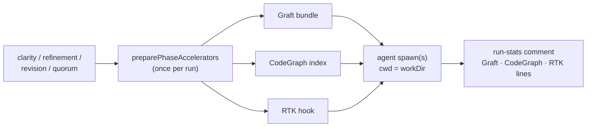

# PR Summary — Issue #2569

## Summary

Closes #2569.

Clarity assessment, refinement, revision and quorum now get Graft, CodeGraph and
RTK the same way the six phases wired by #2102, #2103, #2383, #2384 and #2561
already do. A new shared helper, `worker/deno/lib/phase_accelerators.ts`
(`preparePhaseAccelerators`), does all three once per run:

- collects one Graft bundle;
- prepares one CodeGraph index;
- prepares one RTK run.

The helper then gives each phase:

- `applyPrompt`, which adds the bundle and the tool lines to the prompt;
- `spawnOptions()`, which supplies `cwd`, `mcpConfig` and the RTK
  `settingsJson`;
- `recordSuccess`, `afterSpawn` and `report()`, which fill in the
  Graft/CodeGraph/RTK lines of the run-stats comment.

A quorum plan-off makes three spawns (two drafts and the judge). All three share
the one preparation, and their Graft queries are added together.

Docs updated: `docs/CONFIGURATION.md` (the `codegraph_context.enabled`,
`rtk_output.enabled` and `graft_context.enabled` prose),
`docs/RTK-OUTPUT-TRIAL.md` and `docs/REPO-CONTEXT-TRIAL.md` §1.2. The "not
wired" caveat is removed, and the path counts go from six to ten.

## Evidence

This is a backend-only change, so there are no screenshots. Each test below
drives the real phase entry point with seams for the model, `gh` and the RTK
and CodeGraph preparers:

- `worker/deno/tests/phase_accelerators_test.ts` checks the helper:
  - prepares once per run;
  - each accelerator can be switched off on its own;
  - Graft queries are tallied across invocations.
- The four phase tests below each check the following when the accelerators
  are on:
  - one Graft collection per run, against `${workDir}/repo`;
  - one RTK preparation per run;
  - every spawn carries the bundle, the Graft and CodeGraph lines, both MCP
    servers and the RTK hook, with `cwd` set to `workDir`;
  - the stats comment carries the Graft, CodeGraph and RTK lines in that
    order.

  With the accelerators off, each also checks that the spawn is left
  unaccelerated.
  - `worker/deno/tests/clarity_graft_codegraph_2569_test.ts`
  - `worker/deno/tests/refinement_graft_codegraph_2569_test.ts`
  - `worker/deno/tests/revision_graft_codegraph_2569_test.ts`
  - `worker/deno/tests/quorum_graft_codegraph_2569_test.ts`: all three spawns
    are accelerated, and the stats report 9 Graft queries.

Result: `deno task test tests/*_2569_test.ts tests/phase_accelerators_test.ts`
gives 12 passed, 0 failed. `deno task check` and `deno task lint` are clean.

## Test Plan

- [x] `deno task test tests/*_2569_test.ts tests/phase_accelerators_test.ts`
- [x] Existing clarity, refinement, revision and quorum suites still pass
- [x] `deno task check`, `deno task lint`, markdownlint on the edited docs
- [x] `./quality.sh`
