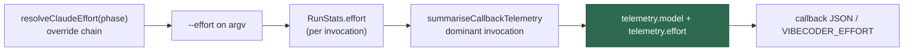

# Record the effort each run used in the post-run callback

## Summary

Part of #2573. The per-phase effort sweep on Opus 5.5 compares pilot hosts
against control hosts. The per-host fleet counters accumulate across the
`phase_effort_overrides` change on a pilot host, and no per-run record said
what effort a run was started with. So the runs a pilot host made before the
override and the runs it made after it could not be told apart.

This adds one optional field to the post-run callback: `telemetry.effort`,
exported as `VIBECODER_EFFORT`. It is the effort of the dominant invocation,
the same invocation `telemetry.model` names, so the two fields always describe
the same call. The value is the one the runner put on the command line, after
every override was applied. It is omitted when that invocation recorded none.

The callback contract is additive-only. `CALLBACK_SCHEMA_VERSION` stays at `2`,
and the compatibility test asserts that.

No default changes. `PHASE_EFFORT_DEFAULTS` is untouched, because the issue
requires the pilot figures first.

## Evidence

This is a backend change with no web interface, so there is nothing to
screenshot. The evidence is the tests:

- `run_callback_telemetry_test.ts` checks both directions. When the small
  invocation is at `high` and the large one at `medium`, the run reports
  `medium`. With the sizes swapped, it reports `high`. When the dominant
  invocation recorded no effort, the field is absent rather than borrowed from
  a smaller call. These tests failed type-checking before the field existed.
- `callback_schema_compat_test.ts` checks that `telemetry.effort` and
  `VIBECODER_EFFORT` are emitted when set and omitted when unset, and that the
  schema version is still `2`.
- The 15 callback suites, including `run_callbacks_test.ts`,
  `run_callback_context_test.ts` and `run_core_callbacks_test.ts`, pass with
  216 tests passed and 0 failed.

## Criterion 5: effort within one resumed conversation

Only `implementation` and `planning` runs join a stream conversation
(`worker/deno/lib/stream_session.ts:81-82`). A repository's blank stream is
shared by planning runs and by implementation runs of issues that have no
milestone. Before each issue, `/compact` resumes the stream under the
`compaction` phase (`worker/deno/lib/stream_compaction.ts:238`). That phase has
no `PHASE_EFFORT_DEFAULTS` row, so it resolves to `DEFAULT_EFFORT` (`high`).
`quality_fix`, `ci_fix` and `pr_feedback` never resume a stream.

Today `planning`, `issue` and `compaction` all resolve to `high`, so effort does
not change within a conversation. An arm that lowers `issue` alone, or the
planning-shaped phases alone, would introduce a change. The sweep plan on #2573
sets `compaction` alongside `issue` so that milestone streams stay on one level.

## Acceptance Criteria

This PR does not close #2573. The pilot, the decision-log rows and any default
change are still outstanding.
