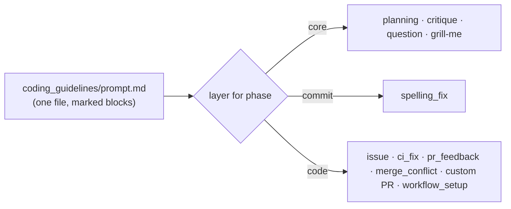

# PR Summary — Issue #2574

## Summary

The shared `coding_guidelines` block (57 KB, about 14.5k tokens) went whole to
every phase. The `issue` template also repeated about 12.5 KB of it. This PR
fixes both. Closes #2574.

- **One home per rule.** `prompts/issue/prompt.md` no longer copies these
  guideline sections: Performance Task Workflow, Issue Lifecycle, the
  `## Blocked:` deferral, Human Escalation, the three internal-dependency
  sections, the Escape Hatch body, and the two worked examples the guidelines
  already carry. The run still gets every one of those rules from its system
  prompt. The template keeps only what is specific to the issue:
  - the "this route arms that guard" lifecycle note;
  - the `gh` escalation commands, filled with `{{REPO}}` and
    `{{ISSUE_NUMBER}}`;
  - the follow-up labelling rule and hand-off comment;
  - the three worked examples the guidelines do not have.
- **Scope contradiction fixed.** The Boy Scout Rule now says "Leave the lines
  you change cleaner than you found them, and never beyond them". It no longer
  licenses tidying code the change does not touch, which **Stay in scope**
  forbids.
- **Phase-scoped layers.** `coding_guidelines/prompt.md` stays one file, so
  each rule has one home and `computeStaticPromptHash()` still covers both
  layers. It now marks blocks with `<!-- guidelines-layer: commit|code -->`.
  The new `selectCodingGuidelinesLayer()` in
  `lib/coding_guidelines_overlay.ts` keeps or drops each block by layer. It
  always strips the marker lines, and it fails loud on an unknown, nested,
  stray or unclosed marker. `CODING_GUIDELINES_LAYER_BY_PHASE` in
  `lib/prompt_builder.ts` is the one table that picks each phase's layer:
  - **core:** `planning`, `planning_critique`, `question` and `grill_me`;
  - **commit** (core plus commit safety, the run-id trailer, non-interactive
    execution and streaming reads): `spelling_fix`, because it commits;
  - **code** (every layer): `issue`, `ci_fix`, `pr_feedback`,
    `merge_conflict`, custom PR and `workflow_setup`.
- **Question carve-out kept.** Human Escalation and the Escape Hatch are core
  rules, as the issue specifies, so the `question` phase still receives them.
  The #782 carve-out sentence therefore still earns its place.
- Two dangling references were reworded so they read correctly in the core
  layer:
  - the Execution Environment note that the Playwright server is "described
    below";
  - the Escape Hatch pointer to the internal-dependency "section above".
- Docs: `docs/EXTENDING.md` § Phase-scoped coding-guidelines layers, and the
  `coding_guidelines` row in `docs/PROMPTS.md`.

## Evidence

Backend and prompt change, with no web interface to screenshot.

Sizes were measured with the Claude overlay (`provider: claude, model: opus`).
"System" is the rendered `<coding_guidelines>` block. For `grill-me`, that block
is spliced into the user template rather than the system prompt. "Template" is
the raw `prompts/<phase>/prompt.md`. Tokens use the worker's own estimate of 4
characters per token.

| Phase | System bytes before → after | System tokens before → after | Template bytes before → after | Total tokens before → after |
|---|---|---|---|---|
| issue | 58,234 → 58,380 | ~14,559 → ~14,595 | 48,117 → 35,173 | ~26,588 → ~23,389 (−12%) |
| ci_fix | 58,234 → 58,380 | ~14,559 → ~14,595 | 22,323 → 22,323 | ~20,140 → ~20,176 |
| pr_feedback | 58,234 → 58,380 | ~14,559 → ~14,595 | 11,860 → 11,860 | ~17,524 → ~17,560 |
| merge_conflict | 58,234 → 58,380 | ~14,559 → ~14,595 | 14,627 → 14,627 | ~18,216 → ~18,252 |
| workflow_setup | 58,234 → 58,380 | ~14,559 → ~14,595 | 23,215 → 23,215 | ~20,363 → ~20,399 |
| spelling_fix | 58,234 → 36,158 | ~14,559 → ~9,040 | 10,481 → 10,481 | ~17,179 → ~11,660 (−32%) |
| planning | 58,234 → 29,695 | ~14,559 → ~7,424 | 16,681 → 16,681 | ~18,729 → ~11,594 (−38%) |
| planning_critique | 58,234 → 29,695 | ~14,559 → ~7,424 | 17,883 → 17,883 | ~19,030 → ~11,895 (−37%) |
| question | 58,234 → 29,695 | ~14,559 → ~7,424 | 10,118 → 10,118 | ~17,088 → ~9,954 (−42%) |
| grill-me | 58,234 → 29,695 | ~14,559 → ~7,424 | 27,726 → 27,726 | ~21,490 → ~14,356 (−33%) |

The code-writing phases grow by 146 bytes, from the reworded Boy Scout Rule and
the two reference fixes. Their rendered guidelines are otherwise byte-identical
to before, because the marker lines are removed.

## Acceptance Criteria

- **met**: No `##` or `###` section of `prompts/issue/prompt.md` has 50% or
  more of its normalised text duplicated in the guidelines.
  - Evidence: `issue template - no section is mostly a copy of the guidelines
    (Issue #2574)`. It uses a whitespace-normalised six-word-shingle coverage
    measure, and `issue template - the duplicate detector catches a pasted
    section` proves the guard fires.
  - The highest remaining section is `## Tool Use` at 22%. Before this PR the
    worst were the internal-dependency sections at 96–100%.
- **met**: The Boy Scout Rule no longer licenses edits outside the change, and
  no rule in the rendered `issue` prompt contradicts **Stay in scope**.
  - Evidence: `guidelines - the Boy Scout Rule stays inside the change (Issue
    #2574)`.
- **met**: The rendered system prompt for `planning`, `planning_critique`,
  `question` and `grill_me` contains none of the code-only sections, and a test
  asserts the present and absent headings for each phase.
  - Evidence: `layers - planning, critique, question and grill-me get the core
    layer only`, and `layers - spelling_fix gets core plus the commit layer`.
- **met**: The rendered `issue`, `ci_fix`, `pr_feedback` and `merge_conflict`
  prompts still contain every rule, each from one source, and a test asserts
  that the union of their section headings is unchanged.
  - Evidence: `code phases - the union of rendered section headings is
    unchanged`, a 94-heading snapshot taken before the change, and `layers -
    code-writing phases get every layer, with no marker left behind`.
- **met**: The PR summary gives before and after byte counts for each phase's
  system prompt and user template.
  - Evidence: the table above.
- **met**: Each phase's system prompt is byte-identical across two builds with
  different issue numbers, and `computeStaticPromptHash()` changes when either
  layer changes.
  - Evidence: `layers - each phase's system prompt is byte-identical across
    issues`, and `layers - the static prompt hash moves when either layer
    changes`.
- **missing**: No quality regression over the next 20 planning, question and
  issue runs.
  - Reason: this can only be measured after merge, from live fleet telemetry.
    The figures belong in a comment on #2574 once 20 runs of each phase have
    completed.

## Standards Review

- Australian English throughout.
- The tests were written first. The new test file failed to compile against
  the old API, then failed on the duplicated sections.
- No behavioural instruction was deleted. Every rule removed from the issue
  template is still delivered by the guidelines in the same run.

## Test Plan

- `deno test --allow-all`, run on the 191 prompt-content test files plus 2
  further importers of the changed modules: 2,983 + 77 passed, 0 failed.
- `deno fmt`, `deno lint` and `deno check` on every changed `.ts` file.
- `npx markdownlint-cli2` on every changed `.md` file: 0 errors.
