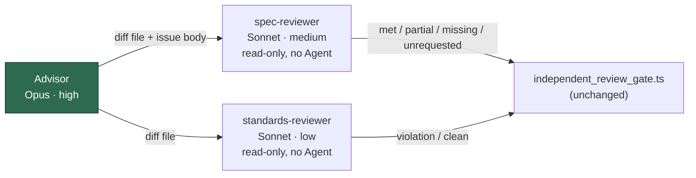

# Run the Spec/Standards reviewers as defined cheaper agents and cap sub-agent spawning (Issue #2575)

## Summary

Closes #2575.

Every criteria-bearing `issue` run dispatches two reviewer sub-agents before it
writes the PR summary. Neither had a definition, so both inherited the
advisor's model and effort: Opus 5.5 at `high` for two extra contexts on
nearly every run. This PR defines them as named `--agents` entries on a cheaper
tier, scopes the Standards reviewer as Anthropic advises, and sets Claude
Code's deterministic sub-agent spawn caps on every Claude child.

| Agent | Model | Effort | Tools |
| --- | --- | --- | --- |
| `spec-reviewer` | `sonnet` | `medium` | `Read`, `Grep`, `Glob`; `Agent` denied |
| `standards-reviewer` | `sonnet` | `low` | `Read`, `Grep`, `Glob`; `Agent` denied |

**Behind a key, off by default.** The issue's last criterion says the pilot
figures are recorded *before the change becomes the default*, and the pilot
compares the two arms. So the reviewer definitions ride a new host-wide
`issue_reviewer_agents` key (default `false`), measured with the existing
pilot method in `docs/MODEL-AND-CACHING.md`. With the key and the executor
split both off, the argv is unchanged byte for byte. The spawn caps are not
behind the key: the issue asks for them on every Claude spawn.

**Expected cost effect (key on).** Two review contexts move from Opus 5.5 at
`high` ($4/$20 per MTok) to Sonnet ($2/$10) at `medium` and `low`. That halves
the per-token price and also cuts thinking tokens. There is also a small
saving on the advisor side: it hands each reviewer a diff-file path instead of
pasting the diff. No fleet figure is claimed; the pilot produces it.

**Spawn caps (verified against the docs).** The Agent SDK page
[Cap subagent depth, concurrency, and spend](https://code.claude.com/docs/en/agent-sdk/subagents#cap-subagent-depth-concurrency-and-spend)
and the Opus 5 prompting guide name `CLAUDE_CODE_MAX_SUBAGENT_SPAWN_DEPTH`
(default 3; `1` stops sub-agents from spawning their own) and
`CLAUDE_CODE_MAX_CONCURRENT_SUBAGENTS` (default 20; a spawn past the cap is
refused with `Concurrent subagent limit reached`). Both are honoured from
Claude Code 2.1.217. The image pins 2.1.281 (`container/tools.json`) and
`softwareMinVersions.claude` is 2.1.280. The worker sets depth `1` and
concurrency `4` in `buildClaudeChildEnv`. A value already in the parent
environment wins. There is no `.config.json` key for them.

## Changes

- `worker/deno/lib/issue_executor_agents.ts` adds the two reviewer definitions
  and `buildIssueRunAgents({ executorSplit, reviewerAgents })`. It returns
  `undefined` when both switches are off.
- `worker/deno/lib/execute_claude_phase.ts` and `lib/phases/execute_phase.ts`
  build `agents` from both switches. The executor edit guard stays tied to the
  split alone.
- The `issue_reviewer_agents` key is plumbed through `config.ts`,
  `config_defaults.ts`, `config_unknown_keys.ts`, `validation.ts`, `types.ts`
  and `commands/execute_claude_phase.ts`.
- `worker/deno/lib/claude_env.ts` adds `CLAUDE_SUBAGENT_CAP_ENV`, applied to
  every Claude child.
- `prompts/issue/prompt.md` changes only the reviewer-dispatch passage. It
  dispatches `spec-reviewer` / `standards-reviewer` by `subagent_type` when the
  run defines them, and otherwise falls back to general-purpose sub-agents. It
  writes the diff to a file for read-only reviewers. It also limits the
  Standards reviewer's `violation` to documented standards that affect
  correctness, security or the stated requirements, with everything else
  `optional`.
- `worker/deno/lib/issue_executor_split_prompt.ts`: one line now says the
  reviewers run on the phase model only when the run does not define them.
- `worker/deno/lib/deepseek_executor.ts`: the `--agents` drop warning no longer
  assumes the split.
- Docs: a new `issue_reviewer_agents` row in `docs/CONFIGURATION.md`. A new
  *Reviewer sub-agents (issue phase)* section in `docs/MODEL-AND-CACHING.md`,
  covering the pilot, the cost effect and the spawn caps, plus its TOC entry
  and provider-matrix row.

## Evidence

- New `worker/deno/tests/issue_reviewer_agents_2575_test.ts` covers the
  definitions (model, effort, read-only tools, `Agent` denied), the switches in
  both directions, the default-off key, the Claude argv carrying both
  definitions, the spawn caps (set, and overridable by an explicit parent
  value), and the prompt naming the agents and scoping `violation`.
- `execute_phase` / `execute_claude_phase` split tests gain call-site tests:
  with reviewers on, the runner gets both reviewers and no executor; with
  reviewers and split on, it gets all three. The existing key-off tests
  (`agents === undefined`) pass unchanged.
- `config_defaults_test.ts` checks that `issue_reviewer_agents` defaults to
  `false` and loads `true`.
- `claude_env_test.ts` and `claude_token_isolation_test.ts` were adjusted for
  the two worker-set cap variables. The empty-environment test now expects the
  caps beside the audit switch. The credential-name helper excludes the caps,
  which are not credentials. The "exactly one credential" invariant is
  unchanged.
- `independent_review_gate_test.ts` and
  `issue_prompt_v39_independent_review_test.ts` pass unchanged.
- The targeted runs of every test file that references a touched module or
  doc all pass. `deno fmt`, `deno lint` and `deno check` are clean on the
  changed `.ts` files, and `markdownlint-cli2` is clean on the changed docs.

## Acceptance Criteria

- **met**: the Spec and Standards reviewers are dispatched as named agents
  defined through `--agents`. Each has an explicit model and effort, read-only
  tools and `Agent` denied, and a test asserts that the argv carries both
  definitions on an `issue` run. The definitions are sent only when
  `issue_reviewer_agents` is on (the pilot arm). Evidence:
  `issue_reviewer_agents_2575_test.ts::an issue run's Claude argv carries both reviewer definitions`
  and
  `execute_claude_phase_issue_executor_split_2342_test.ts::issue_reviewer_agents on hands the runner both reviewers and no executor`.
- **met**: `prompts/issue/prompt.md` names the agents, and the Standards
  reviewer's brief limits `violation` to documented standards that affect
  correctness, security or the stated requirements. Evidence:
  `issue_reviewer_agents_2575_test.ts::the prompt's Standards brief limits violation to documented, material departures`.
- **met**: Claude spawns carry deterministic sub-agent caps
  (`CLAUDE_CODE_MAX_SUBAGENT_SPAWN_DEPTH=1`,
  `CLAUDE_CODE_MAX_CONCURRENT_SUBAGENTS=4`), checked against the docs and the
  pinned CLI 2.1.281 (≥ 2.1.217). Evidence:
  `issue_reviewer_agents_2575_test.ts::every Claude child carries the deterministic sub-agent caps`.
- **met**: `independent_review_gate.ts` is untouched. Its tests and the prompt
  tests that exercise it pass unchanged, and the provenance markers are the
  same. Evidence: `independent_review_gate_test.ts`,
  `issue_prompt_v39_independent_review_test.ts::the shape it prescribes passes the live gate`.
- **missing**: no pilot figures yet. This PR cannot produce the pilot figures
  for success rate, first-attempt gate pass rate and missed-criterion
  reopen/`needs-revision` share. They need a 30-run or 4-week fleet window. The
  change therefore ships off by default (`issue_reviewer_agents: false`), so
  it does not become the default before those figures are recorded on #2575.

## Standards Review

- **clean**: Australian English, TDD (a failing test first, and both
  directions: key off leaves no `--agents`, key on sends the definitions),
  KISS (no new module, reusing `issue_executor_agents.ts`), and no host env
  var for an operator setting (the key is in `.config.json`; the caps are
  spawn env).

🤖 Generated with [Claude Code](https://claude.com/claude-code)
