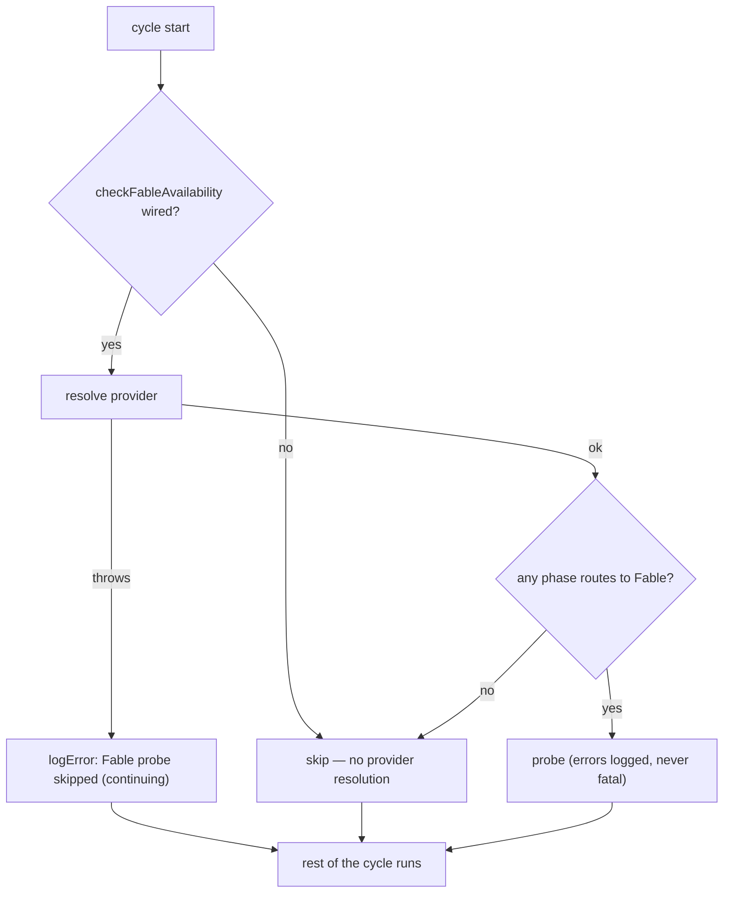

# PR Summary — Issue #2586

## Summary

Closes #2586.

PR #2564 made every `runCoreLoop` cycle call `selectAgentProvider()`
unconditionally, before checking whether the Fable probe was wired at all. When
that resolution threw, the cycle's catch-all turned the fault into
`Fatal error in main loop` and the run aborted. For example, a provider override
left behind by an earlier test named `codex` on a claude-only image. On `main`
this failed 28 of the 67 `run_core_test.ts` tests, depending on test order.

The fix, in `worker/deno/lib/run_core.ts`:

- **Short-circuit.** The provider is resolved only when
  `deps.checkFableAvailability` is wired.
- **Fail loud, not fatal.** A resolution fault is logged with
  `Fable probe skipped: could not resolve the agent provider (continuing): …`.
  The probe is skipped and the cycle carries on, the same way the other
  best-effort per-cycle steps behave (`bindGraftRun`, `prepareCodegraphRun`).
- **Seam.** A new optional dep, `resolveFableRoutingProvider`, defaults to
  `selectAgentProvider`. The regression tests use it to inject a throwing
  resolver instead of mutating `Deno.env` (Issue #880).

No documented usage changed, so no docs needed updating.

## Evidence

This is a backend-only change, so there are no screenshots. The evidence is
tests only.

- `deno task test tests/run_core_test.ts`: 69 passed, 0 failed. That is the 67
  existing tests plus 2 new regression tests. Before the fix, 28 failed on
  `main`.
- `tests/parallel_safety_cap_test.ts` passes. The new tests do not touch
  `Deno.env`.
- `deno task check`, `deno task lint` and `deno task check:manifests` are clean.

## Reproduction

- **symptom** — on `main`, `deno task test tests/run_core_test.ts` fails 28 of
  67 tests with
  `Fatal error in main loop: The running container image did not install the "codex" coding-agent provider.`
  The cycle calls `selectAgentProvider()` every time, even with no Fable probe
  wired. When that call throws, the whole cycle aborts.
- **status** — `verified` — the regression test was observed failing against the
  unfixed code and passing after the fix. The run swapped in `origin/main`'s
  `worker/deno/lib/run_core.ts` and ran
  `deno test -A --no-check --filter "Issue #2586" tests/run_core_test.ts`. The
  test failed with
  `AssertionError: the resolution fault must be logged, got: []`. With the fixed
  `run_core.ts` both #2586 tests pass.
- **regression test** —
  `worker/deno/tests/run_core_test.ts::run_core - an unresolvable provider skips the Fable probe loudly and the cycle continues (Issue #2586)`
- **companion test** —
  `worker/deno/tests/run_core_test.ts::run_core - an unresolvable provider does not abort the cycle when the Fable probe is unwired (Issue #2586)`
  pins the short-circuit: no provider is resolved when the probe is unwired. Run
  alone, it also passes against the unfixed code, because the old code never
  calls the injected resolver. It guards the fix but does not reproduce the
  symptom by itself.

## Test Plan

- [x] `deno task test tests/run_core_test.ts tests/parallel_safety_cap_test.ts`
- [x] `deno task check` / `deno task lint` / `deno fmt --check`
- [x] `deno task check:manifests`
- [x] `./quality.sh < /dev/null`
