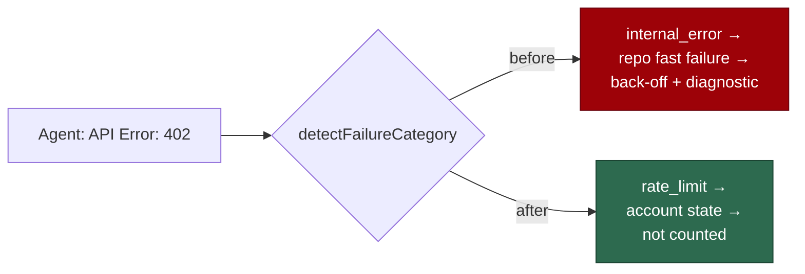

# PR Summary — Issue #2590

## Summary

`stSoftwareAU/GRQ-AutoTrader` was backed off as a repository that "fails at
setup", but the repository was fine. Its release comments (#948, #966, #1011,
#941, each 11–13 s) show the agent CLI returned `API Error: 402`, which is an
account payment refusal. Two defects turned that into a repository diagnostic
whose last error was only `
`. Closes #2590.

- **Wrong category.** `detectFailureCategory()` matched the generic `Error:`
  rule, so a payment refusal became `internal_error`. That category counts
  towards the fast-failure back-off. Out of credit is now `rate_limit`: account
  state that never counts against a repository.
- **One out-of-credit detector.** The billing regex has moved from
  `run_outcome_classifier.ts` to `isOutOfCreditMessage()` in
  `failure_diagnosis.ts`, which adds a line-anchored `API Error: 402`. The
  classifier's `rate_limit` branch uses it too, so a payment refusal is still
  classed `out-of-credit` rather than `usage-limit`.
- **Useless detail line.** `diagnosticErrorLine()` picked the last line of the
  failure message. That was the `
` closing the collapsible block
  the worker wraps around the agent's output. `
`, `
` and
  code-fence lines are now skipped as scaffolding.
- **Docs.** The fast-failure section of `docs/CONFIGURATION.md` covers both
  rules.

## Evidence

This is a backend-only change, so the tests are the evidence. On the base
commit the new tracker and diagnosis tests failed: 4 failed and 113 passed. The
"402 elsewhere" guard passed. After the change:

- `deno test -A` passes 178 of 178 across `failure_diagnosis`,
  `repo_fast_failure_tracker`, `run_outcome_classifier`,
  `coding_failure_ladder` and `repo_fast_failure_issue`.
- The neighbouring rate-limit, usage-limit, quorum and infra-retry suites pass
  126 of 126.
- `deno fmt` and `deno lint` are clean.

## Reproduction

- **Symptom:** a healthy repository is backed off after three agent-API
  payment refusals of about 12 s each. Its diagnostic's "Last error" is
  `
`.
- **Status:** verified. The regression tests reproduce the real release-message
  layout, failed before the fix and pass after it.
- **Regression test:** `worker/deno/tests/repo_fast_failure_tracker_test.ts::isFastFailure - an agent-API payment refusal is not the repository's fault (Issue #2590)`.
  The other regression tests are:
  - `repo_fast_failure_tracker_test.ts::diagnosticErrorLine - markdown scaffolding does not displace the agent's error (Issue #2590)`
  - `repo_fast_failure_tracker_test.ts::diagnosticErrorLine - a fenced block keeps its content, not the fence (Issue #2590)`
  - `failure_diagnosis_test.ts::failure diagnosis - an agent-API payment refusal is an account limit (Issue #2590)`
  - `failure_diagnosis_test.ts::failure diagnosis - a 402 elsewhere in the text is not a payment refusal (Issue #2590)`
  - `run_outcome_classifier_test.ts::run failure classifier - a payment refusal categorised rate_limit keeps out-of-credit (Issue #2590)`

## Test Plan

- [x] Watched the new tests fail before the fix and pass after it.
- [x] Ran the targeted suites plus the rate-limit and classifier neighbours.
- [x] `deno fmt` and `deno lint`.
- [ ] Run `./quality.sh`. `run_core_test.ts` already has 28 failures on main,
      tracked in #2586; they are not affected by this change.
