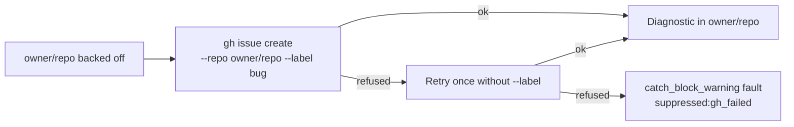

# PR Summary — Issue #2592

## Summary

Closes #2592.

The diagnostic for a backed-off repository `owner/repo` is now filed in
`owner/repo` itself. It is never filed in `stSoftwareAU/VibeCoder`.

- `resolveRepoFastFailureTarget(repo)` now returns the monitored repository.
  - The per-repo opt-in `fast_failure_diagnostics_here` has been removed, along
    with `RepoConfig.fastFailureDiagnosticsHere` and its `REPO_CONFIG_KEY_MAP`
    entry.
  - The `repoConfigs` option of `fileRepoFastFailureIssue` has been removed too.
- If the repository refuses `gh issue create --label bug`, the create is retried
  exactly once without `--label`.
  - If the retry fails as well, the worker records a `catch_block_warning` fault
    and returns `suppressed:gh_failed`.
  - Nothing falls back to VibeCoder.
- The dedup marker `<!-- VIBE_REPO_FAST_FAILURE:owner/repo -->` is unchanged.
- The docs now describe this policy:
  - the "Where it is filed" text in `docs/CONFIGURATION.md`, now with a Mermaid
    flow;
  - the `repo_config` table row has been removed;
  - the module doc comment;
  - the `SELF_DIAGNOSTIC_FAMILIES` comment in `self_diagnostic_provenance.ts`.

### Replaced tests (documented, not silently removed)

| Old test (Issue #1950)                               | Replacement (Issue #2592)                                           |
| ---------------------------------------------------- | ------------------------------------------------------------------- |
| `resolveRepoFastFailureTarget` defaults to VibeCoder | `resolveRepoFastFailureTarget - is always the monitored repository` |
| `resolveRepoFastFailureTarget` honours the opt-in    | (same test as above: the opt-in no longer exists)                   |
| `repo_config targets the affected repository`        | `searches and files in the monitored repository, never VibeCoder`   |
| `config` maps `fast_failure_diagnostics_here`        | `config - loadConfig no longer maps fast_failure_diagnostics_here`  |

New tests:

- `a refused label is retried once without --label`
- `both create attempts failing is suppressed, with no VibeCoder fallback`

### Deviation: a leftover key is inert, not warned

The issue assumed the Issue #1334 unknown-key warning would flag a leftover
`fast_failure_diagnostics_here`. In fact that detection checks only top-level
keys and a few fixed nested blocks. `repo_config` entries are deliberately
free-form: `normaliseRepoConfig` keeps unknown keys as they are, and nothing
reads them.

So a stale key in an operator's `.config.json` is harmless and silently ignored.
Adding a `repo_config` key validator would be a separate change, so it is left
for a follow-up.

## Evidence

- `deno task test tests/repo_fast_failure_issue_test.ts tests/config_test.ts`:
  `ok | 130 passed | 0 failed`. All five #2592 tests pass.
- `./quality.sh < /dev/null` finished with
  `Result: PASSED (with skipped checks)`:
  - deno tests: parallel run PASSED in 4m33s, serial run PASSED in 1m18s;
  - lint, type check, fmt, mermaid, markdownlint and semgrep all PASSED;
  - `config integration` was SKIPPED because no `.config.json` exists in the
    container.

## Test Plan

- [x] The target is the monitored repository, and VibeCoder is never searched or
      filed into.
- [x] A refused label is retried once without `--label`, and no fault is
      recorded.
- [x] When both creates fail: one `catch_block_warning` fault,
      `suppressed:gh_failed`, and no fallback.
- [x] `fast_failure_diagnostics_here` is no longer mapped into `RepoConfig`.
- [x] The full quality gate is green.
