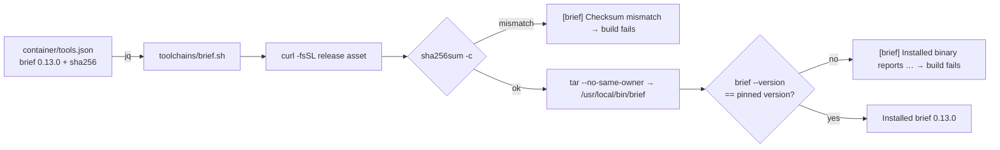

# PR Summary — Issue #2601

## Summary

This PR pins git-pkgs/brief v0.13.0 in the worker image, installed the same way RTK is. It adds a `brief` toolchain entry to `container/tools.json` and a new `container/toolchains/brief.sh` fragment. The fragment reads the pins with `jq`, downloads the release, checks it with `sha256sum -c`, extracts it with `tar --no-same-owner` and installs the bare binary to `/usr/local/bin/brief`. The build stops loudly with a `[brief]`-prefixed message in any of these cases:

- a pin is missing;
- the architecture is not supported;
- the checksum does not match;
- the archive layout is not the expected one;
- the installed binary reports a different version.

`brief` is added to the Containerfile's `install-toolchains.sh` id list, after `rtk`, with a comment block. `container/toolchains/brief.sh` is added to `CONTAINER_IMAGE_INPUTS`, so editing it changes the image tag. The real `--version` output is recorded as the start-up self-check fixture, and the dependency inventory is regenerated. Only the binary is installed: `enrich` and remote scans are not configured. Closes #2601.

## Evidence

I checked the pins against the upstream v0.13.0 release:

- **Assets:** the Linux assets are `brief_0.13.0_linux_amd64.tar.gz` and `brief_0.13.0_linux_arm64.tar.gz`.
- **Checksums:** both SHA-256 digests match the release's `checksums.txt` and the downloaded bytes.
- **Layout:** each tarball has a bare `brief` binary at its top level, next to `LICENSE` and `README.md`.
- **Version flag:** `brief --version` prints `brief 0.13.0`.

I ran the real fragment end to end on an aarch64 host, with only `install` redirected to a temp directory:

```text
[brief] Installing 0.13.0 for arm64
/tmp/tmp.nw0YQjaRS9/brief.tar.gz: OK
[brief] Installed brief 0.13.0
```

The same run with the arm64 pin changed:

```text
/tmp/tmp.Jl0NgvVaSU/brief.tar.gz: FAILED
sha256sum: WARNING: 1 computed checksum did NOT match
[brief] Checksum mismatch for brief 0.13.0 (arm64) — the download does not match the sha256 pin in …/bad.json
```

`./quality.sh` passed after the final edit. `config integration` was skipped, as it is on every run here.



## Acceptance Criteria

<!-- vibe-spec-review inputs="diff+issue-body" -->

- **partial** — The image builds on amd64 and arm64, and the version command inside the image prints `0.13.0` — evidence: `container/tools.json`, `worker/deno/tests/toolchain_selfcheck_test.ts` fixture `brief 0.13.0`, and the real fragment run on arm64 above — reviewer: partial — reason: no full image build ran in this environment on either architecture; CI's image build is the remaining check
- **met** — Altering either `sha256` pin in `container/tools.json` makes the image build fail with a message that names brief — evidence: `worker/deno/tests/install_toolchains_test.ts::container/toolchains/brief.sh - a checksum mismatch aborts before extracting, naming brief` — reviewer: met
- **met** — Altering the pinned `version` makes the post-install version assertion fail the build — evidence: `worker/deno/tests/install_toolchains_test.ts::container/toolchains/brief.sh - an altered version pin fails the post-install assertion` — reviewer: met
- **met** — `deno test worker/deno/tests/container_manifest_test.ts` passes with the new entry — evidence: `worker/deno/tests/container_manifest_test.ts` (127 passed) — reviewer: met
- **met** — Tests and quality checks pass — evidence: `./quality.sh` passed after the final edit — reviewer: met
- **unrequested** — the version assertion matches the pinned version as a whole space-separated token, which is stricter than `rtk.sh`'s substring match — reviewer: unrequested — reason: stops a pin such as `3.0` from passing against `brief 0.13.0`; covered by its own test
- **unrequested** — extra fragment tests: a missing pin, a missing version, an unsupported architecture, the wrong archive layout and the happy path — reviewer: unrequested — reason: they mirror the existing RTK fragment tests, so the new fragment gets the same failure-path coverage
- **unrequested** — updates to `docs/CONTAINER.md` and `docs/CONTAINER-IMAGE.md` — reviewer: unrequested — reason: the issue names `docs/` as a file area, and a code change owes a docs change

## Standards Review

<!-- vibe-standards-review inputs="diff+CODING-STANDARDS.md" -->

- **violation** — Quality Gates: the self-check test had no `REAL_IMAGE_OUTPUT` fixture for `brief` — evidence: `worker/deno/tests/toolchain_selfcheck_test.ts:307` — reason: fixed in this diff by adding `brief: { command: "brief 0.13.0\n" }`
- **violation** — Quality Gates / correctness: `brief.sh` was missing from `CONTAINER_IMAGE_INPUTS`, so editing it would not rebuild the image — evidence: `worker/deno/lib/container_image_hash.ts:101` — reason: fixed in this diff by adding the path
- **violation** — A Code Change Owes a Docs Change: `docs/audits/dependency-inventory.md` had no `brief` row — evidence: `docs/audits/dependency-inventory.md:53` — reason: fixed in this diff by regenerating it with `supply-chain-gate --write-inventory`
- **clean** — the reviewer checked these and found them compliant:
  - fails loud on every failure path;
  - exact version plus per-architecture SHA-256, verified before extraction;
  - `--no-same-owner` on extraction and trap cleanup of the temp directory;
  - stdin redirected from `/dev/null`;
  - Australian English;
  - DRY: the pins are read from `tools.json`;
  - KISS;
  - behavioural tests, no grepping of source;
  - `brief` kept out of `REQUIRED_REPO_TOOLCHAIN_COMMANDS`.

  The reviewer also said the version-check comment overstated parity with the self-check; that comment is reworded in this diff.

## Test Plan

These tests are new in `worker/deno/tests/install_toolchains_test.ts`, all prefixed `container/toolchains/brief.sh - `:

- `a verified archive reporting the pinned version installs`
- `a missing pin aborts before downloading`
- `a missing version pin aborts, naming it`
- `an unsupported architecture aborts, naming it`
- `a checksum mismatch aborts before extracting, naming brief`
- `an archive without brief at its top level aborts`
- `an altered version pin fails the post-install assertion`
- `a pin matching only part of the reported version fails`

Existing suites that now cover the new entry:

- `container_manifest_test.ts` checks that the fragment and manifest agree and that the Containerfile id list includes brief.
- `toolchain_selfcheck_test.ts` gains a real-output fixture.
- `container_image_hash_test.ts` checks the image inputs.
- `supply_chain_gate_test.ts` checks the inventory.

🤖 Generated with [Claude Code](https://claude.com/claude-code)
