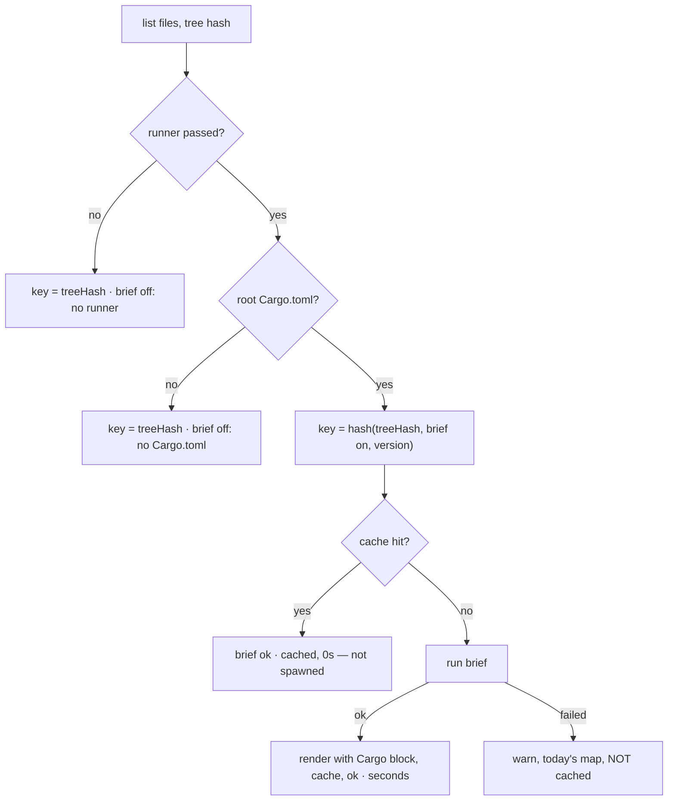

## Summary

Adds a brief runner and an optional "Cargo commands (from brief)" block to the
codebase map. Nothing calls it yet: the next #2581 sub-issue adds the switch,
the wiring and the reporting. A caller that passes no runner gets today's map,
today's cache key and today's behaviour. Closes #2602.

- **`worker/deno/lib/brief_toolchain.ts` (new).**
  - `createBriefRunner` spawns `brief --json <absolute repo path>` through a
    spawn seam (`runWithTimeout` by default, `DEFAULT_SUBPROCESS_TIMEOUT_MS`).
    It uses a fixed argv and no shell, and never builds a network subcommand.
  - In brief v0.13.0 (`cmd/brief/main.go`) the offline scan is the default
    command, not a named subcommand. `--json` forces the report format.
  - The runner returns `{status:"ok", commands, seconds}` or
    `{status:"failed", reason}` and never throws.
  - The allowlist keeps strings that start with `cargo `. It drops any string
    with Unicode `Cc`/`Cf`/`Zl`/`Zp`/`Co` characters or a backtick, drops
    commands over 200 characters, keeps at most 20 commands and removes
    duplicates.
- **`codebase_map.ts`.** New optional `briefCommands` option. When it is
  present and non-empty, `renderCodebaseMap` adds the block straight after
  `## Commands` and applies the allowlist again first.
- **`codebase_map_cache.ts`.** New optional `brief: {runner, version}` and
  `warn` options.
  - The runner is called only when the repo root has a `Cargo.toml`. It is then
    part of the cache key: `hash(treeHash, brief on, version)`.
  - A failed run logs a warning, falls back to today's map and is not cached.
  - The result carries a new `brief` outcome: `ok` with `seconds`, `ok` with
    `cached:true, seconds:0`, `failed`, `off` with reason `no Cargo.toml`, or
    `off` with reason `no runner`.
- **Sweep ledger.** New `top-up-2602` slice plus
  `docs/audits/security-sweep-2602-brief-toolchain.md`. A short note in
  `docs/MODEL-AND-CACHING.md`.

## Evidence

Backend only, with no UI to screenshot. The tests call the real runner, the
renderer and the cache against temporary git repositories, with brief stubbed
at the spawn seam.

Full `./quality.sh` run: every stage passed except markdownlint, which flagged
MD018 on a wrapped `#2581` in the new audit record. That line was fixed and
`markdownlint-cli2` was re-run on the file with 0 issues.

## Acceptance Criteria

<!-- vibe-spec-review inputs="diff+issue-body" -->

- **met** — exact argv to the spawn seam (binary, offline scan, repo path), no shell, no network subcommand — evidence: `worker/deno/tests/brief_toolchain_test.ts::createBriefRunner - spawns brief with the fixed offline scan argv and no shell`, `::briefScanArgs - never names a network-facing subcommand` — reviewer: met — reason: the reviewer could not confirm the offline form against v0.13.0. Confirmed here from `cmd/brief/main.go@v0.13.0`: no subcommand falls through to `cmdScan`.
- **met** — non-Cargo lines, control characters and over-long lines are filtered, and only allowlisted, capped Cargo commands survive — evidence: `brief_toolchain_test.ts::extractCargoCommands - keeps only allowlisted, capped Cargo commands`, `::sanitiseCargoCommands - caps the command count` — reviewer: met
- **met** — with no runner the map and the cache key are byte-identical to today's (Rust and non-Rust fixtures) — evidence: `codebase_map_test.ts::renderCodebaseMap - with no brief commands the map is byte-identical to today's` (golden strings captured from the pre-change renderer), `codebase_map_cache_test.ts::getOrGenerateCodebaseMap - with no runner the map, key and outcome are today's` — reviewer: met
- **met** — a stub runner returning `ok` adds the Cargo block and the outcome carries `seconds` — evidence: `codebase_map_cache_test.ts::getOrGenerateCodebaseMap - an ok brief run adds the Cargo block and reports seconds` — reviewer: met
- **met** — without a `Cargo.toml` the runner is never called, the map is today's and the outcome is `off` with reason `no Cargo.toml` — evidence: `codebase_map_cache_test.ts::getOrGenerateCodebaseMap - no Cargo.toml never calls the runner` — reviewer: met
- **met** — a failed stub (missing binary, non-zero exit or timeout) gives today's map plus a warning, outcome `failed`, and nothing cached — evidence: `codebase_map_cache_test.ts::getOrGenerateCodebaseMap - a failed brief run warns, renders today's map and is not cached` — reviewer: met
- **met** — a cache hit with brief on returns `ok` with `cached:true, seconds:0` without spawning, and a new version misses — evidence: `codebase_map_cache_test.ts::getOrGenerateCodebaseMap - a brief cache hit does not spawn brief; a new version misses` — reviewer: met
- **met** — tests and quality checks pass — evidence: full `./quality.sh` run. All stages passed; the one markdownlint finding was fixed and re-checked clean — reviewer: met
- **unrequested** — a paragraph in `docs/MODEL-AND-CACHING.md` — reviewer: unrequested — reason: the standard that a code change owes a docs change; `docs/` is in the issue's file area
- **unrequested** — the absolute-path guard in `createBriefRunner` — reviewer: unrequested — reason: stops brief reading the path as a URL or registry shorthand, which would reach the network
- **unrequested** — the wider allowlist (format/bidi/tag characters, backticks, dedupe, trim), applied again at render time — reviewer: unrequested — reason: the output is injected into the prompt, so the input is validated at the trust boundary
- **unrequested** — the `warn` option and the `runBrief` throw-to-`failed` wrapper — reviewer: unrequested — reason: a seam for the warning assertion; the wrapper enforces "never throw into the caller" even for a non-conforming runner
- **unrequested** — exported helpers and constants (`briefScanArgs`, `extractCargoCommands`, `sanitiseCargoCommands`, `BriefSpawn`, `MAX_*`, `timeoutMs`/`now` options) — reviewer: unrequested — reason: test seams and the shared allowlist the renderer reuses
- **unrequested** — reasons squashed to one line and capped at 200 characters, including the first line of stderr — reviewer: unrequested — reason: keeps the warning and the later run-stats line short, as the issue's "short reason" asks
- **unrequested** — `CachedCodebaseMap.brief` is required, not optional — reviewer: unrequested — reason: every path sets an outcome; the only consumer (`execute_claude_phase.ts`) is unaffected
- **unrequested** — the "brief map is keyed apart from today's map" test and the Mermaid diagram in the module header — reviewer: unrequested — reason: backs the cache-key requirement and documents the flow

## Standards Review

<!-- vibe-standards-review inputs="diff+CODING-STANDARDS.md" -->

- **violation** — a new `lib/` module must be claimed by a sweep slice — evidence: `worker/deno/lib/brief_toolchain.ts` (`deno task check:manifests` failed) — reason: fixed in this diff. The `top-up-2602` slice is in `docs/audits/lib-sweep-coverage.json` (`sweptAt` = merge-base with `origin/main`) with the written record `docs/audits/security-sweep-2602-brief-toolchain.md`. `check:manifests` now passes.
- **violation** — incomplete input validation at the prompt trust boundary: Unicode tag characters (U+E0000–E007F) and the soft hyphen got past the character filter — evidence: `worker/deno/lib/brief_toolchain.ts:46-47` — reason: fixed in this diff. The filter is now `/[\p{Cc}\p{Cf}\p{Zl}\p{Zp}\p{Co}]/u`, with the regression test `brief_toolchain_test.ts::sanitiseCargoCommands - drops tag characters and soft hyphens`.
- **clean** — Australian English; fail-loud failures (`failed` is logged at WARN and never cached); secret redaction through `createLogger`; `Result` for parse errors; injected spawn and clock seams with no sleeps or real processes; the tests call real code; no hidden files staged; no-runner golden output pinned. Optional note, not chased: shell metacharacters after `cargo ` survive the filter. The commands are documentation the agent reads, like the existing `deno task` and npm lines, and the audit record says so.

## Test Plan

- New `worker/deno/tests/brief_toolchain_test.ts` (16 tests): argv, remote-path refusal, timeout option, the `ok` result with seconds, missing binary, a thrown spawn, non-zero exit, timeout, unparseable output, the allowlist, the count cap, bidi/zero-width/tag/soft-hyphen characters, and the empty report.
- `worker/deno/tests/codebase_map_test.ts`: byte-identical golden maps (Rust and Deno fixtures), block placement, and the allowlist applied again at render time.
- `worker/deno/tests/codebase_map_cache_test.ts`: the no-runner key and outcome, the `ok` block with seconds, no `Cargo.toml`, failures not cached, a thrown runner, a cache hit that does not spawn and a version bump that misses, and keys kept separate.
