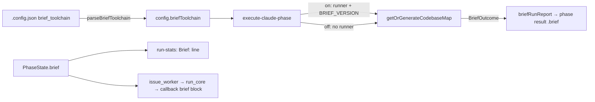

# PR summary — Issue #2603

## Summary

This PR adds the per-host `brief_toolchain` switch to `.config.json`. It is off by default and parsed fail-loud. The PR also records brief's outcome as a `Brief:` run-stats line and an additive `brief` block in the run callback. Closes #2603.

- **Config.** The new `worker/deno/lib/brief_toolchain_config.ts` adds `parseBriefToolchain`, `BRIEF_TOOLCHAIN_KEYS` and `defaultBriefToolchain`. `loadConfig` throws, naming `brief_toolchain`, on:
  - a non-object or `null` block;
  - a non-boolean `enabled`;
  - any unknown key.

  The parsed value is `config.briefToolchain`.
- **Threading.** `execute-claude-phase` passes `briefToolchainEnabled`. `runExecuteClaudePhase` gives `getOrGenerateCodebaseMap` a brief runner and `BRIEF_VERSION` only while the switch is on. It returns `brief: BriefRunReport` on the phase result through the `CodegraphCarrier`. The issue worker, `run_core` and the production callback wiring carry `brief` the same way `rtk` is carried.
- **Stats line.** `BRIEF_STATS_PREFIX` and `buildBriefStatsLine` render one of these lines, or no line when the switch is off:
  - `- **Brief:** ok (1.5s)`
  - `ok (cached)`
  - ``failed — `<reason>` ``
  - `off — no Cargo.toml`
- **Callback.** `BRIEF_OFF`, `briefNotRun`, `briefBlock()` and `VIBECODER_BRIEF_ENABLED` are added. The block is `{enabled, status, seconds?, cached?, reason?}`. It is appended last, and `schemaVersion` stays at 2.

**Known gap (filed as #2621).** Only the `execute-claude-phase` path renders the codebase map. The main-loop implementation phase (`lib/phases/execute_phase.ts`) builds no map at all. On the main loop, therefore:
- `PhaseState.brief` is never set, so no `Brief:` line is posted;
- the callback reads `{enabled:<switch>,status:"off"}`.

The issue prescribed exactly this threading. Wiring the map into the main loop would change every implementation prompt fleet-wide, which needs a human decision, so it is tracked in #2621. The switch stays off everywhere until then, so nothing changes today.

## Evidence

This is a backend/CLI change with no UI, so there is no screenshot. It is verified by the tests below and a full `./quality.sh` run.

## Acceptance Criteria

<!-- vibe-spec-review inputs="diff+issue-body" -->

- **met** — `brief_toolchain` absent → `enabled:false`; `{"enabled":true}` → on; an unknown key or `"enabled":"yes"` fails config load naming `brief_toolchain` — evidence: `worker/deno/tests/brief_toolchain_config_test.ts::loadConfig - an unknown brief_toolchain key fails the load` — reviewer: met
- **met** — switch off: map, stats comment and callback byte-identical apart from `brief:{enabled:false,status:"off"}`, brief never spawned — evidence: `worker/deno/tests/execute_claude_phase_codebase_map_test.ts::brief switch off: brief never spawned and the map is today's`, `issue_run_stats_comment_test.ts::brief line - no line at all when the switch is off` — reviewer: met
- **partial** — switch on, Rust repo, brief succeeds: Cargo block, `Brief: ok (<n>s)`, callback `status:"ok",seconds:n` — evidence: `execute_claude_phase_codebase_map_test.ts::brief switch on, Rust repo: the map carries the Cargo block`, `issue_run_stats_comment_test.ts::brief line - ok reports the seconds brief took`, `run_callbacks_test.ts::the brief block carries each outcome of the trial` — reviewer: partial — reason: each surface is proven, but no production run reaches the stats comment or callback, because the main-loop phase builds no map (#2621)
- **partial** — switch on, brief missing or non-zero: today's map, `Brief: failed — <reason>`, callback `failed`, run not failed — evidence: `execute_claude_phase_codebase_map_test.ts::brief switch on, brief fails: today's map, failed, run not failed` — reviewer: partial — reason: same main-loop gap (#2621). The reviewer also noted the reason is wrapped in a code span (``failed — `<reason>` ``). That is kept on purpose, because the reason is brief's stderr going into a GitHub comment and the span neutralises mentions and markup.
- **partial** — switch on, no `Cargo.toml`: `Brief: off — no Cargo.toml`, callback `{enabled:true,status:"off"}` — evidence: `execute_claude_phase_codebase_map_test.ts::brief switch on, no Cargo.toml: off, brief not spawned`, `issue_run_stats_comment_test.ts::brief line - switched on with no Cargo.toml says off and why` — reviewer: partial — reason: the stats line is never posted by a production run until #2621
- **partial** — switch on, cache hit: `Brief: ok (cached)`, callback `cached:true, seconds:0` — evidence: `execute_claude_phase_codebase_map_test.ts::brief switch on, cache hit: ok, cached, brief not spawned again`, `issue_run_stats_comment_test.ts::brief line - a cache hit says cached, not a time` — reviewer: partial — reason: same main-loop gap (#2621)
- **met** — tests and quality checks pass — evidence: full `./quality.sh` run after the final edit — reviewer: partial — reason: the reviewer caught a `deno fmt` import-order failure in `brief_toolchain_test.ts`. That is fixed in this diff, and the gate was re-run.
- **unrequested** — `BRIEF_VERSION` constant with a drift test against `container/tools.json` — reviewer: unrequested — reason: the #2602 map API requires a version for the cache key; the test stops the pin and the key drifting apart
- **unrequested** — `BriefRunReport` / `briefRunReport()` in `brief_toolchain.ts` — reviewer: unrequested — reason: the glue from the map's `BriefOutcome` to the report the stats line and callback share
- **unrequested** — `briefNotRun()` and its wiring in `run_core_production_deps.ts` — reviewer: unrequested — reason: mirrors `rtkNotRun`, so a switched-on host's early exit is never archived as `enabled:false`
- **unrequested** — `brief` fed to the stats comment from `completion_phase.ts` and `handle_no_changes_phase.ts`, plus the `PhaseState.brief` / `WorkOnIssueResult.brief` fields — reviewer: unrequested — reason: the stats comment is posted only from those two wrap-ups, not from `issue_worker.ts` as the issue assumed, so they are the stats feed
- **unrequested** — the stats-line failure reason is rendered in a code span with backticks and line breaks stripped, and the callback `reason` is passed through `redactSecrets()` — reviewer: unrequested — reason: output encoding for external-tool text going to a GitHub comment and to operator hooks
- **unrequested** — an explicit `null` block is refused, and errors name the rejected JSON type — reviewer: unrequested — reason: same fail-loud posture as `rtk_output`
- **unrequested** — `brief_toolchain` added to `KNOWN_CONFIG_KEYS` and `config_defaults.ts` — reviewer: unrequested — reason: required for the key to load without an unknown-key warning and for the one-source default
- **unrequested** — key-order pins in `callback_schema_compat_test.ts` and `worker_build_callback_2444_test.ts` moved one place, and tests added in `run_core_callbacks_test.ts`, `completion_phase_run_stats_test.ts` and `brief_toolchain_test.ts` — reviewer: unrequested — reason: `brief` is appended after `rtk`; the business rule "additive block appended last" is unchanged, only the last key's name
- **unrequested** — the `top-up-2603` sweep-ledger slice and `docs/audits/security-sweep-2603-brief-toolchain-config.md` — reviewer: unrequested — reason: `check:manifests` requires every new `lib/` module to be claimed by a sweep slice

## Standards Review

<!-- vibe-standards-review inputs="diff+CODING-STANDARDS.md" -->

- **violation** — quality gate: new `lib/brief_toolchain_config.ts` claimed by no sweep slice — evidence: `worker/deno/tests/lib_sweep_coverage_test.ts:472` — reason: fixed here with the `top-up-2603` slice and its written record
- **violation** — quality gate: `deno fmt --check` import order — evidence: `worker/deno/tests/brief_toolchain_test.ts:20` — reason: fixed here
- **violation** — requirements, and "A Code Change Owes a Docs Change": `PhaseState.brief` is never set in production, because only `execute-claude-phase` builds the map — evidence: `worker/deno/lib/issue_worker_types.ts:303`, `worker/deno/lib/execute_claude_phase.ts` — reason: this stands. The issue prescribed this threading, and wiring the map into the main loop needs a product decision. It is filed as #2621, and `docs/CONFIGURATION.md` now states that the map is rendered by the `execute-claude-phase` path only.
- **clean** — The reviewer checked these and found them compliant:
  - fail-loud config parsing, with the default from `config_defaults.ts`;
  - `Result` for parse faults;
  - the additive callback contract, with `schemaVersion` at 2;
  - brief failures warn and never fail the run;
  - output encoding of the stats-line reason;
  - tests call real functions with injected runners, with no real `brief` spawn;
  - Australian English.

  Optional notes: `issue_worker.ts` builds `{status:"off",enabled}` inline, as RTK does. The reviewer also suggested redacting the callback reason, and that is now done.

## Test Plan

- New: `worker/deno/tests/brief_toolchain_config_test.ts`, covering the parser and `loadConfig`: absent, true/false, non-boolean, non-object, `null`, unknown key.
- `worker/deno/tests/execute_claude_phase_codebase_map_test.ts`: switch off (brief not spawned, map unchanged), ok, failed (with a warning, run not failed), no `Cargo.toml`, cache hit.
- `worker/deno/tests/issue_run_stats_comment_test.ts`: each `Brief:` line form, no line when off (byte-identical), code-span escaping, position after `RTK:`, the tally ignores the line, and the post path.
- `worker/deno/tests/run_callbacks_test.ts`: every block shape, `BRIEF_OFF` last, `briefNotRun`, `VIBECODER_BRIEF_ENABLED`, reason redaction, and `workOnIssue` reporting the host switch.
- `worker/deno/tests/brief_toolchain_test.ts`: `briefRunReport` mapping, and `BRIEF_VERSION` matching `container/tools.json`.
- `worker/deno/tests/run_core_callbacks_test.ts` and `worker/deno/tests/completion_phase_run_stats_test.ts`: `brief` carried to the terminal run and to the stats comment.
- Updated key-order pins: `callback_schema_compat_test.ts` and `worker_build_callback_2444_test.ts`, now expecting `brief` last, `rtk` second-last and `codegraph` third-last.
