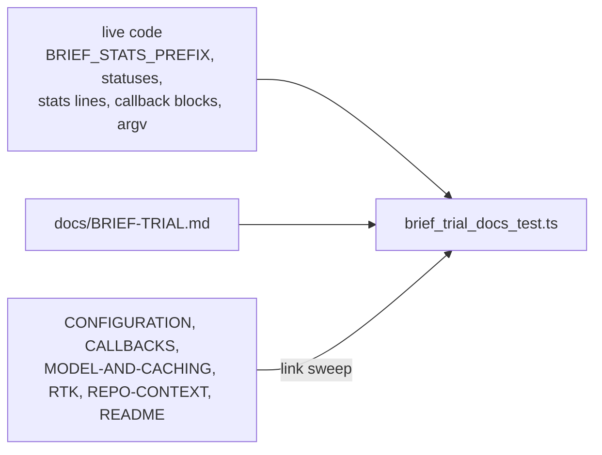

# PR summary — Issue #2604

## Summary

Adds `docs/BRIEF-TRIAL.md`, the protocol the brief trial (#2581) is judged by, with a drift test that ties it to the live code. Closes #2604.

- **The page.** 11 sections that mirror `docs/RTK-OUTPUT-TRIAL.md`: the candidate and its wiring (brief v0.13.0 pinned in `container/tools.json`, `brief_toolchain.enabled`, the `## Cargo commands (from brief)` block for repos with a `Cargo.toml`), motivation (not evidence), the bar, the window and switch (host placeholder `TRIAL-HOST-NOT-YET-NAMED`, not GRQ-23 or GRQ-25, 2 days or 20 runs whichever is later, a switch-on date line), the comparison rule, where each figure is read from, the security posture, an empty results table and verdict template, what the verdict changes, what is out of scope, and related documentation.
- **Links.** The page is linked from `docs/CONFIGURATION.md` (the `brief_toolchain` row), `docs/CALLBACKS.md` (the `brief` block), `docs/MODEL-AND-CACHING.md` (the Cargo block), §11 of RTK-OUTPUT-TRIAL, Related documentation in REPO-CONTEXT-TRIAL, and the README documentation table.
- **Drift test.** `worker/deno/tests/brief_trial_docs_test.ts` imports `BRIEF_STATS_PREFIX`, `buildBriefStatsLine`, `briefRunReport`, `BRIEF_OFF`, `briefNotRun`, `BRIEF_TOOLCHAIN_KEYS`, `BRIEF_VERSION`, `BRIEF_BINARY` and `briefScanArgs`, and asserts that each section quotes what they render. Renaming the prefix fails 2 tests. Renaming a status fails in `liveReports()`.

## Evidence

This is a docs and test change with no UI, so there is no screenshot. It is verified by the drift test and a full `./quality.sh` run.

## Acceptance Criteria

<!-- vibe-spec-review inputs="diff+issue-body" -->

- **met** — §1 candidate and wiring: v0.13.0 pin, `brief_toolchain.enabled`, the Cargo block for a `Cargo.toml` repo — evidence: `brief_trial_docs_test.ts::the candidate section names the live switch, version and block` — reviewer: met
- **met** — §2 motivation, not evidence — evidence: `::the motivation section states that it is not evidence` — reviewer: met
- **met** — §3 the bar: ≥ 10% fewer tokens or lower cost per completed implementation run, no lower success rate, brief's time counted against it — evidence: `::the bar section states every clause of the bar` — reviewer: met
- **met** — §4 one named host (not GRQ-23 or GRQ-25), 2 days or 20 runs whichever is later, opens after deployment plus a human switch, switch-on date line, marked placeholder host — evidence: `::the window section states the host, the length and the opening` — reviewer: met
- **met** — §5 only `Brief: ok` runs count, `failed` reported separately, a Rust control on the control hosts over the same dates, #2573 hits both sides — evidence: `::the comparison rule uses the live prefix and statuses` — reviewer: partial — reason: the reviewer caught "or no runner on that path" in the `off` bullet, which the live path never produces. It is removed.
- **met** — §6 quotes the live `Brief:` lines and callback `brief` blocks — evidence: `::the figure-sources section quotes the shapes the code renders` — reviewer: partial — reason: the failed example read `brief exited 1`, but the live reason is `brief exited with code N`, and the switched-on `{"enabled":true,"status":"off"}` shape was missing. Both are fixed, and the test now asserts `JSON.stringify(briefNotRun(true))`.
- **met** — §7 fixed argv, no shell, offline scan only, no `enrich` or remote scan, allowlisted and capped parse, timeout — evidence: `::the security section lists the argv and every forbidden subcommand` — reviewer: met
- **met** — §8 an empty results table and verdict template — evidence: `::the results section leaves a table and a verdict to fill in` — reviewer: met
- **met** — §9 keep: the switch stays on that host, and widening is a separate decision; miss: record the negative result and remove brief in one PR — evidence: `::the page says what a keep and a miss change` — reviewer: met
- **met** — §10 out of scope: `outline`, `threat-model`, `sinks`, `missing`, `enrich`, remote scans; removing Graft and CodeGraph is a separate follow-up that updates REPO-CONTEXT-TRIAL — evidence: `::the out-of-scope section names what the trial leaves alone` — reviewer: met
- **met** — CONFIGURATION and CALLBACKS document the switch and field and link the page; RTK §11 and REPO-CONTEXT Related documentation link it — evidence: `::the trial page is linked from every doc that names the switch` — reviewer: met
- **met** — linked everywhere the RTK equivalents are documented — evidence: the README documentation-table row and the link sweep over every doc naming `brief_toolchain` — reviewer: partial — reason: the README table row was missing, and it has been added
- **met** — the drift test fails on renaming `BRIEF_STATS_PREFIX` or a status — evidence: a mutation of the prefix failed 2 tests before it was reverted — reviewer: met
- **unrequested** — a link from `docs/MODEL-AND-CACHING.md` — reviewer: unrequested — reason: that page documents the Cargo block the trial measures, and the link sweep requires every doc naming `brief_toolchain` to link the protocol

## Standards Review

<!-- vibe-standards-review inputs="diff+CODING-STANDARDS.md" -->

- **violation** — testing: the check that CONFIGURATION and CALLBACKS document `brief_toolchain` searched the whole file — evidence: `worker/deno/tests/brief_trial_docs_test.ts` link-sweep test — reason: fixed. It is now scoped with `section()` to "Operational Defaults" and "What a hook receives", which must name the switch and link the page.
- **violation** — DRY and drift: the test retypes `## Cargo commands (from brief)` — evidence: `brief_trial_docs_test.ts` candidate test — reason: this stands. The heading is private to `renderBriefCommands` in `lib/codebase_map.ts` and is already pinned by that module's own tests (`codebase_map_test.ts`, `codebase_map_cache_test.ts`). Exporting it for a docs test would widen this PR into `lib/`.
- **violation** — YAGNI: an unused `<!-- brief-trial-host -->` HTML marker in §4 — evidence: `docs/BRIEF-TRIAL.md` §4 — reason: fixed by removing it. The `**Trial host:**` line carries the placeholder.
- **clean** — Australian English; the tests import live constants and renderers rather than grepping source; no non-literal `RegExp` (semgrep); the existing docs were edited surgically, not reflowed; no hidden or secret files staged.

## Test Plan

- `cd worker/deno && deno test -A tests/brief_trial_docs_test.ts < /dev/null`: 11 passed.
- Mutation check: renaming `BRIEF_STATS_PREFIX` fails the comparison and figure-sources tests.
- Full `./quality.sh`: PASSED. `config integration` was skipped because it needs a host config.
