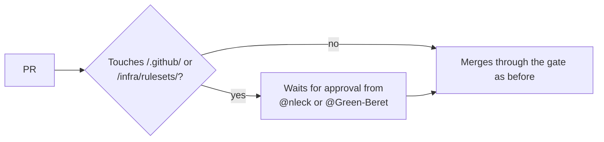

# PR Summary — Issue #2606

## Summary

Closes #2606.

`infra/rulesets/main.json` already sets `require_code_owner_review: true`, but
the repo had no CODEOWNERS file, so that setting did nothing. This PR adds
`.github/CODEOWNERS`, which makes the setting take effect.

- **Owners:** `@nleck @Green-Beret`, the human repo admins.
  - The worker bot identities (`stservice`, `VibeCoderST`) are not owners, so
    the fleet cannot approve its own changes.
  - I used individual users rather than the `system-admin` team because the
    worker token cannot confirm that the team has write access. A team with no
    access would leave the rule silently inert.
- **Paths covered:**
  - `/.github/`: workflows, CI scripts, scanner config, a future `actions/`
    directory, and the CODEOWNERS file itself.
  - `/infra/rulesets/`: the merge policy.
- **Parser:** `worker/deno/lib/codeowners.ts` is a small CODEOWNERS parser.
  - `parseCodeowners` rejects a malformed owner by throwing.
  - `ownersForPath` resolves the owners of a path; the last matching rule wins.
  - The test uses these to check the committed file.
  - Globs are matched segment by segment, with no dynamic `RegExp`.
  - The module is claimed by sweep slice `top-up-2606`, and its written record
    is `docs/audits/security-sweep-2606-codeowners.md`.
- **Docs:** the claim in `CONTRIBUTING.md` described a CODEOWNERS file that did
  not exist. It now describes the real one.
- **Not changed:** `required_approving_review_count` stays at `0` on purpose.
  The Actions-audit docs name "code-owner review on, zero approvals" as the
  chosen policy for an autonomous fleet. Raising the count would stop every
  fleet PR from merging, not just privileged ones.

## Evidence

- `deno test --allow-read tests/codeowners_test.ts`: 9 passed.
  - The test named `committed CODEOWNERS - privileged paths have human owners,
    no bots` reads the real `.github/CODEOWNERS`.
  - Before this change the file did not exist, so that test failed.
- `./quality.sh` result: see the Test Plan below.

## Test Plan

- [x] Parser unit tests cover:
  - comments and blank lines
  - the user, team and email owner forms
  - a malformed owner, which throws
  - empty input
  - anchored and unanchored patterns
  - last match wins
  - a rule with no owners, which clears ownership
- [x] Coverage test on the committed file: workflows, actions, scripts,
      CODEOWNERS and `infra/rulesets/main.json` all have owners, and none of
      them is a bot.
- [x] `./quality.sh < /dev/null`
