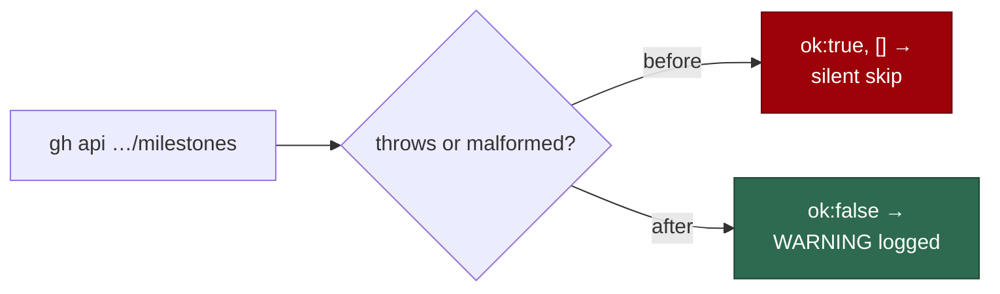

# PR Summary — Issue #2607

## Summary

`findActiveMilestoneBranches()` returned `{ ok: true, value: [] }` in two
cases where the milestone list could not be read: when the
`gh api repos/{repo}/milestones` call threw, and when the response failed
validation. `syncMilestoneBranches()` treated that as "this repo has no
milestones" and skipped every milestone branch for the cycle without logging
anything. Closes #2607.

- **API or parse failure** now returns `ok: false` with
  `Could not list milestones for <repo>: <cause>`.
- **Malformed response** now returns `ok: false` with
  `Malformed milestones response for <repo>: <field>: <reason>`. The
  validation error is named.
- **No caller change.** `syncMilestoneBranches()` already logs a `WARNING` for
  `ok: false` and moves on to the next repository.
- A genuinely empty list (`[]`) is still `ok: true` with no milestones.

## Evidence

This is a backend-only change, so the tests are the evidence. There is no
screenshot. Four new tests in `worker/deno/tests/milestone_branch_sync_test.ts`
inject a default branch that resolves, so the milestones call is the only
thing that fails:

- `a failing milestones call is ok:false (Issue #2607)`
- `unparseable milestones output is ok:false (Issue #2607)`
- `a malformed milestones response is ok:false naming the field (Issue #2607)`
- `a non-array milestones response is ok:false (Issue #2607)`

All four failed on the unfixed code (`0 passed | 4 failed`). With the fix, the
whole file passes (`69 passed | 0 failed`).

The existing test `handles API failure gracefully` did not change. It still
passes, but it only covered the path where the default-branch lookup fails, so
it never reached the laundered branch.

## Test Plan

- [x] `deno test -A tests/milestone_branch_sync_test.ts` passes: 69 passed.
- [x] The related `milestone_sync_*`, `idle_*` and `agent_run_termination`
      test files pass: 1073 passed.
- [x] `./quality.sh` passed. `config integration` was skipped, as it is on
      every run.
