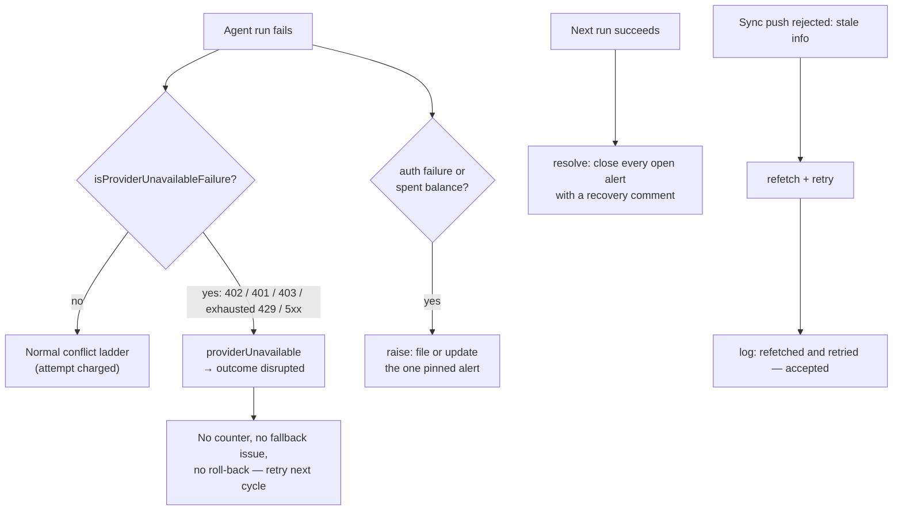

# PR Summary — Issue #2613

## Summary

Closes #2613.

A provider outage (for example `402 Insufficient Balance`) used to look like
unresolved merge conflicts. The worker then spent conflict-ladder attempts,
filed merge-fallback issues and tried milestone roll-backs. This PR classifies
the failure as "provider unavailable" and parks the work instead.

- **Classify:** `isProviderUnavailableFailure` (`agent_output.ts`) covers
  authentication, quota-exhausted, rate-limit, network and model-unavailable
  failures. `BALANCE_EXHAUSTED_RE` recognises a spent balance ("402",
  "insufficient balance/credits", "credit balance is too low").
- **Park:** `merge_conflict_agent.ts` reports `providerUnavailable` instead of a
  verdict. Every consumer treats that report as a disruption, not a failure:
  - `milestone_conflict_ladder.ts` and `milestone_branch_sync.ts` (judged
    `disrupted`).
  - `pr_merge_conflict_processor.ts` (the attempt is withdrawn, not spent).
  - `milestone_gate_repair.ts` (the round is not run).

  No fallback issue is filed and no roll-back is attempted. The branch is
  retried on the next cycle.
- **Spent balance takes the usage-limit pause:** `claude_executor.ts` treats a
  402 like a usage limit, so it takes the terminal pause instead of the
  rate-limit retry ladder.
- **One pinned alert:** the new `provider_outage_alert.ts` keeps one open issue
  per provider in the fleet repo.
  - The issue carries a
    `<!-- vibe-provider-outage provider="…" first-seen="…" -->` marker and is
    updated in place, so first-seen is preserved.
  - It closes itself with a recovery comment on the first successful run.
  - `claude_runner.ts` feeds it through a process-wide alerter installed in
    `mod.ts`.
- **Stale-info push:** `milestone_sync_pr.ts` refetches and retries, and now
  logs that it did. `milestone_rollback.ts` no longer words a stale-info refusal
  as a repository-rule refusal.

## Evidence

- The full `./quality.sh < /dev/null` gate passes. Only config integration was
  skipped, because this worktree has no `.config.json`.
- New suite: `worker/deno/tests/provider_outage_alert_test.ts` covers file,
  update (first-seen kept), close, dedup against strangers' look-alikes, a
  failed search filing nothing, redaction and the provider-id allowlist.

## Acceptance Criteria

<!-- vibe-spec-review inputs="diff+issue-body" -->

| Criterion | reviewer: | Evidence |
| --------- | --------- | -------- |
| AC1 — a 402 during the conflict ladder files no fallback and changes no counter | **partial** | `milestone_conflict_ladder_test.ts`, `milestone_branch_sync_test.ts`, `milestone_rollback_test.ts` and `pr_merge_conflict_processor_test.ts` show `disrupted` or withdrawn: no fallback, no roll-back and no conflict attempt spent. The failed-once, fast-failure-streak and back-off counters are not changed by new code. They rely on the existing usage-limit parking, which a 402 now enters through `claude_executor.ts` (`usage_limit_detection_test.ts`). |
| AC2 — exactly one alert open during an outage, closed on recovery | **met** | `provider_outage_alert_test.ts`: the second failure updates the same issue, concurrent failures are serialised into one alert, and a success closes every open alert. |
| AC3 — stale-info rejection is retried after a refetch, and the report says so | **met** | `milestone_sync_pr_test.ts` asserts the "refetched and retried — accepted" log. `milestone_rollback_test.ts` asserts that a stale-info refusal is not worded as a repository rule. |

## Standards Review

<!-- vibe-standards-review inputs="diff+CODING-STANDARDS.md" -->

- **TDD with real functions:** every new branch is exercised by calling the
  module with injected `gh` and agent fakes. Nothing inspects source text.
- **Fail loud:** a failed alert search returns `gh-failed` and files nothing.
  Alert errors are logged, never swallowed silently. The alert is a side
  channel, so it never fails the run.
- **Security:** the provider id is allowlisted before it reaches argv. Error
  text is redacted, clipped and has its backticks neutralised. Only
  fleet-authored issues are edited or closed. See
  `docs/audits/security-sweep-2613-provider-outage-alert.md` (sweep slice
  `top-up-2613`).
- **KISS:** one `SIMPLE-ON-PURPOSE` cut. A 429/5xx outage is parked but never
  alerted, because it clears on its own.
- **Docs:** `docs/MERGE.md`, `docs/INTERNALS.md` and `DESIGN-PRINCIPLES.md` are
  updated.
- **Australian English** is used throughout.

## Test Plan

- [x] `./quality.sh < /dev/null` from the repo root.
- [x] `provider_outage_alert_test.ts`, `agent_output_1695_test.ts` and
      `usage_limit_detection_test.ts`: classification, including the regex
      positives and negatives (a "resets in 402s" message is not treated as a
      spent balance).
- [x] Conflict-ladder, branch-sync, gate-repair, roll-back, sync-PR and PR
      merge-conflict suites: the disruption paths.

## Notes

- **Runner-test stubs changed:** "Credit balance is too low" now counts as a
  spent balance, which takes the terminal usage-limit pause. Stubs in
  three suites (`claude_runner_rate_limit_fallback_test.ts`,
  `claude_runner_invocation_budget_3648_test.ts` and
  `run_core_watchdog_test.ts`) used that text to mean "rate limited", so they
  now use "API rate limit exceeded - too many requests". The
  behaviour those tests check is unchanged.
- **Why the alerter is a singleton:** the alert is raised from
  `claude_runner.ts`, deep in every agent call path. Threading a dependency
  through every caller would touch dozens of signatures. `mod.ts` installs one
  alerter per process. When none is installed, `noteProviderRunOutcome` does
  nothing, so tests and other entry points are unaffected.
- **Cross-host duplicate alerts:** serialisation is per process. Two hosts
  failing at the same moment can each file an alert. Recovery closes every open
  fleet-authored alert for the provider, so duplicates never outlive the outage.
- **Follow-up from nleck (not in scope):** serialise `update-branch` so that only
  the next-in-line PR (green but BEHIND) is updated. This is a separate change
  to the merge queue.
- **Config integration skipped:** there is no `.config.json` in this worktree.
  The quality gate skips that stage on purpose.
