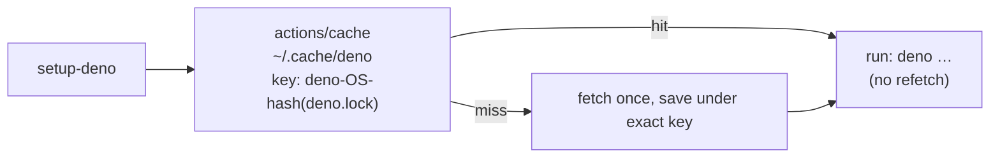

# PR Summary — Issue #2619

## Summary

Closes #2619

Eight jobs installed Deno with no module cache, so every run fetched every
dependency again. This adds the validate job's `Cache Deno modules` step
(`actions/cache@v6.1.0`, pinned to its SHA) after `denoland/setup-deno` in each
of them. The step uses an exact lockfile key with no `restore-keys` (Issue
#4404). In jobs where setup-deno is conditional, the cache step carries the same
`if:`.

| Workflow                  | Job                                           |
| ------------------------- | --------------------------------------------- |
| `dependency-audit.yml`    | `deno-audit`                                  |
| `gitleaks.yml`            | `full-history`                                |
| `markdown-lint.yml`       | `markdownlint` (`if:` detect-deno)            |
| `release-tag.yml`         | `tag` (`if:` plan tag)                        |
| `security-tabletop.yml`   | `tabletop`                                    |
| `security-tree-sweep.yml` | `sweep`                                       |
| `validate-scripts.yml`    | `supply-chain-gate`, `milestone-resurrection` |

`container-build.yml` is not in the audited list, so it stays out of scope. The
new test exempts it by name.

## Evidence

- The SHA was checked with `gh api repos/actions/cache/commits/v6.1.0`, which
  returned `55cc8345863c7cc4c66a329aec7e433d2d1c52a9`, the same SHA the validate
  job already uses.

## Test Plan

- New `workflow_hardening_test.ts` test: every `denoland/setup-deno` step
  (except `container-build.yml`) must be followed by a step that uses the pinned
  `actions/cache` SHA, has `path: ~/.cache/deno` and the exact lockfile key, and
  has no `restore-keys`. Before the change it failed at
  `dependency-audit.yml:100`; now it passes.
- Every workflow parses as YAML, and `actionlint` is clean.
- `./quality.sh`
