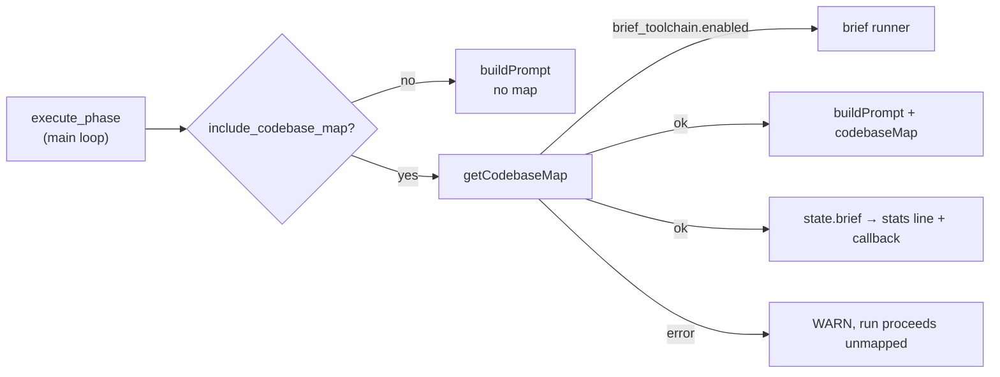

# PR Summary — Issue #2621: codebase map on the main-loop issue phase

## Summary

Closes #2621

The fleet's issue runs go through `lib/phases/execute_phase.ts`, not the
`execute-claude-phase` CLI. The codebase map, and the brief trial that rides on
it (#2581), were only wired into the CLI path, so neither ever reached the runs
that matter. This PR makes the main-loop execute phase do the same as the CLI:

- Call `getOrGenerateCodebaseMap` when `include_codebase_map` is on. Brief gets
  a runner only when `brief_toolchain.enabled` is on.
- Pass the map to `buildPrompt` as `codebaseMap`.
- Set `state.brief = briefRunReport(enabled, map.brief)`. The completion and
  no-changes phases already spread this into the run-stats comment and the
  callback.

A map fault is non-fatal. It logs `Codebase map unavailable …` and the run
continues unmapped.

> ⚠️ **Fleet-wide prompt change: reviewer decision.** `include_codebase_map`
> defaults to `true`, so after this merges **every main-loop implementation
> prompt gains the codebase map**, not only the brief-trial hosts. The issue
> asks a human to confirm this is wanted. The `work-on` label was taken as the
> go-ahead, but the merging reviewer makes the final call. A host that does not
> want it can opt out with `"include_codebase_map": false` in `.config.json`.
> Brief itself stays off unless `brief_toolchain.enabled` is set.

### Files

- `worker/deno/lib/phases/execute_phase.ts`: the map block, and `codebaseMap` is
  now passed to the prompt.
- `worker/deno/lib/issue_worker_wiring.ts`: a new
  `infrastructure.getCodebaseMap` dep. It is `getOrGenerateCodebaseMap` in
  production and an empty map in mocks, so mocked runs never spawn git or brief.
- `docs/CONFIGURATION.md` and `docs/MODEL-AND-CACHING.md`: both implementation
  paths now render the map and take the brief switch.

Base branch: `milestone/2581-container-worker-deno-brief-trial`. The brief
symbols (`briefRunReport`, `PhaseState.brief`, `brief_toolchain`) exist only
there.

## Evidence

`deno test -A tests/execute_phase_codebase_map_2621_test.ts`: 4 passed.
`tests/execute_phase_*_test.ts` together with the wiring tests: 154 passed, 0
failed.

## Test Plan

`worker/deno/tests/execute_phase_codebase_map_2621_test.ts` drives the real
`workOnIssueExecuteClaude`:

- **Brief off:** one map call with no brief runner. The map reaches
  `buildPrompt`, and `state.brief` is `{enabled:false,status:"off"}`.
- **Brief on:** the map is called with a runner, `BRIEF_VERSION` and `warn`, and
  the brief outcome lands on `state.brief`.
- **`include_codebase_map: false`:** no map call, no map in the prompt, and no
  brief report.
- **Map fault:** the run proceeds unmapped and `state.brief` stays unset.

Against the unfixed code, these tests fail because the map was never requested.
