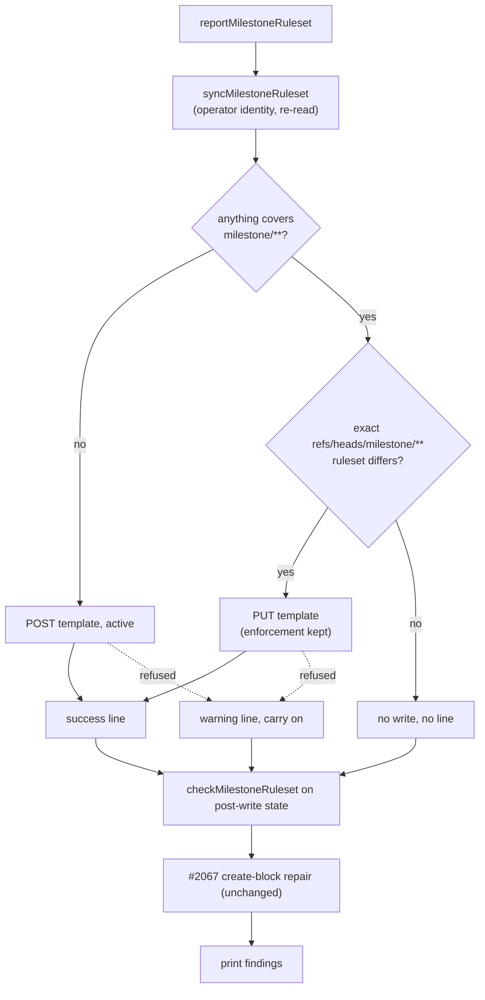

# PR Summary — Issue #2623

## Summary

Setup now makes every monitored repository's `milestone/**` ruleset match the
GRQ-AutoTrader "milestone branches" template on every run, with no prompt.
Closes #2623.

- **Create.** When no ruleset covers `milestone/**`, setup creates
  "Vibe Coder milestone branches" (`active`) with no `[y/N]` prompt.
  `askCreateMilestoneRuleset` is gone.
- **Align.** Setup rewrites any ruleset whose include is exactly
  `refs/heads/milestone/**` and whose name, rules, checks, strict policy,
  create exemption or bypass actors differ from the template. That includes
  Vibe-named rulesets, and rules the template lacks are removed. Setup never
  changes enforcement: a `disabled` or `evaluate` ruleset keeps its setting,
  and the existing `ruleset-disabled` warning (now worded to say so) is the one
  warning line. A broader ruleset that merely covers `milestone/**` is left
  alone.
- **Template** (`buildMilestoneRulesetBody`): `deletion`, `non_fast_forward`
  and `required_status_checks`. Checks mirror the default branch and keep
  `integration_id` where one is set. The rule uses
  `strict_required_status_checks_policy: false` and
  `do_not_enforce_on_create: true`. With no checks to mirror (GRQ-www) the
  ruleset has only the first two rules. Bypass actors mirror the
  default-branch ruleset.
- **Findings.** The #2461 `non-strict-checks` error is removed. Findings are
  now assessed after the writes, so setup reports the repository as it left it.
- **Reporting.** Each create or align prints one `success` line. Each failure
  prints one `warning` line with the GitHub error (a 404 is explained as
  missing admin), and setup carries on. An already-aligned ruleset gets no
  write and no line.
- **Identity.** Writes run as the operator, which re-reads the rulesets first
  (Issue #595). A service-account read may not show bypass actors, and a
  full-document PUT must carry them. If that read fails, setup prints a
  warning and never treats the ruleset as "missing" (Issue #678).
- **#2067 repair.** The create-block repair is unchanged. It now runs after the
  sync, so it only reaches milestone-only rulesets the sync does not own, or
  ones whose alignment failed.

Docs updated: `docs/SETUP.md` (the `branch-protection-sync` step),
`docs/MERGE.md` and `docs/workflows/milestones.md`. The last two had said the
strict up-to-date policy holds a stale child until the branch is level. That
is no longer true: the template leaves strict off.

## Evidence

This is a backend/CLI change with no UI to screenshot. The behaviour is
covered by unit tests that run the real planner, sync and setup wiring
against a stubbed `gh`.

## Test Plan

- `worker/deno/tests/milestone_ruleset_read_test.ts`
  - New `planMilestoneRulesetSync` tests: already aligned (no write); missing
    (create, active); no rulesets at all (two rules, no bypass); hand-made
    (renamed, strict off, extra `pull_request` dropped, stale bypass removed);
    GRQ-style mirror from an explicit `refs/heads/Develop` ruleset with
    `integration_id`; Vibe-named hand edit reverted; `disabled`/`evaluate`
    enforcement kept; broader ruleset untouched; unknown enforcement skipped
    with a reason.
  - New `syncMilestoneRuleset` tests: an unreadable list fails loud; align is a
    PUT to the ruleset's own id; an invalid slug never reaches `gh`.
  - New `applyMilestoneSyncOutcomes` test: the post-write state needs no
    further write.
  - Wiring tests rewritten (they asserted the removed question). They now
    cover: aligned repo writes and prints nothing; missing ruleset created
    without asking, under the operator, with one success line; differing
    ruleset aligned with one success line; disabled ruleset aligned with one
    enforcement warning; failed create warns and still reports missing; an
    unreadable operator view warns; the GRQ-www check-less ruleset is created
    and still draws `no-required-checks`.
- `worker/deno/tests/milestone_ruleset_check_test.ts`
  - The `createMilestoneRuleset` tests became `syncMilestoneRuleset` tests:
    the exact template body with `gate`@15368; `~ALL` coverage writes nothing;
    no checks gives two rules; a 404 is explained as needing admin.
  - The two #2461 `non-strict-checks` tests were replaced by tests asserting
    that a non-strict or absent policy is no longer reported. This is a
    deliberate business-logic change requested by the issue.
- `worker/deno/tests/repo_rulesets_test.ts`
  - The builder now writes strict `false`.
  - New tests: `integration_id` is kept; no checks gives deletion and
    force-push only; enforcement is passed through.
- `worker/deno/tests/milestone_ruleset_create_block_repair_test.ts`
  - The three setup-wiring tests use a `refs/heads/milestone/*` variant of the
    blocked ruleset. The sync now aligns an exact `milestone/**` ruleset first,
    and that already clears the block. The repair is still exercised end to
    end on a ruleset the sync does not own. The `ask` seam was removed.
- `worker/deno/tests/setup_consent_prompt_test.ts`
  - Removed the three `askCreateMilestoneRuleset` tests together with the
    function. The issue removes that prompt on every run. The
    `readConsentLine` tests it shared a file with are kept.
- Targeted run: 156 passed, 0 failed. `./quality.sh` was run before raising
  the PR.
