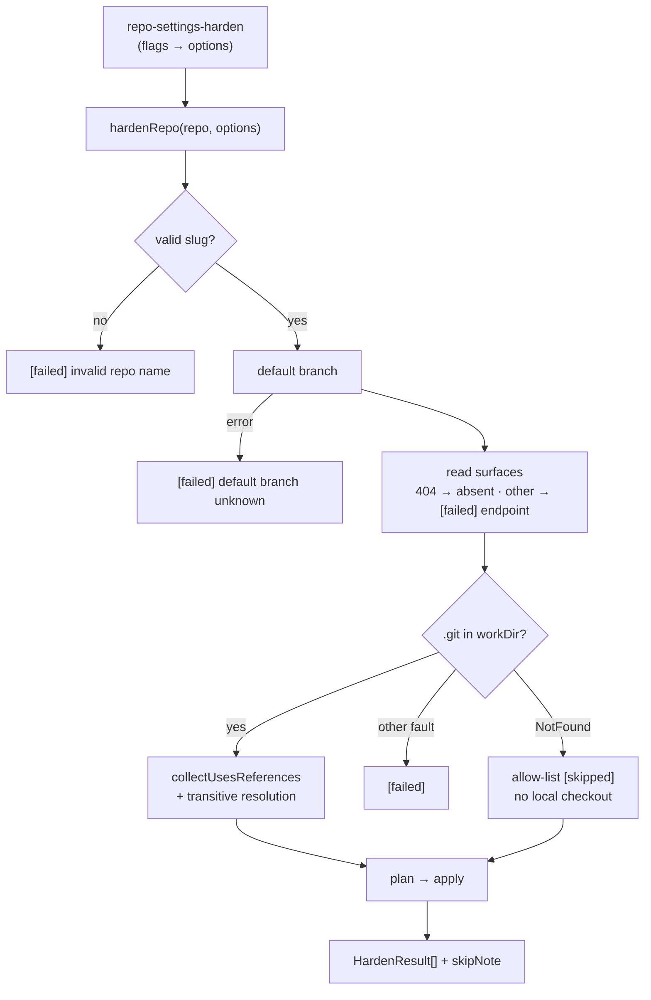

# PR Summary — Issue #2626: a reusable per-repo `hardenRepo`

## Summary

Closes #2626 (part of #2611)

The per-repository work behind `repo-settings-harden` now lives in one exported
function, `hardenRepo(repo, options)`, in
`worker/deno/lib/repo_settings_harden.ts`. A fleet-wide caller can reuse it per
repository. The command is a thin wrapper that keeps all its flags and its
output format.

- **`hardenRepo`** handles the whole run: the settings snapshot, the default
  branch, `collectUsesReferences`, transitive action resolution, planning and
  apply. It returns `{results, skipNote, coordinates, referenceCount,
  unreadable}` and never throws; every fault becomes a `failed` result.
  `requireReviews` stays off unless the caller passes it.
- **Ruleset lookup:** `applyRulesetReviews` prefers the active
  `VIBE_RULESET_NAME` ruleset (`Vibe Coder default branch`) over the one named
  after the branch. If neither exists, it fails and names both. A matched
  ruleset with no `pull_request` rule also fails; it is never silently skipped.
- **No checkout:** when `workDir` has no `.git`, the allow-list step is
  recorded as `skipped` with the reason `no local checkout`, and nothing is
  written. Any other probe fault (for example, `ENOTDIR`) is `failed`.
- **Fail-loud reads:** a settings read that fails with anything other than a
  404 gives a `failed` result naming the endpoint, and nothing is planned from
  it. A 404 still means the surface is absent.
- **`findCodeownersOnDefaultBranch(repo, gh)`** checks `.github/CODEOWNERS`,
  `CODEOWNERS` and `docs/CODEOWNERS`. It returns `present` with the path,
  `absent` when all three are 404, or `error` for any other failure.

### Files

- `worker/deno/lib/repo_settings_harden.ts` adds:
  - `hardenRepo` and `HardenRepoOptions` / `HardenRepoOutcome`;
  - `collectUsesReferences`, moved here from the command;
  - `findCodeownersOnDefaultBranch`;
  - the `skipped` status;
  - the Vibe-ruleset preference.

  Slug validation reuses `isValidRepoSlug` from `repo_rulesets.ts`.
- `worker/deno/commands/repo_settings_harden.ts` is now a thin wrapper around
  `hardenRepo`.
- `worker/deno/tests/repo_settings_harden_test.ts` has 20 new test
  declarations (22 runs, counting the three-path loop) using a routing stub
  `gh`. Temp paths are removed on unload.
- `docs/GITHUB-ACTIONS-AUDIT-SCAN.md` covers the ruleset preference, the
  `hardenRepo` contract, the checkout skip and failure, and
  `findCodeownersOnDefaultBranch`.

### Review notes not taken

- **Relabel read failures as a neutral `GET` kind:** not taken.
  `HardenStep.method` is `PUT | PATCH`, and `ghWrite` relies on that union.
  Instead, the failed result's `kind` names the step that could not be planned,
  and `detail` names the endpoint.
- **Drop the skip record on an already-hardened repo without a checkout:** not
  taken. The allow-list cannot be verified without the workflows, so reporting
  the skip is the honest outcome.
- **`--allow-action` without a checkout is ignored:** by design, because the
  whole allow-list step is skipped. The skip line says so.

## Evidence

Run from `worker/deno`:

- `deno test -A tests/repo_settings_harden_test.ts`: **44 passed, 0 failed**.
- The same file with `tests/codeowners_test.ts`, `tests/repo_rulesets_test.ts`,
  `tests/workflow_hardening_test.ts` and
  `tests/state_write_symlink_hardening_test.ts`: **87 passed, 0 failed**.
- `deno fmt`, `deno lint` and `deno check mod.ts`: clean. `markdownlint-cli2`:
  0 issues.
- `./quality.sh`: **PASSED (with skipped checks)**. Only the config
  integration check was skipped, because there is no host config.

## Acceptance Criteria

<!-- vibe-spec-review inputs="diff+issue-body" -->

| # | Criterion | Status | Evidence |
|---|-----------|--------|----------|
| 1 | Tests written first with a stub gh | met | The new tests and the `makeGh` routing stub landed alone in WIP checkpoint `55596c7f` (test file only, 426 lines), before any library or command change |
| 2 | Existing tests pass | met | The original 22 tests in `repo_settings_harden_test.ts` are unchanged and pass, as do the related suites (87 in total) |
| 3 | A Vibe-only ruleset with `requireCodeOwnerReview` → exactly one ruleset write | met | "a Vibe-only ruleset gets exactly one write turning on code-owner review" asserts one `PUT repos/<repo>/rulesets/7` with the full rule body |
| 4 | No matching ruleset → `failed`, naming both | met | "no matching ruleset fails naming both the branch and the Vibe ruleset" |
| 5 | No checkout → no allow-list write; the skip is recorded | met | "without a local checkout the allow-list is skipped, never written" and "a missing checkout records the skip even when nothing else is planned" |
| 6 | CODEOWNERS: 3 locations, absent, non-404 error | met | `findCodeownersOnDefaultBranch` tests: present at each of the 3 paths, absent after 3 reads, error on HTTP 500, and an invalid repo |
| 7 | A failed workflow read → `failed` naming the endpoint, no write | met | "a failed workflow-permissions read is a failure naming the endpoint, with no write". The 404 counterpart is asserted as absent |
| 8 | An already-hardened repo makes zero writes under `apply` | met | "an already-hardened repo makes zero writes under apply": no writes, no results, no skip note |
| 9 | The quality gate passes | met | `./quality.sh` passed; see Evidence |

## Standards Review

<!-- vibe-standards-review inputs="diff+CODING-STANDARDS.md" -->

Verdict: **pass with notes**. Notes applied:

- **DRY:** reuse `isValidRepoSlug` rather than a second slug regex.
- **Re-export:** drop the stale `collectUsesReferences` re-export from the
  command.
- **Fail loud on the checkout probe:** only `NotFound` counts as "no checkout";
  any other `stat` fault is `failed`, with a regression test.
- **Missing tests:** added tests for an invalid repo, a ruleset with no
  `pull_request` rule, and the non-NotFound probe fault.
- **Temp cleanup:** temp directories and the branch cache are removed on
  unload.

The notes not taken, and why, are under **Review notes not taken** above. The
code, comments and docs use Australian English. No new dependencies were added,
and no hidden files or secrets are staged.

## Test Plan

`worker/deno/tests/repo_settings_harden_test.ts` drives the real `hardenRepo`
through `makeGh`. The stub answers read endpoints from a route table (an Error
is thrown, and an unknown endpoint is a 404) and records every write together
with its `--input` body. Covered:

- **Vibe ruleset:**
  - it is written;
  - it is preferred over the branch-named ruleset;
  - the branch-named ruleset is the fallback;
  - with neither, the step fails naming both;
  - with no `pull_request` rule, the step fails.
- **Reviews:** `requireReviews` stays off by default.
- **Checkout:**
  - without a checkout, the allow-list is skipped with nothing written, and the
    skip is recorded even on a hardened repo;
  - a probe fault other than NotFound fails loud (this test fails against the
    earlier catch-all probe).
- **Reads:**
  - a non-404 read failure names the endpoint;
  - a 404 is absent;
  - every read failing still does not throw;
  - an unknown default branch is one failed result;
  - an invalid repo makes no gh call.
- **Hardened repo:** zero writes under `apply`.
- **Private repo:** returns the paid-add-on skip note.
- **`findCodeownersOnDefaultBranch`:** all three locations, absent, a non-404
  error, and an invalid repo.
