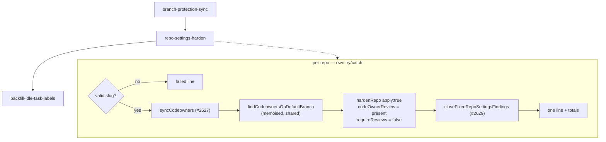

# PR Summary — Issue #2628: a non-fatal repo-settings hardening step in setup

## Summary

Closes #2628 (part of #2611)

Setup now hardens every monitored repository's GitHub settings on every run,
writing only what has drifted. The new `repo-settings-harden` step runs
straight after the default-branch ruleset sync and before the `idle-task`
back-fill.

- **`runRepoSettingsHarden(config, deps)`** lives in
  `worker/deno/setup/repo_settings_harden_sync.ts`. For each repository, in
  order, it:
  1. runs the CODEOWNERS writer (`syncCodeowners`, #2627);
  2. runs `hardenRepo` (#2626) with `apply: true`. `requireCodeOwnerReview` is
     set only when `findCodeownersOnDefaultBranch` returns `present`, and
     `requireReviews` is always `false`;
  3. runs the audit-issue closer (`closeFixedRepoSettingsFindings`, #2629).
- **One default-branch lookup per repository.** The writer and the code-owner
  decision share a memoised `findCodeownersOnDefaultBranch`, so both act on
  the same answer.
- **Output.** Each repository prints one line:
  `<repo>: N applied, N unchanged, N skipped, N failed`. The line also names
  each failed step with its message, each skip (such as the private-repo
  secret-scanning note, or "no CODEOWNERS on the default branch"), and the
  CODEOWNERS outcome. A totals line follows.
- **Isolation.** Each repository runs in its own `try`/`catch`. A thrown
  repository gets a failed line and the next one still runs. The step returns
  `false` when any repository failed, and never throws out of `runAll`. A
  CODEOWNERS writer `error` counts as a failure. Closer warnings are printed,
  but do not fail the step.
- **Wiring.** `setup_cli.ts` gets a `repo-settings-harden` subcommand. It uses
  the ruleset sync's `createSetupGhJson(gh_config_dir)` seam (with `~`
  expanded), the gitignore sync's `WORK_DIR ?? $HOME/auto-issue-work`, and
  `resolveCodeownersOwners` for the `codeowners_owners` key. Its production
  dependencies are the real `syncCodeowners` (#2627) and
  `closeFixedRepoSettingsFindings` (#2629), both merged into the milestone
  branch. The closer gets `service_accounts` as its fleet logins; when that
  list is empty, the closer warns and closes nothing. `runAll` now walks
  an exported, ordered `RUN_ALL_REPO_STEPS` table, so a test can read the
  order directly.

### `setup.ps1` needed a change after all

The issue expected no PowerShell change, but that turned out to be wrong.
`setup.sh` and `setup.ps1` do not call `setup_cli.ts all`. Each one calls every
repository sync subcommand by name. Without a new line in both scripts, the
step would never run from either launcher.

Both launchers now call `repo-settings-harden` between `branch-protection-sync`
and `backfill-idle-task-labels`. `SHARED_SETUP_SUBCOMMANDS` in
`worker/deno/lib/setup_contract.ts` lists it too, so `setup_parity_test.ts`
fails if either launcher drops it.

### Files

- `worker/deno/setup/repo_settings_harden_sync.ts`: the new step.
- `worker/deno/setup/setup_cli.ts`: the subcommand, `RUN_ALL_REPO_STEPS`, and
  the usage text.
- `setup.sh`, `setup.ps1`, `worker/deno/lib/setup_contract.ts`: the launcher
  step and the parity contract.
- `worker/deno/tests/setup_repo_settings_harden_test.ts`: 16 tests.
- `docs/SETUP.md`: a new "Repository settings hardening" section covering what
  the step changes, what it never changes, the owners key and the output. It
  also updates the sync-phase list, the flowchart and the subcommand table.
- `docs/audits/lib-sweep-coverage.json` and
  `docs/audits/security-sweep-2628-repo-settings-harden-sync.md`: the lib-sweep
  top-up for the new module.

## Evidence

Run from `worker/deno`:

- `deno test -A --parallel tests/setup_repo_settings_harden_test.ts`: **16
  passed, 0 failed** (about 0.3 s, with no network and no sleeps).
- A mutation run confirmed the tests catch regressions. Forcing
  `requireReviews: true`, requiring code-owner review unless the lookup said
  `absent`, and returning `true` unconditionally made 7 tests fail.
- `tests/setup_parity_test.ts` and `tests/setup_ps1_test.ts`: **43 passed**.
- After wiring the merged siblings, the new suite together with `setup_repo_settings_audit_close_test.ts`, `codeowners_sync_test.ts`, `lib_sweep_coverage_test.ts` and `setup_parity_test.ts`: **107 passed, 0 failed**.
- `tests/lib_sweep_coverage_test.ts`: **31 passed**.
- `tests/setup_cli_container_repair_test.ts` and
  `tests/milestone_ruleset_check_test.ts`: **35 passed**.
- `deno fmt`, `deno lint` and `deno check` on the changed files: clean.
  `markdownlint-cli2`: 0 errors.
- The full quality gate runs in CI.

## Acceptance Criteria

<!-- vibe-spec-review inputs="diff+issue-body" -->

| # | Criterion | Status | Evidence |
|---|-----------|--------|----------|
| 1 | Tests written first in `setup_repo_settings_harden_test.ts`, stub gh seam, temp `WORK_DIR` | met | The test file was written and run red (type-check failure: the module did not exist) before `repo_settings_harden_sync.ts` was written. `makeFakeGitHub` is a stateful stub gh; each test builds its checkouts under a temp `WORK_DIR` |
| 2 | A drifted repo gets exactly the drifted writes; a second run makes zero writes | met | "a drifted repo gets exactly the drifted writes, and a second run makes none": exactly 5 writes (token, SHA pin, allow-list union, secret scanning, ruleset), then `writes == []` |
| 3 | No request sets `required_approving_review_count` above 0 | met | "no request ever sets required_approving_review_count above 0" walks every write body over two runs, and asserts `requireReviews` is never true |
| 4 | Two repos, the first throws in `hardenRepo`: the second is hardened, both lines are printed, and the step returns `false` | met | "a repo whose hardenRepo throws never stops the next, and the step returns false". The companion test "a failed step inside hardenRepo is never swallowed into a true return" covers the same case for a failed step |
| 5 | A private repo gets no secret-scanning writes, and its line reports the skip | met | "a private repo gets no secret-scanning write and its line reports the skip" (the line carries `SECRET_PROTECTION_SKIP_NOTE`). The public counterpart asserts the PATCH is made |
| 6 | `requireCodeOwnerReview` is true only on `present` | met | "requireCodeOwnerReview is true only when the default branch has CODEOWNERS": `.github/` and `docs/` are true; absent and HTTP 502 are false |
| 7 | `runAll` runs the step after `runBranchProtectionSync` and before `runBackfillIdleTaskLabels` | met | `runAll` iterates `RUN_ALL_REPO_STEPS`. The test "runAll - repo-settings-harden runs right after branch-protection-sync and before backfill-idle-task-labels" checks the order; `setup_parity_test.ts` checks the same order for the launchers |
| 8 | The setup docs describe the step | met | `docs/SETUP.md` has a "Repository settings hardening" section, a list entry, a flowchart node and a table row |
| 9 | The `deno task` quality gate passes | met | Targeted suites pass locally; CI runs the full gate on this PR |

## Standards Review

<!-- vibe-standards-review inputs="diff+CODING-STANDARDS.md" -->

Verdict: **pass**.

- **KISS/DRY:** the step reuses `hardenRepo`, `findCodeownersOnDefaultBranch`,
  `isValidRepoSlug`, `createSetupGhJson` and the existing `WORK_DIR`
  resolution. It adds no second planner or writer.
- **Fail loud:** every repository fault is on a line and in the return value.
  A CODEOWNERS lookup error is named, and it is never mistaken for an absent
  file.
- **Setup-time only:** the module comment carries the same rate-limit warning
  as `branch_protection_sync.ts`.
- **Tests:** they are fast (no network, no sleeps), and temp paths are removed
  on unload.
- **Other:** the code, comments and docs use Australian English. No new
  dependencies were added, and no secrets are staged.

## Test Plan

`worker/deno/tests/setup_repo_settings_harden_test.ts` runs the real
`hardenRepo` against `makeFakeGitHub`, which applies each write to per-repo
state so the next read sees it. The CODEOWNERS writer and the closer are
stubs typed by their exported contracts. The tests cover:

- **Drift:** the first run writes exactly what drifted, and the second run
  makes zero writes. The totals line comes last.
- **Approving reviews:** never required.
- **Isolation:** a throw in one repository, a failed step and an invalid slug.
- **Secret scanning:** skipped on a private repository, and written on a
  public one.
- **Code-owner review:** follows the default branch's CODEOWNERS, with one
  shared lookup. A lookup error is reported.
- **Ordering:** the CODEOWNERS writer, then `hardenRepo`, then the closer, and
  `fleetLogins` comes from `service_accounts`.
- **CODEOWNERS outcome:** shown on the line. A writer error fails the
  repository, but the repository is still hardened.
- **Closer:** its warnings are printed once, and a closer throw is caught.
- **Empty repos:** no configured repositories is a quiet success.
- **`runAll` order.**
