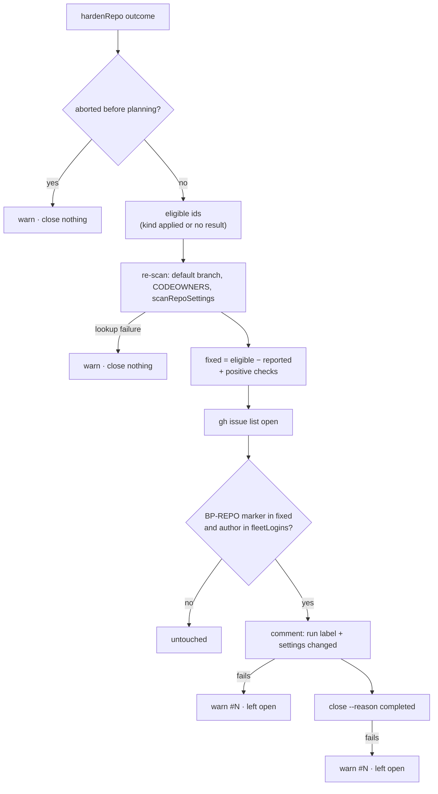

# PR Summary — Issue #2629: close fleet-filed `BP-REPO-*` audit issues once setup's read-back confirms the fix

## Summary

Closes #2629 (part of #2611)

When setup's `hardenRepo` fixes a repository setting, it now re-scans the repo
and closes the matching audit issue: one comment, then
`gh issue close --reason completed`. Only issues that the audit filed from a
fleet account are closed.

- **`parseRepoSettingsFindingId(body)`** is new in
  `worker/deno/lib/admin_only_finding.ts`. It returns the upper-cased
  `BP-REPO-*` id from the `<!-- finding-id: … -->` marker, or `null`. The
  admin-only hand-off (`isAdminOnlyRepoSettingsIssue`) now uses it too, so the
  marker is defined in one place.
- **`closeFixedRepoSettingsFindings(opts)`** is in the new
  `worker/deno/setup/repo_settings_audit_close.ts`. It uses the contract
  `{repo, outcome, ghCommandFn, fleetLogins, runLabel, log}` and returns
  `{closed, warnings}`. It also accepts an optional `defaultBranch`, and never
  throws.
- **Wiring:** #2628 is building `repo_settings_harden_sync.ts` alongside this
  PR. That module calls this function after `hardenRepo`. The logic is in its
  own module so the two issues do not conflict.

### Finding id → hardening step kind

| Finding id | Step kind |
| ---------- | --------- |
| `BP-REPO-DEFAULT-TOKEN-WRITE`, `BP-REPO-ACTIONS-MAY-APPROVE-PRS` | `workflow-token` |
| `BP-REPO-ACTIONS-ALLOW-ALL`, `BP-REPO-ACTIONS-ALLOW-LIST-INCOMPLETE` | `actions-allow-list` |
| `BP-REPO-SHA-PIN-NOT-ENFORCED` | `sha-pinning-required` |
| `BP-REPO-RULESET-NO-REVIEW`, `BP-REPO-CODEOWNERS-NOT-ENFORCED` | `ruleset-reviews` |
| `BP-REPO-SECRET-SCANNING-OFF`, `BP-REPO-PUSH-PROTECTION-OFF` | `secret-scanning` |

`HardenResult.status` has no `unchanged` value. The planner adds no step for a
setting that is already compliant, and a surface it could not read is recorded
as a `failed` result of that kind. So a kind is treated as **unchanged** when
it has no result at all, and as **applied** when every result of that kind is
`applied`. Any `failed`, `planned` (dry run) or `skipped` result makes the kind
ineligible. If the hardening pass stopped before planning (invalid slug,
unknown default branch, or a thrown fault), `hardenRepo` records a failed
`ruleset-reviews` read of `repos/<repo>`. In that case nothing is closed and a
warning is logged.

For some findings, the scanner can stay silent without the setting being
fixed. These need the read-back to show the fix directly:

- **Secret scanning and push protection:** the status must read `enabled`. A
  token without admin rights cannot see these settings, and a private repo is
  exempt.
- **`CODEOWNERS-NOT-ENFORCED`:** a CODEOWNERS file must exist.
- **`ALLOW-LIST-INCOMPLETE`:** the repo must use `allowed_actions: selected`.

`BP-WORKER-TOKEN-CAN-EDIT-RULESETS` does not match the `BP-REPO-*` marker, so it
is never closed.

## Acceptance Criteria

| Criterion | Status | Evidence |
| --------- | ------ | -------- |
| Tests written first; `admin_only_finding_test.ts` covers the parser: valid marker, whitespace variants, non-`BP-REPO` id, no marker | ✅ met | four `parseRepoSettingsFindingId - …` tests in `worker/deno/tests/admin_only_finding_test.ts` |
| A fixed finding with a fleet-filed issue gets exactly one comment and one close `--reason completed` | ✅ met | `a fixed finding with a fleet-filed issue gets exactly one comment and one close --reason completed` in `worker/deno/tests/setup_repo_settings_audit_close_test.ts` |
| A finding still reported by the re-scan closes nothing | ✅ met | `a finding still reported by the re-scan closes nothing` |
| A failed re-scan lookup closes nothing and prints a warning | ✅ met | `a failed re-scan lookup closes nothing and prints a warning`, plus the CODEOWNERS-lookup variant |
| A non-fleet author's issue with the same marker is untouched | ✅ met | `an issue filed by a non-fleet author with the same marker is untouched` (the fleet-filed twin closes, so the finding is fixed) |
| A failed close prints a warning naming the issue number and does not throw | ✅ met | `a failed close prints a warning naming the issue number and does not throw` |
| `deno task` quality gate passes | ✅ met | targeted `deno test` (30 passed), `deno fmt`/`lint`/`check`, and markdownlint pass locally. The full gate runs in CI on this PR |
| Closing wired into `repo_settings_harden_sync.ts` after hardening | ◐ partial | That file belongs to #2628, which is being built alongside this PR. This PR exports the function it calls: `closeFixedRepoSettingsFindings` from `worker/deno/setup/repo_settings_audit_close.ts` |

Other tests cover both directions of each rule:

- A setting that was already compliant closes.
- A step that is `failed`, `planned` or `skipped` does not close.
- An `applied` step together with a `failed` step of the same kind does not
  close.
- An aborted pass does not close.
- Secret scanning and CODEOWNERS close only on a positive read.
- A private repo that is exempt does not close.
- A failed comment leaves the issue open.
- A failed issue list closes nothing.
- An empty fleet list closes nothing.
- The fleet login match is case-insensitive.
- An unknown id does not close.
- A `gh` stub that throws is reported as a warning.
- `FINDING_STEP_KIND` covers every id the scanner files.

## Security

This PR adds a lib-sweep top-up, `top-up-2629`, and its ledger
`docs/audits/security-sweep-2629-repo-settings-audit-close.md`.
