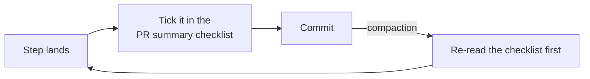

# PR Summary — Issue #2635

## Summary

Closes #2635

The Long-Horizon Runs section told the agent to save its progress before the context refreshes. It named no working record to keep along the way, and no point at which to read that record back. The compaction bullet now names one mechanism: a running `- [ ]` checklist of the task's steps, kept in the PR summary. It also says when to update the checklist (tick each step as it lands) and when to re-read it (first, after a compaction).

**Why the PR summary and not a scratch file.** `docs/archive/pr-summaries/pr-summary-<N>.md` is already committed on every run, so it survives a compaction and a container restart. A scratch file would need one of two things: a cleanup step, or a `.gitignore` entry plus a guarantee that it never reaches the PR. The PR summary needs neither, and needs no Commit Safety allowlist change.

**Cost to the fixed prompt.** The change is **net +1 line**: 3 lines are replaced by 4 in `prompts/coding_guidelines/prompt.md` (1159 → 1160 lines, +75 bytes). The rule rides the existing compaction bullet, so it adds no new bullet to the always-loaded prompt that #2574 shrank.

`docs/REFERENCES.md` now records that this tip from the Opus 5.5 blog is covered.

## Evidence

This is a prompt-only change, so the evidence is the tests. There is no visual surface.

- `worker/deno/tests/running_checklist_2635_test.ts` has 4 tests. It reads the section through `section()`, `withoutSection()` and `flat()` from `tests/support/markdown_docs.ts`.
- **TDD:** run against the prompt on `origin/main`, the suite fails. Against the edited prompt it passes (`ok | 4 passed | 0 failed`).
- The targeted prompt suites pass: `coding_guidelines_*`, `prompt_*`, `no_verify_ban` and `hidden_allowlist_drift`.

## Checklist

- [x] Choose the mechanism and record why
- [x] Edit the Long-Horizon Runs compaction bullet
- [x] Tests: the mechanism, when to update, when to re-read, one carrier, and the negative control
- [x] Update `docs/REFERENCES.md`
- [x] Run `./quality.sh`

## Acceptance Criteria

<!-- vibe-spec-review inputs="diff+issue-body" -->

- **met** — The Long-Horizon Runs guidance names one checklist mechanism and says when to update it and when to re-read it — evidence: `prompts/coding_guidelines/prompt.md` compaction bullet; `running_checklist_2635_test.ts::names one mechanism` and `::says when to update and when to re-read it` — reviewer: met
- **met** — The PR states how many lines the change adds to the fixed prompt, and the addition is kept as small as possible — evidence: Summary above, net +1 line (1159 → 1160, +75 bytes), with no new bullet; `::one bullet carries the rule, not a new one` — reviewer: met
- **met** — If the design uses a file, it can never be committed and the allowlist is not widened — evidence: the design uses no scratch file, because the PR summary is already a committed artefact; neither `.gitignore` nor `gitignore_enforcer.ts` changes — reviewer: met
- **unrequested** — `docs/REFERENCES.md` row updated — reviewer: unrequested — reason: that row listed this tip as a gap, and a code change owes a docs change

## Standards Review

<!-- vibe-standards-review inputs="diff+CODING-STANDARDS.md" -->

- **violation** — Documentation-drift tests: the first draft sliced the section by hand and pinned a raw bullet count — evidence: `worker/deno/tests/running_checklist_2635_test.ts` — reason: fixed in this diff. The test now uses `section()` and `flat()`, asserts that exactly one bullet carries the rule, and adds a `withoutSection()` negative control.
- **clean** — Australian English; KISS (no new bullet, no new file mechanism); Commit Safety (no hidden paths staged, allowlist unchanged); Token Economy (+75 bytes); real-function tests through `loadPrompt`, with no source grep of code.

## Test Plan

- `deno test -A worker/deno/tests/running_checklist_2635_test.ts`
  - `names one mechanism: a checklist in the PR summary`
  - `says when to update and when to re-read it`
  - `one bullet carries the rule, not a new one`
  - `negative control: the rule lives only in Long-Horizon Runs`
- `./quality.sh < /dev/null`
