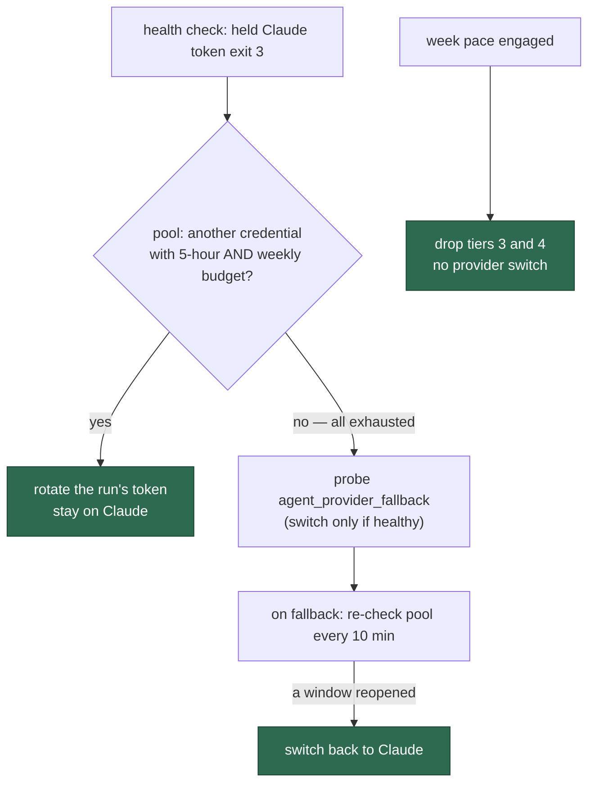

# Drain every Claude credential before the fallback provider; the pace guard never switches provider

## Summary

On GRQ-23 at 2026-09-25 06:54:56Z the weekly-pace guard engaged
(`used=68.0% elapsed=33.9% projected=200.7%`). Because
`agent_provider_fallback: ["deepseek"]` was configured, the #2470 pace
fallback then **switched the whole host's active provider to DeepSeek**. After
that every claim ran on DeepSeek, `top-priority` and `work-on` included, while
Claude still had 32% of its week left. DeepSeek answered
`402 Insufficient Balance` three minutes later.

The owner's rule (2026-09-25): *"I want to drain Claude completely before
flipping to DeepSeek"*, and *"if we are out of the 5-hour (or weekly) limits on
ALL the Claudes then we would flip."* This PR does three things:

1. **A pace projection never moves work to another provider.** The #2470
   switch is removed along with `pace_provider_fallback.ts`. An engaged guard
   drops tiers 3 and 4 and switches nothing, as it did before #2470. The claim
   scan, the idle census and the filer read the gate's one recorded verdict
   again (`weekPaceGate.lastEngaged()`).
2. **One exhausted credential rotates to the next Claude credential.** When
   the cycle-start health check reports the held token usage-limited
   (exit 3), the health gate asks the credential pool for another token with
   budget on **both** its five-hour window and its weekly limit. That uses the
   new `ClaudeCredentialPool.selectAvailable`. If it finds one, the gate
   switches the run's token to it. `agent_provider_fallback` is probed only
   when every credential is exhausted.
3. **The run switches back once a window reopens.** While a fallback stands
   in, the gate re-checks the pool at most every ten minutes and restores the
   preferred provider as soon as one credential has budget again.

A token whose budget cannot be measured is never rotated to, so a failed
probe cannot bounce the run between two spent tokens. A run whose token came
from the environment, not a pool file, cannot name the refused credential, so
it keeps the pre-#2637 fallback path.

Closes #2637.

## Acceptance Criteria

| # | Criterion | Status | Evidence |
|---|-----------|--------|----------|
| 1 | Pace engaged with an `ordered` fallback: every claim (all tiers) runs on the preferred provider; the projection never switches the active or per-claim provider | met | The pace switch is deleted from `run_core_production_deps.ts`. `run_core_production_deps_drain_claude_2637_test.ts` drives the real factory with an engaged gate and `agent_provider_fallback: ["deepseek"]`, runs the scan, and asserts `runProviderOverrideId() === undefined` and no `[pace-fallback]` line |
| 2 | The fallback is selected only once the preferred provider is actually exhausted | met | The health gate probes `agent_provider_fallback` only after `selectPreferredCredential` finds no credential with budget. See `run_core_test.ts`, "every Claude credential exhausted: the fallback provider takes over" |
| 3 | A fallback that is itself out of balance is never selected while Claude has quota, and never parks work | met | Nothing selects the fallback while any Claude credential has budget (criteria 1 and 2). When all are spent, the existing health probe still refuses an unhealthy alternative (`an unhealthy alternative keeps the skip-cycle path`) |
| 4 | The scan, census and filer share one verdict | met | All five consumers read `weekPaceGate.lastEngaged()` / the scan's `isEngaged()`. The wiring test asserts `deps.weekPaceEngaged()` equals the gate's verdict in both directions |
| 5 | Tests in both directions: pace engaged keeps every tier on Claude; Claude exhausted moves work to the fallback. Also 2 of 3 exhausted stays on Claude, 3 of 3 flips, and a reset returns to Claude | met | Pool: five `selectAvailable` tests in `claude_credential_pool_test.ts`. Loop: three #2637 tests in `run_core_test.ts` (rotate, flip, switch back). Wiring: four tests in `run_core_production_deps_drain_claude_2637_test.ts` (pace engaged/not, 2 of 3 / 3 of 3) |
| 6 | Docs describing #2470's pace fallback are updated | met | `docs/workflows/issue-processing.md` (the gate never moves work), `docs/SETUP.md` (drain-before-fallback and its log lines), `docs/PROVIDER-PARITY.md` (flow chart and fallback text), `docs/CONFIGURATION.md` (`agent_provider_fallback` row). The #2470 sweep ledger is marked retired and its slice is removed from `lib-sweep-coverage.json` |

## Reproduction

- **Symptom:** the pace guard engages with an `ordered` fallback configured,
  and the host's active provider flips to DeepSeek for every tier
  (`[pace-fallback] week pace engaged — switching the active provider to
  deepseek`). Claims then park on `402 Insufficient Balance` while Claude
  still has quota.
- **Status:** partial. The GRQ-23 log lines above show the switch in
  production. The removed `ensurePaceFallback` set the run override to the
  first alternative on the first engaged scan. The regression test needs the
  new `weekPaceGate` seam, so it was not run against the pre-fix factory.
- **Covering regression test:**
  `worker/deno/tests/run_core_production_deps_drain_claude_2637_test.ts`,
  "pace engaged with a fallback configured: no provider switch, and the shared
  verdict drops the backlog tiers (Issue #2637)". Also `run_core_test.ts`,
  "one exhausted credential rotates to the next Claude credential, never to
  the fallback provider (Issue #2637)".

## Tests run

Targeted `deno test --allow-all` over every test file that imports
`run_core.ts`, `run_core_production_deps.ts` or `claude_credential_pool.ts`,
plus `lib_sweep_coverage_test.ts`. `deno fmt`, `deno lint` and `deno check` on
every changed `.ts` file, and markdownlint on every changed `.md` file.
