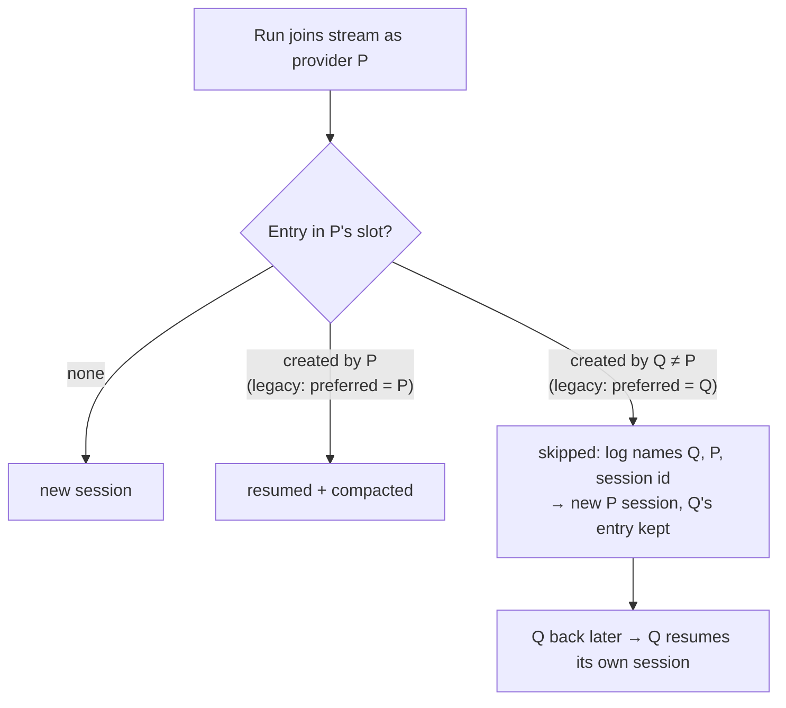

# PR Summary — Issue #2638

## Summary

Closes #2638.

On GRQ-23 a stream session built on Claude (about 1.2 MB of transcript) was
stored in the stream record's DeepSeek slot. After the pace fallback moved the
host to DeepSeek, the next run resumed it
(`session 2ab1e141-… (resumed) … providerId=deepseek`). DeepSeek got the whole
Claude transcript and the run ended with `Prompt is too long`. A stream session
now belongs to the provider that created it.

- **Record the creator:** each entry in `stream-<key>.json` now carries
  `providerId`, the provider whose CLI created the session
  (`resume_state_store.ts`). The field is optional and additive, so older files
  still parse.
- **Never resume another provider's session:** `lookupStreamSession` returns a
  new `foreign` status when the entry in a provider's slot was created by a
  different provider. `adoptStreamSession` then opens a new session
  (`outcome: "new"`, with `skipped` set). It does **not** delete the entry, so
  switching back to its creator resumes it again. `primeStreamSession` logs the
  skip, naming the session id and both providers.
- **Legacy entries:** an entry with no recorded creator is presumed to belong to
  the configured preferred provider. That is the repository's pin, else
  `agent_provider`, never the pace fallback's run override. There is no
  migration step. The new `preferredAgentProviderId` (`agent_provider.ts`)
  resolves the same way as `resolveAgentProviderId` but ignores the run
  override. `preferredStreamProviderId` (`stream_session.ts`) adds the repo pin
  and falls back to the default instead of throwing. This also neutralises the
  contaminated GRQ-23 records: their DeepSeek-slot entries are presumed Claude's
  and are skipped on DeepSeek.
- **Compaction follows the same rule:** `compactStreamSession` accepts
  `sessionProviderId`. When it differs from the run's provider, compaction is
  `skipped` and the message names both providers and the session id. The setup
  and planning callers pass the adopted state's provider.
- **Hand-on names the provider that served the run:** planning now passes each
  turn's `provider` to `handOnStreamSession`, as the execute phase already did.
  Before, a turn whose state carried no provider was filed under the provider
  *anticipated* before the spawn. That is one way a Claude session lands in the
  DeepSeek slot.
- **Docs:** `DESIGN-PRINCIPLES.md` has a new principle, F2c.

## Evidence

New suite `worker/deno/tests/stream_session_provider_binding_2638_test.ts` has
10 tests, all passing. Before the fix, 4 of them failed: the GRQ-23 record, the
legacy record, creator recording, and compaction of another provider's session.

## Acceptance Criteria

<!-- vibe-spec-review inputs="diff+issue-body" -->

| Criterion | Status | Evidence |
| --------- | ------ | -------- |
| AC1: a session records its creator, the store keeps one session per provider, and a run never resumes another provider's session | **met** | Tests "a saved stream session records the provider that created it", "a Claude-created stream session is not resumed on DeepSeek" and "a Claude session filed in the DeepSeek slot is still not resumed on DeepSeek". Resumed state carries the creator, so `sessionResumeForProvider` also drops it if the spawn lands elsewhere ("a resumed stream state is bound to its creator at spawn"). |
| AC2: switching back resumes the original provider's own session | **met** | "switching back to Claude resumes Claude's own session after a DeepSeek run": Claude → DeepSeek (own session) → Claude resumes `CLAUDE_SESSION`, and DeepSeek resumes its own. A foreign entry is never deleted. |
| AC3: stored sessions with no provider are treated as the configured preferred provider, with no migration and no crash | **met** | "a legacy record with no provider reads as the preferred provider's" covers both preferences. "the preferred provider ignores the pace fallback's run override" covers the resolver. |
| AC4: the skip log names both providers and the session id | **met** | `primeStreamSession` logs `stream session <id> was created by <creator> — not resuming it on <provider>; …`. The test asserts the id, `claude` and `deepseek`. The compaction skip names all three too. |
| AC5: tests cover both directions | **met** | Not resumed on DeepSeek (two tests) and resumed on Claude (two tests), plus the legacy case and compaction in both directions. |

## Reproduction

- **symptom**: a stream session created on Claude was resumed on DeepSeek
  (`stream stSoftwareAU/GRQ (blank) session 2ab1e141-… (resumed)
  providerId=deepseek`). The run logged `init model: claude-opus-5`, then
  `Prompt is too long`.
- **status**: `verified`. Against the pre-fix `lib/`, the new suite fails the
  GRQ-23 record case (the DeepSeek slot holding a Claude session is resumed)
  and the legacy-record case (an unlabelled DeepSeek-slot entry is resumed on
  DeepSeek). With the fix, all 10 tests pass.
- **regression test**:
  `worker/deno/tests/stream_session_provider_binding_2638_test.ts::#2638 - a Claude session filed in the DeepSeek slot is still not resumed on DeepSeek`

## Standards Review

<!-- vibe-standards-review inputs="diff+CODING-STANDARDS.md" -->

- **TDD:** the failing tests were written first, and they cover both
  directions.
- **Backward compatible:** the new `providerId` field is optional. Old files
  parse, and nothing is migrated.
- **Resume is an optimisation:** a mismatch costs one resume, never the issue.
  An unresolvable preferred provider degrades to the default and says so.
- **Scope:** no change to the pace-fallback selection (#2637) or
  `provider_outage_alert.ts` (#2633). The `agent_provider.ts` change adds a
  read-only resolver and an opt-out flag on the private selection helper.
- No new lib files, so no lib-sweep top-up is needed.
- **Australian English** is used throughout.

## Test Plan

- [x] `deno test --allow-all` on every test that imports a touched module
      (`stream_session`, `stream_compaction`, `resume_state_store`,
      `agent_provider`, `planning_processor`, `setup_branch_phase`).
- [x] `deno fmt`, `deno lint` and `deno check` on the changed files.
- [x] markdownlint on the changed `.md` files.
