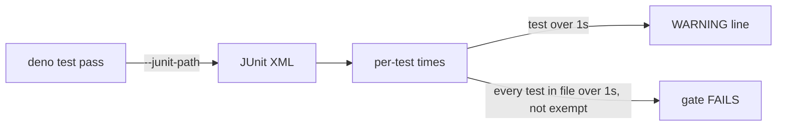

## Summary

Makes the slow "fully mocked" planning tests fast, adds a unit-test time budget
to the unit runner and the gate, and gives agents a unit-only targeted test
command. Closes #2642.

**Root cause.** `processIssuePlanning` and the setup-branch phase called
`primeStreamCompaction` directly. It sits outside every `createMockDeps` seam.
The planning tests share a fixed `workDir` (`/tmp/rtk-2384-planning-work`,
`/tmp/planning-2561-work`, …), and the first round records a stream session
there. After that, every round, including rounds in later `deno test`
processes, "resumed" the stream. `compactStreamSession` then walked
`~/.claude/projects` and spawned the **real agent CLI** (`nice -n 5 claude
--resume <id>` with a `/compact` prompt, found by patching `Deno.Command`). On a
host with `claude` installed and logged in, that is a real model turn, which
explains the 1–3 s per test.

**Fix.** `primeStreamCompaction` is now a `ClaudeDeps` seam. Production wires
the real function. `createMockDeps` answers `undefined` (no compaction window)
and spawns nothing. Both call sites go through `deps.claude`.

**Time budget.** Each unit pass now runs with `--junit-path`. The new
`lib/unit_test_time_budget.ts` reads the per-test times back:

- every test over 1 s gets a `WARNING: slow unit test (1.23s > 1.00s): <file> — <name>` line;
- a file whose tests *all* exceed 1 s fails the gate (`Deno tests: FAILED (unit-test time budget)`) and `deno task test:unit`, unless it is in `INTEGRATION_TEST_FILES` or on `SLOW_UNIT_TEST_KEEP_FILES`. That keep-list includes `IN_GATE_SCRIPT_SUITES` by reference.

**Targeted unit runs.** `deno task test:unit tests/a_test.ts tests/b_test.ts`
runs only the unit tests among the files named. Parallel-safe files run under
`--parallel` and parallel-unsafe ones run serially. Integration suites are
skipped and named. `prompts/coding_guidelines/prompt.md` and
`CODING-STANDARDS.md` now point at this command instead of a raw
`deno test <files>`.

## Evidence

Backend/CLI change. There is no UI to screenshot.

### Before / after: every test file that drives `processIssuePlanning` or the setup phase

Measured on this host (Linux aarch64, `deno test --no-check --allow-all <file>`,
the file run alone):

| File | Before | After |
|---|---:|---:|
| `tests/planning_processor_rtk_test.ts` | 5 s (4 s in-test; ~0.5 s/test) | **37 ms** |
| `tests/planning_processor_graft_codegraph_2561_test.ts` | 2 s | **25 ms** |
| `tests/graft_context_wiring_2102_test.ts` | **13 s** | **47 ms** |
| `tests/planning_processor_codegraph_2159_test.ts` | 1 s | 20 ms |
| `tests/planning_processor_test.ts` (131 tests) | 643 ms | 102 ms |
| the other 13 files that reach planning/setup-branch | unchanged (ms) | unchanged |

`issue_worker_test.ts` (15 s) and `git_push_test.ts` (3 s) did not change.
Their cost comes from somewhere else and is outside this issue's cause.

### `run_ps1_launcher_test.ts`: the per-test cost is inherent

39 tests, 80 s here. Most cost about 1 s and a few cost 2–7 s. I routed the
harness's `VIBE_REAL_DENO` through a timing wrapper for one test ("exits with
the container's exit status"). A single launch makes **six real
`deno run mod.ts …` sub-invocations** of ~200 ms each: `run-mode`,
`container-launch-plan`, `container-reap`, `container-image-prune`,
`container-store-prune` and `container-restart-backoff`. Those sub-commands are
what the containment verdict is about: the launch plan decides the mounts, and
reap and prune decide what the host keeps. Stubbing them would test the stub,
not `run.ps1`. The 6–7 s cases are the watchdog tests, which wait out a real
deadline by design. `pwsh` itself starts in ~80 ms, and the per-test harness
setup (a temp tree and five stub scripts) costs milliseconds. Nothing
non-essential was left to cut, so the file stays as it is, on the keep-list,
via `IN_GATE_SCRIPT_SUITES`.

## Acceptance Criteria

REVIEW_PLACEHOLDER

## Test Plan

- `worker/deno/tests/stream_compaction_seam_2642_test.ts` (new) is the regression test. Planning and the setup phase must reach compaction through `deps.claude`, and the seam's window must reach every turn. It **failed on the unfixed code** (3/3 red; the planning case spawned `claude` and took 601 ms) and passes after the fix (21 ms).
- `worker/deno/tests/unit_test_time_budget_test.ts` (new) covers both directions (a slow stub test is reported, a fast one is not), the all-slow file failure, integration and keep-list exemptions, JUnit parsing including entities and malformed reports, a real `deno test --junit-path` report, and a missing report failing loud.
- `worker/deno/tests/unit_test_passes_test.ts` adds per-pass JUnit paths and `targetedUnitTestPasses`: the split, integration skipping, path normalisation, de-duplication, empty passes omitted and the real manifests.
- Re-ran the 18 planning/setup-branch test files, `unit_test_passes_test.ts`, `quality_gate_test_env_test.ts` and the prompt/guideline suites. All green.
