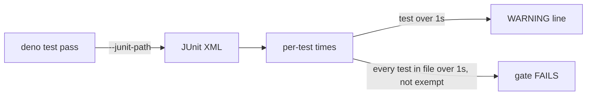

## Summary

Makes the slow "fully mocked" planning tests fast, adds a unit-test time budget
to the unit runner and the gate, and gives agents a unit-only targeted test
command. Closes #2642.

**Root cause.** `processIssuePlanning` and the setup-branch phase called
`primeStreamCompaction` directly. It sits outside every `createMockDeps` seam.
The planning tests share a fixed `workDir` (`/tmp/rtk-2384-planning-work`,
`/tmp/planning-2561-work`, …), and the first round records a stream session
there. After that, every round, including rounds in later `deno test`
processes, "resumed" the stream. `compactStreamSession` then walked
`~/.claude/projects` and spawned the **real agent CLI** (`nice -n 5 claude
--resume <id>` with a `/compact` prompt, found by patching `Deno.Command`). On a
host with `claude` installed and logged in, that is a real model turn, which
explains the 1–3 s per test.

**Fix.** `primeStreamCompaction` is now a `ClaudeDeps` seam. Production wires
the real function. `createMockDeps` answers `undefined` (no compaction window)
and spawns nothing. Both call sites go through `deps.claude`.

**Time budget.** Each unit pass now runs with `--junit-path`. The new
`lib/unit_test_time_budget.ts` reads the per-test times back:

- every test over 1 s gets a `WARNING: slow unit test (1.23s > 1.00s): <file> — <name>` line;
- a file whose tests *all* exceed 1 s fails the gate (`Deno tests: FAILED (unit-test time budget)`) and `deno task test:unit`, unless it is in `INTEGRATION_TEST_FILES` or on `SLOW_UNIT_TEST_KEEP_FILES`;
- exempt files get one `slow by decision: <file> — N test(s)` note instead of a WARNING per test. A green gate prints one summary line, not one line per test (#2430). The full list comes from `deno task test:unit`.

`SLOW_UNIT_TEST_KEEP_FILES` holds `IN_GATE_SCRIPT_SUITES` and `SUBPROCESS_TIMING_TEST_FILES` by reference, plus a **baseline**. I measured the budget over the whole unit suite on this host:

- parallel pass: 24,219 tests in 1,652 files;
- serial pass: 129 tests, green, with nothing new over budget.

28 files were already entirely over 1 s (`OVER_BUDGET_AT_BASELINE`; nearly all drive real git repositories) and 10 were within parallel-load noise of it (`NEAR_BUDGET_AT_BASELINE`). They are listed so the gate catches *new* slow files without failing every run on old ones. Burning them down is follow-up issue stSoftwareAU/VibeCoder#2669.

**Targeted unit runs.** `deno task test:unit tests/a_test.ts tests/b_test.ts`
runs only the unit tests among the files named. Parallel-safe files run under
`--parallel` and parallel-unsafe ones run serially. Integration suites are
skipped and named, and an unknown flag is refused. `prompts/coding_guidelines/prompt.md` and
`CODING-STANDARDS.md` now point at this command instead of a raw
`deno test <files>`.

## Evidence

Backend/CLI change. There is no UI to screenshot.

### Before / after: every test file that drives `processIssuePlanning` or the setup phase

Measured on this host (Linux aarch64, `deno test --no-check --allow-all <file>`,
the file run alone):

| File | Before | After |
|---|---:|---:|
| `tests/planning_processor_rtk_test.ts` | 5 s (4 s in-test; ~0.5 s/test) | **37 ms** |
| `tests/planning_processor_graft_codegraph_2561_test.ts` | 2 s | **25 ms** |
| `tests/graft_context_wiring_2102_test.ts` | **13 s** | **47 ms** |
| `tests/planning_processor_codegraph_2159_test.ts` | 1 s | 20 ms |
| `tests/planning_processor_test.ts` (131 tests) | 643 ms | 102 ms |
| the other 13 files that reach planning/setup-branch | unchanged (ms) | unchanged |

`issue_worker_test.ts` (15 s) and `git_push_test.ts` (3 s) did not change.
Their cost comes from somewhere else and is outside this issue's cause.

### `run_ps1_launcher_test.ts`: the per-test cost is inherent

39 tests, 80 s here. Most cost about 1 s and a few cost 2–7 s. I routed the
harness's `VIBE_REAL_DENO` through a timing wrapper for one test ("exits with
the container's exit status"). A single launch makes **six real
`deno run mod.ts …` sub-invocations** of ~200 ms each: `run-mode`,
`container-launch-plan`, `container-reap`, `container-image-prune`,
`container-store-prune` and `container-restart-backoff`. Those sub-commands are
what the containment verdict is about: the launch plan decides the mounts, and
reap and prune decide what the host keeps. Stubbing them would test the stub,
not `run.ps1`. The 6–7 s cases are the watchdog tests, which wait out a real
deadline by design. `pwsh` itself starts in ~80 ms, and the per-test harness
setup (a temp tree and five stub scripts) costs milliseconds. Nothing
non-essential was left to cut, so the file stays as it is, on the keep-list,
via `IN_GATE_SCRIPT_SUITES`.

## Acceptance Criteria

<!-- vibe-spec-review inputs="diff+issue-body" -->

- **met** — `planning_processor_rtk_test.ts` and `planning_processor_graft_codegraph_2561_test.ts` each run in under 1 s, with no test deleted or weakened — evidence: the Before/After table above (37 ms, 25 ms); the reviewer measured 45 ms and 25 ms independently; both files are unchanged — reviewer: met
- **met** — root cause named, and the other affected files fixed too — evidence: Summary ("Root cause"); `worker/deno/lib/issue_worker_wiring.ts` (the `primeStreamCompaction` seam), `worker/deno/lib/phases/setup_branch_phase.ts`; `worker/deno/tests/stream_compaction_seam_2642_test.ts`; `graft_context_wiring_2102_test.ts` went from 13 s to 47 ms — reviewer: met
- **met** — the unit runner prints a WARNING for every unit test over 1 s, and a test pins both directions — evidence: `worker/deno/tests/unit_test_time_budget_test.ts::time budget - a slow stub test is reported with its name and time` / `::a fast test is not reported`; `worker/deno/unit_test_runner.ts` — reviewer: met — reason: since the review, tests in exempt (keep-list or integration) files get one note per file instead of a WARNING each. The standards reviewer flagged dozens of WARNINGs on every green run of files that are slow by decision. Every non-exempt slow test still gets its WARNING.
- **met** — a documented command runs only the unit tests among a given list of files, and the coding guidelines point at it — evidence: `deno task test:unit <files>` via `targetedUnitTestPasses` in `worker/deno/lib/unit_test_passes.ts`; `worker/deno/tests/unit_test_passes_test.ts::targeted passes - …`; `prompts/coding_guidelines/prompt.md` (Targeted Test Execution → Deno); `CODING-STANDARDS.md` — reviewer: met — reason: the flag-value flaw the reviewer noted (`--filter foo`) is fixed; unknown flags are now refused.
- **met** — `run_ps1_launcher_test.ts` is either measurably faster or its inherent per-test cost is explained — evidence: Evidence › "`run_ps1_launcher_test.ts`: the per-test cost is inherent" (six real `deno run mod.ts` sub-invocations per launch, measured) — reviewer: met
- **met** — no quality regression: the unit test count and the set of assertions do not fall — evidence: no existing test removed or edited; 3 + 14 + 6 new tests; the `unitTestPasses` refactor keeps the existing `unit_test_passes_test.ts` green — reviewer: met
- **unrequested** — `deno task test:unit` exits 1 when every file given is an integration suite — reviewer: unrequested — reason: fail loud; a targeted run that ran nothing has proved nothing.
- **unrequested** — the gate fails when a green pass left no readable JUnit report, and a budget failure invalidates the gate's pass cache — reviewer: unrequested — reason: fail loud; a missing report must not read as "no test was slow", and a cached PASS must not outlive a budget failure.
- **unrequested** — a real `deno test` subprocess inside `unit_test_time_budget_test.ts` — reviewer: unrequested — reason: removed after review; the parser is now held to a verbatim fixture of a real report.
- **unrequested** — `test:unit` gains `--allow-write` — reviewer: unrequested — reason: the runner creates the JUnit temp directory; the passes it spawns already had write.
- **unrequested** — `--parallel-only` / `--serial-only` also filter targeted runs — reviewer: unrequested — reason: a side effect of the runner restructure, and consistent with the flags' meaning.

## Standards Review

<!-- vibe-standards-review inputs="diff+CODING-STANDARDS.md" -->

- **violation** — the new budget would fail the gate on current green tests (for example `launcher_signal_readiness_test.ts`) — evidence: `worker/deno/lib/unit_test_time_budget.ts` (`SLOW_UNIT_TEST_KEEP_FILES`) — reason: fixed. `SUBPROCESS_TIMING_TEST_FILES` is now kept by reference, and a full-suite measurement produced the `OVER_BUDGET_AT_BASELINE` / `NEAR_BUDGET_AT_BASELINE` burn-down lists (follow-up #2669). The measured suite now gives 0 budget failures.
- **violation** — the new `lib/` module was not claimed by a sweep slice (`lib_sweep_coverage_test.ts`) — evidence: `docs/audits/lib-sweep-coverage.json` — reason: fixed; it is claimed beside `unit_test_passes.ts`.
- **violation** — "In VibeCoder" in the fleet-wide prompt breaks house vocabulary and is repo-specific — evidence: `prompts/coding_guidelines/prompt.md` (Targeted Test Execution) — reason: fixed; the text is now generic ("when `deno.json` has a `test:unit` task … from the directory holding that `deno.json`").
- **violation** — WARNING lines fired on every green run for files that are slow by decision, and a green gate stage printed per-test lines (#2430) — evidence: `worker/deno/lib/unit_test_time_budget.ts`, `worker/deno/lib/quality_gate.ts` — reason: fixed. Exempt files get one note each, and the green gate prints one summary line.
- **clean** — mock seam with no remaining direct callers; `createMockDeps` default spawns nothing; regression test present; fail-loud report handling and cache invalidation; temp-dir cleanup; console redaction kept; happy, error and edge coverage; no env mutation or grep tests; Australian English; no hidden files. Optional note: the 1 s threshold is absolute under `--parallel` load. The near-budget baseline exists so that noise does not fail an unrelated change.

## Test Plan

- `worker/deno/tests/stream_compaction_seam_2642_test.ts` (new) is the regression test. Planning and the setup phase must reach compaction through `deps.claude`, and the seam's window must reach every turn. It **failed on the unfixed code** (3/3 red; the planning case spawned `claude` and took 601 ms) and passes after the fix (21 ms).
- `worker/deno/tests/unit_test_time_budget_test.ts` (new) covers both directions (a slow stub test is reported, a fast one is not), the all-slow file failure, exempt files getting one note and never failing, the baseline and subprocess-timing keep-list, JUnit parsing (entities, malformed reports, a verbatim real `deno test --junit-path` report), and a missing report failing loud.
- `worker/deno/tests/unit_test_passes_test.ts` adds per-pass JUnit paths and `targetedUnitTestPasses`: the split, integration skipping, path normalisation, de-duplication, empty passes omitted and the real manifests.
- Measured the budget over the whole unit suite: the parallel pass (24,219 tests, 2 failures, both fixed since: sweep coverage and house vocabulary) and the serial pass (129 passed). After the baseline there are 0 budget failures. `growth_bound_test.ts` flaked once on a loaded host and passed on re-run; it is a real-clock test untouched here.
- Re-ran the 18 planning/setup-branch test files, `unit_test_passes_test.ts`, `quality_gate_test_env_test.ts` and the prompt/guideline suites. All green.
