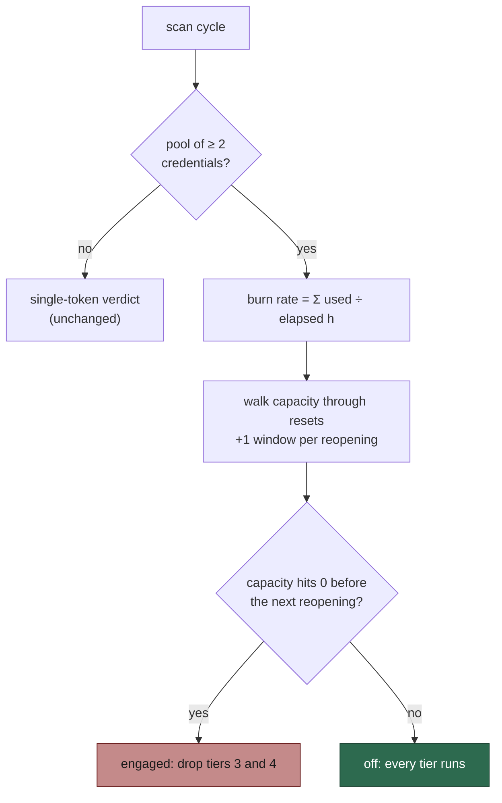

# Judge the weekly pace guard across the whole Claude credential pool

## Summary

The weekly pace guard (#1885) drops `low-priority` and `idle-task` pickup when
the Claude quota will not last until it resets. Until now it judged **one**
token, the one the run held. On GRQ-23 at 2026-09-25 06:54Z it engaged on
`used=68.0% elapsed=33.9% projected=200.7%` for `provider-2`. That reading
said nothing about the other two subscriptions.

The owner's rule (2026-09-25): the guard keeps its job, but "won't make it"
takes every auth token into account. If one token is near its end and another
will open soon, or still has budget, work keeps going.

This PR adds `claudePoolWeekPaceVerdict`, a pure pool-level verdict with the
clock as a parameter:

1. **Burn rate.** Each credential's `used share ÷ elapsed hours` for its own
   window, summed across the pool, in windows per hour. A credential inside
   its 24 h grace, or whose window has rolled over, gives no rate.
2. **Capacity walk.** Start from the sum of every credential's remaining
   share. Step through the reset times in order, drawing capacity down at the
   burn rate (soonest-expiring credential first). Add a full window each time
   a credential's week reopens. The walk ends at the latest reset, at most
   168 h out.
3. **Verdict.** Engaged if capacity reaches zero at or before the next
   reopening. Off otherwise.
4. **Unknown.** A credential with an unknown reading, or with no seven-day
   window, is left out of both the rate and the capacity. A pool with no
   usable reading is `unknown`, logs a WARNING, and leaves the gate off.

A single-credential pool takes its state from the existing
`claudeWeekPaceVerdict`, so it is exact, not just equivalent. A single-token
host doesn't read the pool at all (`readPoolBudgets` answers `null` with
fewer than two candidates). It keeps its one-token path, its probe and its
log line.

In production, `createProductionRunCoreDeps` builds one lazy
`ClaudeCredentialPool` that the #2637 health-gate rotation and the pace gate
share. The gate reads the pool's ten-minute snapshots through the new
`ClaudeCredentialPool.readPoolBudgets`. The claim scan, the idle census and
the filer still read the gate's one recorded verdict.

### The GRQ-23 reading, judged as a pool

At 06:44Z the pool logged `provider` 90 % used (reopens 2026-09-29 01:00Z),
`provider-2` 68 % used (reopens 2026-09-29 22:00Z), and `provider-3` 99 % used
(reopens 2026-09-25 09:00Z). The pool burns 2.95 % of a window per hour and
has 43 % left. `provider-3`'s fresh window at 09:00Z lifts that to about
137 %, which is used up at about 07:27Z on the 27th. That is roughly 42 hours
before `provider` reopens, so the guard **stays engaged** on the pool's own
figures. Across the pool, GRQ-23 is burning about five windows a week against
three subscriptions. The test "GRQ-23 at 2026-09-25 06:54Z" pins this result.

### A note on the issue's first test case

The issue's first case is "95 % and 20 % used, both resetting in 4 days, at
the current rate → off". With only those two credentials the model gives
**engaged**: 115 % of a window spent in 72 h is 1.60 %/h, and the 85 % left
runs out about 53 h in, 43 h before either reopens. That is a pool that
really won't make it. The tests therefore cover the case in three ways:

- With a third, fresh credential (the GRQ-23 shape), it is **off**. The old
  single-token guard would have engaged on the 95 % token.
- With just the two, it is **engaged**.
- With the same shares spent over longer windows (a slow burn), it is
  **off**.

Closes #2647.

## Acceptance Criteria

| # | Criterion | Status | Evidence |
|---|-----------|--------|----------|
| 1 | A pool-level successor takes every credential's seven-day reading and engages only when the pool runs out before capacity reopens, at the current burn rate. Pure, with the clock as a parameter | met | `claudePoolWeekPaceVerdict(budgets, nowMs, options)` and `walkPoolCapacity` in `worker/deno/lib/claude_week_pace.ts`. Neither has a clock of its own |
| 2a | 95 % / 20 %, both resetting in 4 days, at the current rate → off | partial | Off with a fresh third credential (`claude_week_pace_pool_test.ts`, "… beside a fresh third: off"). Also off at a slow rate ("… at a slow rate: off"). With only those two credentials the model's own arithmetic engages, and that is asserted as the fail direction. See the note above |
| 2b | Every credential spent a day before any reset → engaged | met | "every credential spent a day before any reset: engaged" asserts `runsOutAt ≤ nextReopenAt − 24 h` |
| 2c | One spent, another reopening in 2 h with enough to cover → off | met | "one credential spent, another reopening in 2 h …: off". Reverse direction: "… not reopening for 100 h: engaged" |
| 2d | A single-credential host behaves exactly as today | met | "a single credential behaves exactly as the single-token verdict" checks state and reason over 8 used shares × 9 elapsed points (grace, boundary, threshold, rolled over) × drain on/off. "a single-token host keeps the single-token path" shows the gate uses its one-token probe. `readPoolBudgets - a single-token host reads nothing and makes no request` |
| 2e | Unknown readings leave the gate off | met | "unknown readings leave the gate off", "an unknown credential is left out, not counted as headroom", "unknown pool readings warn and never refuse work", "a pool read that throws warns and never refuses work" |
| 3 | The `claude-week-pace:` line reports credentials counted, remaining capacity, burn rate per hour, and run-out against the next reopening. No token is logged | met | `formatPoolWeekPaceEngagedLine` / `…LiftedLine`: `pool counted=3/3 rated=3 remaining=43.0% burn=2.95%/h runs-out=… next-reopen=…`. The wiring test drives the real logger and asserts that no line contains the held token value. The field is `counted=`, not `credentials=`, because the logger's secret redaction masks `credentials=<value>` |
| 4 | Claim scan, idle census and filer share one verdict | met | They are unchanged: all read `weekPaceGate.lastEngaged()` or the scan's `isEngaged()`. `run_core_production_deps_pool_pace_2647_test.ts` drives the real factory with a real pool in both directions and asserts `deps.weekPaceEngaged()` |
| 5 | The five-hour window stays in token selection only | met | `usableSevenDay` reads only the `seven_day` window. "the five-hour window never drives the weekly verdict": five-hour-only readings are unknown, and spent five-hour windows on an on-pace week are off |
| 6 | Pace-guard docs updated | met | `docs/workflows/issue-processing.md` (new "A credential pool is judged as a pool" section with the GRQ-23 example), `docs/SETUP.md`, `DESIGN-PRINCIPLES.md`, `docs/IDLE-TASK-FRAMEWORK.md` |

## Notes

- `claude_week_pace_drain` (#2474) is unchanged. With drain on, the pool
  verdict is off with reason `drain`, as the single-token verdict is. A host
  loading `.config.json` without the key runs the guard (`config.ts` reads
  `=== true`), which is how GRQ-23 logged its engaged lines.
- No new lib module was added, so the lib-sweep ledger needs no top-up.

## Tests

All pure or injected, with no sleeps and no subprocesses:

- `tests/claude_week_pace_pool_test.ts`: 19 tests, about 5 ms.
- `tests/claude_credential_pool_test.ts`: 2 new `readPoolBudgets` tests.
- `tests/run_core_production_deps_pool_pace_2647_test.ts`: production wiring,
  both directions.
- Existing `claude_week_pace_test.ts`,
  `run_core_production_deps_drain_claude_2637_test.ts` and
  `run_core_production_deps_test.ts` pass unchanged.

🤖 Generated with [Claude Code](https://claude.com/claude-code)
