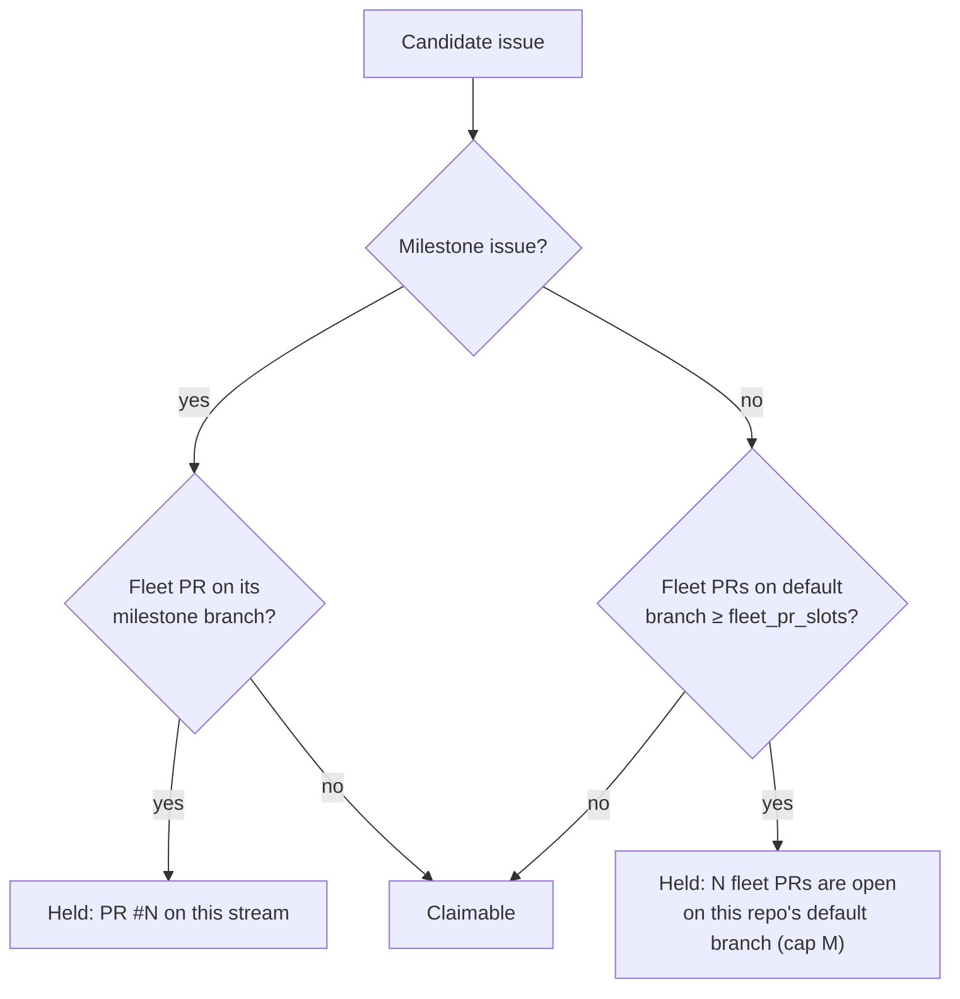

# PR Summary — Issue #2663: one fleet PR per slot

## Summary

Closes #2663

The owner's rule (2026-09-26): "There should be one PR per slot by the fleet
(not other humans). Multiple milestones means multiple PRs."

`getBlockingPRForIssue` held every non-milestone issue while **any** fleet PR
was open on the repository's default branch. The result was one fleet PR at a
time on the default branch, per repository, fleet-wide. This PR changes the
rule:

- A **non-milestone** issue is held only while the fleet's open PRs on the
  default branch reach the slot cap. PRs onto `milestone/*` branches and
  milestone-merge PRs are on other streams and never count.
- A **milestone** issue keeps its per-milestone-branch rule: one PR per
  milestone branch.
- Human-authored PRs never count, as before.

### The cap: `fleet_pr_slots`, default `8`

- A new `.config.json` key, `fleet_pr_slots`, can be overridden per repository
  with `repo_config.<repo>.fleet_pr_slots`. It is resolved by
  `resolveFleetPrSlots` in `worker/deno/lib/issue_query.ts`.
- **Why a fixed default:** no host's config carries the fleet's size. Each host
  knows only its own `max_concurrent_issues`, so the fleet's total slot count
  cannot be derived from config.
- **Why 8:** it is the ceiling of `max_concurrent_issues` (1–8). One host at its
  maximum never holds itself, and four hosts at the default two slots fill it
  exactly.
- Operators should set it to the sum of every host's `max_concurrent_issues`.
- A value that is not a positive integer falls back a level (per-repo → global
  → `8`). The gate is never disabled.

The key is documented in the `docs/CONFIGURATION.md` defaults table and the
`repo_config` table, and is listed in `config_unknown_keys.ts`.

### Fleet author set

`loadConfig` already folds `service_accounts` into `fleetPrAuthors` (#209). The
gate's push-capable set is therefore `github_user ∪ fleet_pr_authors ∪
service_accounts` on every host. New tests pin that a PR by either fleet
account counts.

There is one addition. The census and the idle audit read
`fetchAllOpenPRs`, whose rows carry the listing author as `authorLogin` and no
fetch-login `author`. Until now they classified nothing, so every open PR
counted, human PRs included. The gate now falls back to `authorLogin` when no
fetch login was stamped. As a result those readers classify each PR's owner the
same way the scan does.

### Everything that asks the question uses the same call and cap

- **Claim scan:** all five collectors, `new_work_eligibility`,
  `diagnose-issue` and `diagnose-repo`.
- **Claim-time live re-check:** `claimIssue` takes a `fleetPrSlots` option,
  passed by the setup-branch phase.
- **Idle-decision census:** `RepoCensusInput.fleetPrSlots`. The census now
  passes its push-capable set instead of `[]`.
- **Idle-detect audit:** `fleetPrSlotsFor`.
- **Idle-task filer's gate:** `anyRepoHasUnblockedRealWork`, `fleetPrSlotsFor`.
- **Blocking-PR stall watchdog.**

### Held-issue gate comment

The gate comment has a new `fleet-pr-cap` kind: "6 fleet PRs are open on this
repo's default branch (cap 6) — one fleet PR per slot; this issue is worked once
one lands." It no longer names one PR as the blocker. The comment key carries
the count, so the comment is edited when the count changes. A milestone hold
still names its PR.

### Docs

The per-slot rule replaces "one PR per target branch" and "one PR per work
stream" in these files:

- `docs/workflows/issue-processing.md`: Open PR blocking, the fleet guard stack
  and its diagram, and the one-issue-per-milestone note.
- `DESIGN-PRINCIPLES.md`
- `docs/OVERVIEW.md`
- `docs/HUMAN-PR-POLICY.md`
- `docs/workflows/milestones.md`
- `docs/workflows/resilience-and-concurrency.md`
- `docs/workflows/projects-and-dependencies.md`

## Acceptance Criteria

| Criterion | Status | Evidence |
|-----------|--------|----------|
| A non-milestone issue is held only while the fleet's open PRs on the repo's non-milestone branches number at least the slot count. The count is a documented config value. Milestone issues keep their behaviour. | met | `getBlockingPRForIssue` plus `resolveFleetPrSlots` / `DEFAULT_FLEET_PR_SLOTS` (`issue_query.ts`). `fleet_pr_slots` is in the CONFIGURATION.md tables. Tests: `fleet_pr_slots_test.ts` "below the cap…", "at the cap…", "milestone PRs do not count…", "milestone issues keep one PR per milestone branch". |
| Human-authored PRs never count. | met | "a human PR never counts towards the cap" in `fleet_pr_slots_test.ts`. The existing #4133 tests are kept. |
| The fleet author set is the union of `service_accounts` and `fleet_pr_authors` on every host. A test covers a PR by either fleet account. | met | `loadConfig` union (#209). Tests: "a PR by either fleet account counts" (`fleet_pr_slots_test.ts`), and `fleet_service_accounts_test.ts`, which now sets `fleet_pr_slots: 1` through `loadConfig`. |
| The held-issue gate comment states the count against the cap. | met | `fleet-pr-cap` gate in `held_issue_gate_comment.ts`, recorded as `BlockedCandidateInfo.fleetPrCap` by the work-on and configured-label collectors. Test: "the gate comment names the count against the cap". |
| The idle census counts the same gate the claim scan applies. | met | The census, the audit and the filer's gate all call `getBlockingPRForIssue` with the scan's author set and per-repo cap. Tests: "census and scan agree in both directions" (`fleet_pr_slots_test.ts`); `dependency_blocked_top_priority_parks_nothing_2563_test.ts` and `idle_filing_composition_1050_test.ts` now pass the scan's cap to every instrument. |
| Tests cover both directions: below cap claims, at cap holds, human never counts, other fleet account counts, milestones unaffected. | met | `worker/deno/tests/fleet_pr_slots_test.ts` (12 tests). |
| `docs/workflows/issue-processing.md` is updated to the per-slot rule. | met | "Open PR blocking" and the guard stack are rewritten. |

Existing tests that pin other behaviour behind a single open PR now set a cap of
`1`. This keeps their original meaning (one PR fills the stream), so their
assertions are unchanged.

## Reproduction

- **Symptom:** On stSoftwareAU/GRQ-AutoTrader, 2026-09-25, all 13 `work-on`
  issues (none with a milestone) carried "Held by the fleet — PR #1309 is open
  on this stream" for three hours while #1309 was open. The idle census showed
  `pr_blocked=29` for the repo.
- **Status:** fixed. A non-milestone issue is now held only once the fleet's
  default-branch PRs reach `fleet_pr_slots`.
- **Covering regression test:** `worker/deno/tests/fleet_pr_slots_test.ts`,
  "below the cap a non-milestone issue is claimable". Two fleet PRs at cap 3
  hold nothing. Against the unfixed code, any one fleet PR held the issue.

## Evidence

- `deno test --parallel --reporter=dot` over the 67 test files that touch the
  gate, collectors, census, audit, claim path, stall watchdog and docs: all
  passed, 0 failed.
- `deno check` over `mod.ts`, `commands/`, `lib/` and `tests/`: clean.
- `deno lint` and `deno fmt` are clean.
- `markdownlint-cli2` on every changed `.md` file: 0 errors.
