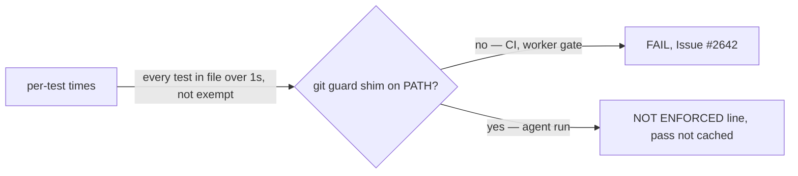

# PR Summary — Issue #2669: burn down `OVER_BUDGET_AT_BASELINE`

## Summary

Closes #2669

The 28 "every test over 1 s" files, plus the ten near-budget ones, were not
slow. The agent's git guard shim is first on `PATH`, and every
message-carrying `git` call a test makes (`-m`, `-F`, `--f…`, `commit-tree`)
starts a Deno process for the guard, costing about 200 ms. With the shim off
`PATH`, all 38 files ran in 2 s. So this PR:

- **deletes both baselines**: `OVER_BUDGET_AT_BASELINE` and `NEAR_BUDGET_AT_BASELINE`.
- **detects the shim** with `gitGuardShimOnPath`. It resolves `git` with the guard's own `resolveExecutable` and looks for `GIT_GUARD_SHIM_MARKER` in its header. When the shim is found, a would-be failure prints a loud `NOT ENFORCED:` line instead of `FAIL:`. The shim is never removed from `PATH`: doing that is the bypass the shim forbids.
- **never caches a waived pass** (`budgetProvedPass`). A gate that enforces the budget re-runs the tests instead of reusing that pass.
- **still enforces the budget in CI and in the worker's own gate**, neither of which has the shim.

## Evidence

| Measurement (38 baselined files, 178 tests) | Without shim | With shim |
| --- | --- | --- |
| Total wall time | 2 s | 39 s |
| Slowest file | 231 ms | — |
| `quality_gate_bump_audit_history_test.ts` | 59–78 ms | 1060 ms |

- `./quality.sh` result: **PASSED (with skipped checks)**. Only
  `config integration` was skipped, because there is no `.config.json`. The run
  was under the shim, and it printed five `NOT ENFORCED:` lines: four
  `milestone_sync_*` files and `quality_gate_bump_audit_history_test.ts`.
- `deno task test:unit tests/unit_test_time_budget_test.ts`: 22 passed.

## Acceptance Criteria

<!-- vibe-spec-review inputs="diff+issue-body" -->

- **partial** — `OVER_BUDGET_AT_BASELINE` is empty; each file made fast or moved to `INTEGRATION_TEST_FILES` with a reason — evidence: `worker/deno/lib/unit_test_time_budget.ts` (constant deleted; `tests/unit_test_time_budget_test.ts:113` forbids a baseline-style keep entry) — reviewer: partial — reason: the list is empty, but no file was edited or moved. Without the shim, where the budget is enforced (CI, the worker gate), all 38 files already run in 2 s in total, so none needed changing. Under the shim, the time the guard spends is reported as `NOT ENFORCED:`, which is a different remedy from the two the issue offers.
- **met** — `NEAR_BUDGET_AT_BASELINE` is empty — evidence: `worker/deno/lib/unit_test_time_budget.ts` (constant deleted; no references remain) — reviewer: met
- **unrequested** — shim detection and the `NOT ENFORCED:` waiver (`gitGuardShimOnPath`, the `unenforced` report field, output from the gate and the runner) — reviewer: unrequested — reason: without it, removing the baselines would fail every agent run on time the guard spends, not the tests.
- **unrequested** — a waived pass is never cached (`budgetProvedPass`, `worker/deno/lib/quality_gate.ts:1367`) — reviewer: unrequested — reason: a gate that enforces the budget must re-run the tests rather than reuse the waived pass.
- **unrequested** — `GIT_GUARD_SHIM_MARKER` exported from `lib/git_guard_shim.ts` — reviewer: unrequested — reason: detection and rendering share one marker (DRY).
- **unrequested** — `CODING-STANDARDS.md`, module doc comments, the new tests and this summary — reviewer: unrequested — reason: the documented budget rule changed, and the new code needs tests.

## Standards Review

<!-- vibe-standards-review inputs="diff+CODING-STANDARDS.md" -->

- **violation** — Never Fail Silently: a skipped check must be enforced loudly — evidence: `worker/deno/tests/unit_test_time_budget_test.ts:262` — reason: fixed here. The unreadable-`git` test used to `return` early (a silent pass) when run as root. It is now `Deno.test({ ignore })`, so it is reported as ignored.
- **violation** — TDD rule 3 / PR summary: tests added or modified must be documented — evidence: `docs/archive/pr-summaries/pr-summary-2669.md:59` — reason: fixed here. The Test Plan below now names each added and modified test.
- **clean** — Australian English; DRY (shared marker, reuses `resolveExecutable`); no new dependencies; fails loud (an unreadable `git` throws, each waiver prints a line and is never cached); the lib takes `PATH` as an argument; tests call real code in temp dirs, with happy, error and edge cases; docs updated; no hidden files or secrets.

## Test Plan

Tests added to `worker/deno/tests/unit_test_time_budget_test.ts` (all Issue #2669):

- `every keep-list entry is a reasoned decision, not a baseline`
- `under the git guard shim a slow file is reported, not failed`
- `without the git guard shim a slow file still fails`
- `budgetProvedPass - only an enforced, clean budget lets a pass be cached`
- `gitGuardShimOnPath` — finds the real rendered shim; no PATH, an empty PATH, or no `git` on it; skips a non-executable `git` or a directory named `git`; an unreadable `git` throws (ignored where root can read it)
- `passesTimeBudget - waives a slow file when the git guard shim is on PATH`

Modified: `the baseline and subprocess-timing suites are on the keep-list` becomes `the subprocess-timing suites are on the keep-list`, because the baseline it also checked is deleted.

- [x] `deno task test:unit tests/unit_test_time_budget_test.ts`: 22 passed
- [x] `deno fmt`, `deno lint` and `deno check` on the touched files
- [x] `./quality.sh`: PASSED (under the shim, with 5 NOT ENFORCED lines)

## Security self-check

- [x] The shim is only detected, never removed or bypassed. `PATH` is not edited.
- [x] An unreadable resolved `git` throws rather than reading as "no shim".
- [x] No secrets, hidden files or new dependencies are staged.
