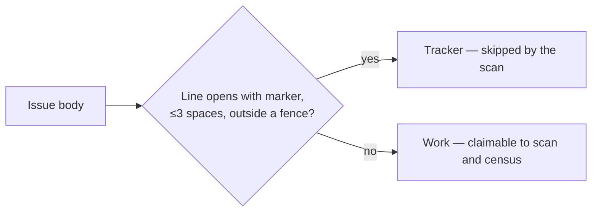

# PR Summary — Issue #2673

## Summary

Closes #2673

On Migration_v21 the census reported #451, #450 and #376 as claimable for three
cycles, but the claim scan kept refusing them. All three issue bodies **quote**
the milestone-tracker marker (`<!-- milestone-tracking-issue … -->`) in
backticks or prose. `isMilestoneTrackingIssue` matched the marker as a plain
substring, so `filterAndSort` dropped each one as a milestone tracker. The census
has no tracker filter, so it counted them as claimable, and the gap produced a
false idle-inversion alert on every cycle.

`hasLiveMilestoneTrackingMarker` (in `lib/issue_filter.ts`) now counts the marker
only in the position the worker writes it: a line that opens with the marker,
indented at most three spaces, outside a fenced code block. A quoted marker
counts as a mention, not a tracker. The title fallback (`Merge milestone '…'
to …`) is unchanged.



Follow-up note: `hasMilestoneTrackingMarker` in `lib/milestone_tracker_identity.ts`
still uses a substring check. That code has a separate purpose (tracker identity
during milestone completion), so it is out of scope here.

## Evidence

- `tests/issue_filter_test.ts` covers the cases below (the first four are
  regressions that failed before the fix):
  - a marker quoted in inline code
  - a marker mentioned mid-sentence
  - a marker inside ``` and ~~~~ fences
  - a marker in an indented code block (4 spaces or a tab)
  - a live marker below other text (3-space indent, CRLF), which is still
    detected
  - a live marker after a closed fence, which is still detected
  - `filterAndSort` keeping an issue whose body quotes the marker
- `tests/idle_decision_census_test.ts`: the census and `filterAndSort` agree
  that a body quoting the marker is claimable (reproduces #450).
- Targeted run: 190 passed across `issue_filter`, `idle_decision_census`,
  `regression_issue_filtering` and `milestone_tracker_identity`. The
  `idle_detect_diagnostics` suite also passed (55).

## Test Plan

- [x] `deno fmt`, `deno lint` and `deno check` pass on the touched files
- [x] `deno task test:unit` passes on the touched and related suites
- [ ] `./quality.sh` passes
