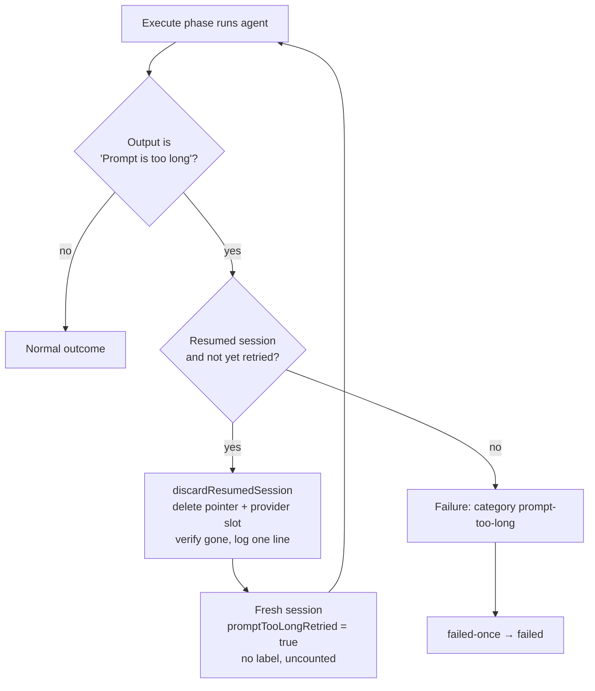

# PR summary — #2682: `Prompt is too long` must not mark an issue failed

## Summary

Closes #2682

When the agent CLI refuses a **resumed** stream session with
`Prompt is too long`, the execute phase now discards that session and retries
once on a fresh session. It logs one line naming the discarded session and the
new one. This first refusal adds no label and does not count towards the retry
budget. A refusal on a fresh session, or after the retry, is an ordinary failure
with category `prompt-too-long`, and goes up the usual `failed-once` → `failed`
ladder.

- `worker/deno/lib/prompt_too_long.ts` (new) holds the detection, the
  retry-or-fail decision, the failure reason and the discard path.
  `discardResumedSession` is the reusable discard that #2689 (token-scope) can
  call.
- `worker/deno/lib/phases/execute_phase.ts` adds
  `executeWithFreshSessionFallback`, which wraps both the first attempt and the
  #1550 infra retry.
- `failure_diagnosis.ts` adds category `prompt_too_long` (shown as
  `prompt-too-long`). It is not infrastructure, so the #1550 infra retry does
  not stack on it. `run_outcome_classifier.ts` maps it to `not_code_fixable`,
  failure class `prompt-too-long`.

## Evidence

Tests (`deno task test:unit`, 16 new tests, all passing):

- `tests/execute_phase_prompt_too_long_2682_test.ts`:
  - a resumed refusal retries once and returns no failure, so no label (line
    112);
  - a second refusal fails as `prompt-too-long` (line 128);
  - a fresh-session refusal fails without retrying (line 152).
- `tests/prompt_too_long_2682_test.ts`:
  - detection, including the 500-character boundary;
  - the retry/fail decision;
  - discard: removes the slot and the pointer, keeps the sibling provider, and
    fails loud when the pointer survives;
  - `handleIssueFailure`: `failed-once`, a comment showing `prompt-too-long`,
    then `failed`;
  - `classifyCodingFailure`: the ladder, `prompt-too-long`.

## Acceptance Criteria

<!-- vibe-spec-review inputs="diff+issue-body" -->

- **met** — A resumed-session refusal discards that session, retries once on a
  fresh one without `/compact`, and logs one line naming both sessions.
  - Evidence: `lib/phases/execute_phase.ts:370` and `lib/prompt_too_long.ts:96`;
    tests `execute_phase_prompt_too_long_2682_test.ts:112` and
    `prompt_too_long_2682_test.ts:149`.
  - reviewer: met
- **met** — The first refusal adds no `failed-once`/`failed` and is not counted.
  - Evidence: the retry happens inside the phase before any failure result is
    returned; the test at `:112` asserts the result is not `failure`.
  - reviewer: met
- **met** — A fresh-session refusal counts as a normal failure: `failed-once`,
  then `failed`.
  - Evidence: `prompt_too_long_2682_test.ts:269` and `:288`;
    `execute_phase_prompt_too_long_2682_test.ts:128` and `:152`.
  - reviewer: met
- **met** — The comment and the log report `prompt-too-long`, not `unknown`.
  - Evidence: `lib/failure_diagnosis.ts:176` and `:293`; the error log field
    `category: "prompt-too-long"`; tests at `:136` and `:269`.
  - reviewer: met
- **met** — The tests cover the no-label retry, `failed-once` on the second
  refusal, and the category.
  - Evidence: as above.
  - reviewer: partial
  - reason: the reviewer noted the retry test did not assert "no label". It now
    asserts `result.status !== "failure"`, which is the only path by which the
    caller applies `failed-once`/`failed`.
- **unrequested** — Security sweep ledger slice `top-up-2682` in
  `docs/audits/lib-sweep-coverage.json`, plus
  `docs/audits/security-sweep-2682-prompt-too-long.md`.
  - Evidence: needed because a new `lib/` module fails `lib_sweep_coverage_test`
    without a slice.
  - reviewer: unrequested
- **unrequested** — A workflow doc section in
  `docs/workflows/issue-processing.md`.
  - Evidence: required by "a code change owes a docs change".
  - reviewer: unrequested
- **unrequested** — The retry clears `autocompactTokens` and `claudeOutput` from
  the old session.
  - Evidence: `execute_phase.ts:370`. Without this, stale state from the
    discarded session would leak into the fresh run.
  - reviewer: unrequested
- **unrequested** — Detection is capped at 500 characters of output, so a real
  run that merely quotes the phrase is not mistaken for a refusal.
  - Evidence: `prompt_too_long.ts:34`.
  - reviewer: unrequested
- **unrequested** — A `RUN_FAILURE_CLASSES` entry and diagnosis wording
  (trim/split the issue).
  - Evidence: `run_outcome_classifier.ts:77`.
  - reviewer: unrequested

Known edges, left out of scope:

- Only the execute phase retries.
- Detection reads the agent output, not stderr.

## Standards Review

<!-- vibe-standards-review inputs="diff+CODING-STANDARDS.md" -->

- **violation (fixed)** — `worker/deno/lib/prompt_too_long.ts:96`: the store's
  delete helpers swallow errors, so the discard could log a removal that never
  happened.
  - Fix: `assertSessionDiscarded` (`:134`) now checks that neither the pointer
    nor a usable provider slot survives, and throws before logging if one does.
- **violation (fixed)** — `worker/deno/tests/prompt_too_long_2682_test.ts`:
  there was no error-path test for the discard and no test at the 500-character
  boundary. Both were added (`:210` and `:232`).
- **clean**:
  - Australian English;
  - KISS/DRY;
  - the retry is bounded to one per run (`promptTooLongRetried`);
  - tests exercise real functions, with no source greps and no wall-clock
    assertions;
  - no secrets, and no new shell or network surface;
  - docs and Mermaid updated;
  - file sizes.

## Test Plan

- [x] `deno fmt`, `deno lint` and `deno check` on the touched files
- [x] `deno task test:unit tests/prompt_too_long_2682_test.ts tests/execute_phase_prompt_too_long_2682_test.ts tests/lib_sweep_coverage_test.ts`
- [x] `./quality.sh < /dev/null`
