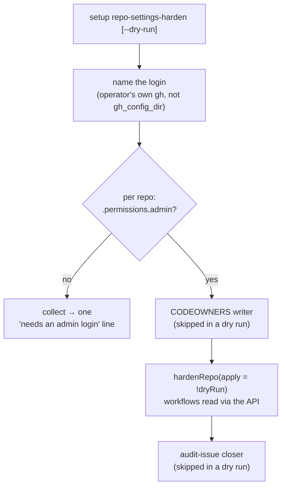

# PR Summary — Issue #2685

## Summary

Setup's `repo-settings-harden` step could never apply. This PR fixes the four
faults the issue reports. Closes #2685.

1. **Admin identity.** The step ran as the fleet account in `gh_config_dir`
   (VibeCoderST). That account holds `write` by design, so every settings write
   got HTTP 403 and every ruleset write got HTTP 404. The step now runs as the
   `operator` identity, which is the operator's own `gh` login with no
   `GH_CONFIG_DIR`. The milestone-ruleset aligner already uses this identity
   (#595), so it is the simplest correct choice: no new config key and no host
   environment variable. The first line names the login.
   - Before touching a repository, the step checks admin once (`repos/{repo}`
     `.permissions.admin`). A repository without admin is left alone, and one
     line lists them all: "needs an admin login". No raw 403 or 404 is printed.
   - The other admin writes already use this identity: the ruleset writes in
     `branch-protection-sync` (`defaultGhExec`, no `GH_CONFIG_DIR`) and the
     milestone ruleset aligner. `branch-protection-sync` is otherwise left
     alone, because #2684 is changing it in parallel.
   - The fleet worker at runtime is unchanged. It still uses the fleet token,
     and nothing widens that token's rights.
2. **`--dry-run` is enforced.** `runRepoSettingsHardenStep` now takes a required
   `dryRun` parameter, so a caller that drops it fails to compile. In a dry run
   the step plans every repository and writes nothing: no settings, no
   CODEOWNERS file, and no audit-issue comment or close. Each line counts
   `planned` and lists the steps it `would apply`. Every other subcommand
   refuses `--dry-run` rather than ignoring it and writing for real
   (`dryRunRefusal`, `DRY_RUN_SUBCOMMANDS`).
3. **The allow-list needs no checkout.**
   `collectUsesReferences(repo, branch,
   gh)` reads the default branch through
   the contents API. It covers `.github/workflows/*.{yml,yaml}` and
   `.github/actions/**/action.{yml,yaml}`, the same set `readWorkflowFiles`
   reads from disk. The transitive composite-action resolution, the SHA-pinned
   refs and the implicit GitHub-owned actions are unchanged. A listing or file
   that cannot be read (anything but a 404) fails the allow-list step alone. An
   empty list is never written in its place. The `repo-settings-harden` command
   loses `--work-dir`.
4. **Code-owner review finds its ruleset by `ruleset_id`.** `ruleset-reviews`
   re-reads the default branch's rules and uses the ruleset its `pull_request`
   rule names, preferring the fleet's own ruleset when several rulesets carry
   one. This is the resolution `planDefaultBranchApproval` uses (#2680). GRQ's
   ruleset is named neither after the branch nor "Vibe Coder default branch", so
   the name lookup failed on GRQ and GRQ-validation.

## Evidence

The tests below were written first and failed against `main`:

- a dry run attempting any write;
- the allow-list reading a checkout;
- the code-owner step using ruleset names;
- no admin preflight;
- `dryRunRefusal` missing.

They pass with this change. Targeted runs:

- `tests/repo_settings_harden_test.ts` and
  `tests/setup_repo_settings_harden_test.ts`: 74 passed, 0 failed.
- Setup neighbours: `setup_parity_test`, `setup_ps1_test` (pwsh installed, so it
  ran), `host_workdir_guard_test`, `codeowners_sync_test`,
  `setup_repo_settings_audit_close_test`, the milestone-ruleset tests,
  `gh_spawn_test` and `orphaned_allowlist_test`: all passed.

Nothing was run against GitHub. The owner applies this by running setup while
logged in to `gh` as an admin.

## Test Plan

- `setup_repo_settings_harden_test.ts`:
  - A dry run performs no write. The `gh` stub rejects every write verb, and the
    test checks that the CODEOWNERS writer and the closer are not called.
  - The step names the login it runs as.
  - Without admin, the step says "needs an admin login" once. It prints no raw
    403 or 404, and the repositories are not read past the permission check.
  - `dryRunRefusal` refuses every writing subcommand and allows the four that
    honour a dry run.
  - The fake GitHub now serves the workflows through the contents API.
- `repo_settings_harden_test.ts`:
  - The allow-list is built from API-read workflows and a local composite
    action, with no checkout.
  - An unreadable workflow directory fails the allow-list alone.
  - Code-owner review goes to the ruleset named by `ruleset_id`, whatever that
    ruleset is called.
  - With no `pull_request` rule at apply time, the step fails without a write.
- Deleted tests: the name-based and checkout-based tests ("the branch-named
  ruleset is still used", "no matching ruleset fails naming both", "without a
  local checkout the allow-list is skipped", "a missing checkout records the
  skip", "a checkout probe fault … fails loud"). They pinned the behaviour this
  issue replaces.
