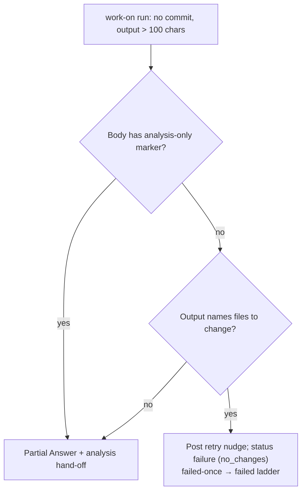

# PR Summary — Issue #2687

## Summary

When a `work-on` run describes a code change but commits nothing, Vibe Coder now
retries the issue. It no longer hands the issue off as "Analysis-only issue — no
PR deliverable". Closes #2687.

GRQ#4871 set out a fix and a RED/GREEN regression test, including the path
`test/worker/IntelligentDesignHeapClampSkip.ts`, then stopped. Because the
output was over 100 characters, the no-changes phase treated it as a Partial
Answer and escalated it with `needs-human`, so a human had to relabel it.

- **`lib/described_code_change.ts`** (new, pure) holds
  `detectDescribedCodeChange(output)`. It reports a described change when a line
  both:
  - names a file (a path with a `/`, or a backticked `name.ext`), and
  - says to change it: an imperative verb, `regression test` or
    `failing test`, or `(RED)` / `(GREEN)`.

  Negated lines ("no need to modify …"), URLs and un-fenced dotted words
  (`Node.js`) do not count. The file list is deduped and capped at 10.
- **`handle_no_changes_phase.ts`**: before the Partial Answer / analysis
  hand-off, a detected described change returns `status: "failure"`. The reason
  maps to the `no_changes` category, so the retry uses the normal failed-once →
  failed budget. The phase also posts a `## Retry: make the code change` nudge
  that names the files, which the next run's prompt carries. An issue whose body
  has the `<!-- analysis-only -->` / `<!-- no-pr -->` marker, meaning it does not
  ask for a code change, is still handed off.
- **Docs**: `docs/workflows/issue-processing.md` documents the exception, and
  the `analysis_only_handoff.ts` docstring notes it. The new module is listed in
  `docs/audits/lib-sweep-coverage.json`.

- [x] Detector module + unit tests
- [x] Retry branch in the no-changes phase + phase tests
- [x] Docs and coverage manifest
- [x] Spec and standards reviews
- [x] Quality gate

## Evidence

- `worker/deno/tests/support/grq_4871_output.ts`: a verbatim excerpt of the
  GRQ#4871 run output.
- `worker/deno/tests/described_code_change_test.ts` (12 tests):
  - the GRQ#4871 output is detected and names
    `test/worker/IntelligentDesignHeapClampSkip.ts`;
  - analysis prose, descriptive verbs, negated lines, URLs, `Node.js` and empty
    input are not detected;
  - `:line:col` suffixes are stripped;
  - unicode paths are handled;
  - the file list is deduped and capped.
- `worker/deno/tests/handle_no_changes_phase_test.ts` (3 new tests):
  - **Regression test for #2687.** The GRQ#4871 output returns failure, with
    `detectFailureCategory(reason) === "no_changes"`, the nudge posted, and no
    `needs-human`, unassign or analysis hand-off comment. On the unfixed code
    this test fails, because the phase handed the issue off.
  - A failed nudge post is still a retry.
  - The analysis-only marker still hands off.

## Acceptance Criteria

<!-- vibe-spec-review inputs="diff+issue-body" -->

- The analysis-only escalation does not fire when the output names files or
  tests to change for a code-change issue; the issue is retried instead.
  **Reviewer: partial.** reason: I departed from this verdict. The reviewer
  found no explicit "issue asks for a code change" check. In this pipeline,
  every `work-on` issue asks for a code change (a raised PR is its completion
  signal) unless its body declares otherwise with the `<!-- analysis-only -->` /
  `<!-- no-pr -->` marker (#2849). The retry is gated on the absence of that
  marker, which is exactly this condition, and a test covers the marker case.
- A test built on the GRQ#4871 run output. **Reviewer: met.**
- The retry nudge is carried into the next prompt. **Reviewer: partial.**
  reason: the nudge is an ordinary issue comment, and the existing
  `selectImplementationComments` keeps non-noise comments in the retry prompt.
  That code is outside this diff, so the reviewer could not see it; it is
  unchanged.
- `docs/audits/lib-sweep-coverage.json` entry. **Reviewer: unrequested.**
  reason: required for every new `lib/` module.
- `docs/workflows/issue-processing.md` and docstring updates. **Reviewer:
  unrequested.** reason: a code change owes a docs change.
- Extra detector and phase edge-case tests. **Reviewer: unrequested.** reason:
  the coding standards require error-path and edge-case coverage for new
  functions.

## Standards Review

<!-- vibe-standards-review inputs="diff+CODING-STANDARDS.md" -->

- **Violation: PR summary missing from the diff.** Evidence: the diff reviewed
  had no `pr-summary-2687.md`. Reason: the file was written after the review.
  This is that file, and it includes the Mermaid diagram the reviewer
  recommended.
- **Possible violation: the nudge-failure log is not redacted.** Evidence:
  `handle_no_changes_phase.ts` logs `err.message`. Reason: no change needed. The
  logger redacts every message at its sink (`lib/logger.ts`,
  `sink(redactSecrets(msg))`).
- **Clean areas:**
  - fail-loud and log levels
  - TDD and coverage (happy, error and edge paths; no source-grep tests)
  - module/test pairing
  - docs updated with the code
  - KISS (a small pure module with no new dependencies)
  - single responsibility
  - Australian English
  - secret redaction of the output before detection
  - tests independent of host state

## Test Plan

- `deno test --allow-all tests/described_code_change_test.ts
  tests/handle_no_changes_phase_test.ts tests/analysis_only_handoff_test.ts`
  passes.
- `./quality.sh` on a clean checkout of the branch head:
  - Every check passed except two tests in
    `cache_secret_redaction_1261_test.ts`. Those tests reject a shared-tmp path
    by design, and that checkout lived under `/tmp`; the file passes (7/7) from
    the real worktree.
  - The eight serial-pass tests pass (129/129).
  - The run in the primary worktree failed only because of a working-tree
    deletion of `.claude/skills/review-fleet-prs/*` that existed before this run
    and is not part of this branch.
