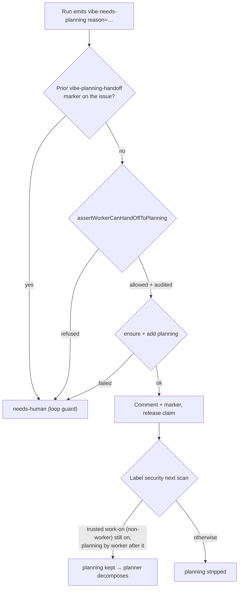

# PR Summary — Issue #2688: hand an oversized `work-on` issue to `planning`

## Summary

Closes #2688

An implementation run that finds its `work-on` issue too large for one PR can
now emit `<!-- vibe-needs-planning reason="…" -->`. The worker then applies
`planning` itself, through a narrow and audited exception, instead of stopping
at `needs-human`.

- **Request marker.** `lib/planning_handoff.ts` detects the marker; a `reason`
  is required, capped at 500 characters. It then adds `planning`, posts a
  marker-neutralised comment carrying `<!-- vibe-planning-handoff -->`, and
  releases the claim. A second request on the same issue goes to `needs-human`,
  so the hand-off cannot loop.
- **Write guard.** `assertWorkerCanHandOffToPlanning` in
  `lib/worker_label_guard.ts` permits `planning` and nothing else. It logs
  `[SECURITY] [WORKER_PLANNING_HANDOFF]` and journals the decision. The general
  guard still refuses `planning`.
- **Trust exception.** `isWorkerPlanningHandoff` in
  `lib/planning_handoff_trust.ts` trusts a worker-added `planning` only when
  every condition below holds. Label security (`verifyOperationalLabels`) and
  discovery (`labelMatchesAllowedAuthor`) share this one predicate.
  - An allowed, non-worker author added `work-on` before `planning`.
  - `work-on` has not been removed since that add.
- **Prompt and docs.** The issue prompt now tells runs how to emit the marker.
  `SECURITY.md`, `docs/THREAT-MODEL.md`, `DESIGN-PRINCIPLES.md` and the lib
  sweep ledger describe the exception.

## Evidence

- The worker hands off an oversized issue without a human. Evidence:
  `tests/handle_no_changes_planning_handoff_test.ts::handle_no_changes_phase - an oversized issue is handed off to planning`
  and
  `tests/planning_handoff_test.ts::handOffToPlanning - applies planning, comments, and releases the claim`.
- The exception is limited to the worker's own hand-off. Evidence:
  - `tests/label_security_test.ts::verifyOperationalLabels - outsider cannot trigger planning even on a trusted work-on issue (Issue #2688)`
  - `…::worker planning on an outsider's work-on is stripped (Issue #2688)`
  - `…::worker planning is stripped once work-on is no longer on the issue (Issue #2688)`
  - `…::the hand-off exception covers planning only (Issue #2688)`
  - the 12 cases in `tests/planning_handoff_trust_test.ts`
- Discovery honours the same predicate. Evidence:
  `tests/issue_query_test.ts::wasLabelAddedByAllowedAuthor trusts a worker planning hand-off / strips worker planning after work-on is removed / never trusts a worker-applied work-on (Issue #2688)`.
- `./quality.sh < /dev/null` exits 0 with "Result: PASSED (with skipped
  checks)". The only skip is config integration.

## Acceptance Criteria

<!-- vibe-spec-review inputs="diff+issue-body" -->

- **met** — an oversized `work-on` issue moves to `planning` without a human —
  evidence:
  `tests/handle_no_changes_planning_handoff_test.ts::handle_no_changes_phase - an oversized issue is handed off to planning`,
  `tests/label_security_test.ts::verifyOperationalLabels - worker planning hand-off of a trusted work-on issue is trusted (Issue #2688)`
  — reviewer: partial — reason: the reviewer flagged that the batched discovery
  timeline carries only `labeled` events, so a `work-on` removal is invisible
  there. Stripping stays authoritative in `verifyOperationalLabels`, which
  checks that `work-on` is currently on the issue. Discovery can therefore at
  worst consider an issue for one cycle before label security strips `planning`.
  Discovery still requires a trusted, non-worker `work-on` add, so an outsider
  gains nothing from this.
- **met** — the label-security tests still pass, and a new test shows the
  exception is limited to the worker's own hand-off — evidence:
  `tests/label_security_test.ts` (all pre-existing cases plus six #2688 cases),
  `tests/planning_handoff_trust_test.ts`,
  `tests/worker_label_guard_test.ts::hand-off guard refuses every other reserved label (Issue #2688)`
  — reviewer: partial — reason: the reviewer noted that trust is read from the
  timeline alone, so a worker login adding `planning` through a direct `gh` call
  would also be honoured. That is intended: the worker login is the hand-off's
  own identity. The result is identical to the marker path, it is bounded by the
  same trusted `work-on` anchor, and `label_security` logs
  `[WORKER_PLANNING_HANDOFF_TRUSTED]`. An outsider still cannot trigger
  planning.
- **unrequested** — prompt section "Too large for one PR → emit the planning
  marker" in `prompts/issue/prompt.md` — reviewer: unrequested — reason: without
  it no run would ever emit the marker, so the criterion would be unreachable.
- **unrequested** — `SECURITY.md`, `docs/THREAT-MODEL.md`,
  `DESIGN-PRINCIPLES.md`, and the security sweep record plus ledger slice —
  reviewer: unrequested — reason: required by "a code change owes a docs change"
  and by the gate's lib-sweep coverage check for the new lib files.
- **unrequested** — `journalGuardDecision` was extracted in
  `worker_label_guard.ts` — reviewer: unrequested — reason: DRY. The new guard
  journals decisions the same way the existing guard does.
- **unrequested** — a new heading entry in
  `tests/coding_guidelines_layers_2574_test.ts` — reviewer: unrequested —
  reason: that test pins the prompt's heading list, so the new prompt section
  had to be added to it.

## Standards Review

<!-- vibe-standards-review inputs="diff+CODING-STANDARDS.md" -->

- **violation** — a failed hand-off comment was only warned about, even though
  that comment carries the loop-guard marker — evidence:
  `worker/deno/lib/planning_handoff.ts:193` (as reviewed) — reason: fixed. It
  now logs at `error` level and names the missing
  `<!-- vibe-planning-handoff -->` marker. A new test covers it:
  `handOffToPlanning - a failed comment is logged as an error, the hand-off stands`.
- **violation** — the untested `ensureLabelExists` failure branch — evidence:
  `worker/deno/lib/planning_handoff.ts:171` — reason: fixed. New test:
  `handOffToPlanning - a failed label ensure reports not applied`.
- **violation** — a literal `"planning"` in the guard duplicated
  `PLANNING_HANDOFF_LABEL` — evidence: `worker/deno/lib/worker_label_guard.ts` —
  reason: fixed. The guard now imports the constant, and there is no import
  cycle.
- **violation** — the test hard-coded 500 as the reason cap — evidence:
  `worker/deno/tests/planning_handoff_test.ts:127` (as reviewed) — reason:
  fixed. The test now asserts against `MAX_PLANNING_REASON_LENGTH`.
- **compliant** — similar timeline fixtures in `label_security_test.ts` and
  `planning_handoff_trust_test.ts` — reason: left as is. The suites build
  different shapes (a REST `gh` mock versus bare timeline events), and sharing
  one helper would couple two unrelated suites.

## Test Plan

- [x] `deno task test:unit tests/planning_handoff_test.ts tests/worker_label_guard_test.ts tests/handle_no_changes_planning_handoff_test.ts tests/label_security_test.ts tests/issue_query_test.ts tests/planning_handoff_trust_test.ts < /dev/null`
      (179 passed, 0 failed)
- [x] `deno fmt`, `deno lint` and `deno check` on the touched files
- [x] `./quality.sh < /dev/null`, which exits 0
