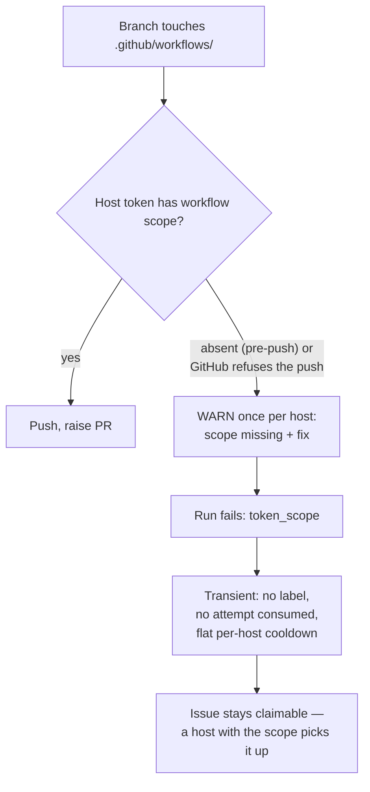

# PR Summary — Issue #2689

## Summary

A push that fails because the host's token lacks the `workflow` OAuth scope is
now treated as a gap in that host, not a fault in the issue. The issue is
released with no `failed-once`, no `failed` and no `needs-human`, so a host
whose token has the scope can claim it. Closes #2689.

GRQ#4939 changed `.github/workflows/quality.yml`. The claiming host's token
could not push that file, so the issue went through the failure ladder and was
parked for a human, even though another host in the fleet could have pushed it.

- **`lib/coding_failure_ladder.ts`**: `token-scope` joins
  `TRANSIENT_FAILURE_CLASSES` as a third group, "host capability". A transient
  failure consumes no attempt, never reaches `handleIssueFailure`, and gets the
  flat per-host cooldown.
- **`lib/label_failure.ts`**: `handleIssueFailure` returns early for
  `token_scope` without adding any label, just as it does for
  `scheduled_release`. This covers any other path into the ladder.
- **`lib/workflow_scope.ts`**: `createMissingScopeWarner()` returns a warner
  that logs, once, a WARNING naming the missing scope and the fix.
  `warnMissingWorkflowScopeOnce` is the process-wide instance.
- **`lib/issue_worker_wiring.ts`**: the warner is injected through
  `InfrastructureDeps.warnMissingWorkflowScope`. Mock deps get a fresh warner
  each time, so no test depends on module state.
- **`lib/phases/completion_phase.ts`**: both scope-refusal sites call the
  warner. These are the pre-push check (scope recorded `absent`) and GitHub's
  own push refusal. Each refusal is still logged at INFO with its reason, and
  the run still returns failure.
- **Docs**: `docs/USAGE.md` and `docs/SETUP.md` now describe the release. They
  replace the old failure path with "Release, no label — a capable host claims
  it".

- [x] `token-scope` classified transient
- [x] Label-free early return in `handleIssueFailure`
- [x] Injected warn-once WARNING at both refusal sites
- [x] Regression tests and completion-phase tests
- [x] Docs (`USAGE.md`, `SETUP.md`)
- [x] Spec and standards reviews
- [x] Quality gate

## Evidence

- `worker/deno/tests/token_scope_release_2689_test.ts` (6 tests). Each uses
  both the pre-push reason and GitHub's own refusal wording:
  - `classifyCodingFailure` returns `token-scope`, transient, with no
    `cooldownKind`.
  - `planCodingFailure` never applies the ladder.
  - `applyCodingFailureLadder` never calls `handleIssueFailure`.
  - **Regression test for #2689.** `handleIssueFailure` adds no label, not even
    for an issue that already carries `failed-once`. On the unfixed code this
    test fails, because the issue was marked `failed` and `needs-human` was
    added.
  - Control test: an ordinary quality failure still enters the ladder.
  - `createMissingScopeWarner` warns once, names the scope, the release and the
    fix, and each fresh warner has its own latch.
- `worker/deno/tests/completion_phase_workflow_refusal_1952_test.ts`:
  - A push refusal logs exactly one scope WARNING.
  - A second pre-push refusal on the same warner (the same host) logs none.

## Acceptance Criteria

<!-- vibe-spec-review inputs="diff+issue-body" -->

- A `token-scope` refusal releases the issue with no `failed-once`, no `failed`
  and no `needs-human`. **Reviewer: met.**
- The host logs the scope it lacks once, as a WARNING. **Reviewer: met.**
- Tests for both. **Reviewer: met.**
- Ideally, skip claiming workflow-touching issues on a host whose token lacks
  the scope. **Reviewer: met.** reason: this is already done by
  `issueLooksLikeWorkflowWork` in the claim scan (#1475,
  `new_work_eligibility.ts`). That code is outside the diff and unchanged; this
  PR covers the cases that check misses.
- `docs/USAGE.md` and `docs/SETUP.md` updates. **Reviewer: unrequested.**
  reason: a code change owes a docs change, and both documents described the
  old failure path.
- The per-refusal `logger.error` became a one-time WARN plus an INFO for each
  refusal. **Reviewer: unrequested.** reason: AC2 asks for one WARNING per
  host. The INFO line keeps every refusal visible in the log, so none passes
  silently.
- Control test for the ordinary ladder. **Reviewer: unrequested.** reason: it
  proves the early return is limited to `token_scope`.

## Standards Review

<!-- vibe-standards-review inputs="diff+CODING-STANDARDS.md" -->

- **Violation: tests depended on a module-level warn-once latch.** Evidence:
  the first commit reset a module flag between tests, which is not safe when
  tests run in parallel. Fixed: the latch is now per instance
  (`createMissingScopeWarner()`) and injected through `InfrastructureDeps`, so
  each test owns its own.
- **Violation: a stale label in the `docs/SETUP.md` Mermaid flow.** Fixed: the
  node now reads `Fail the run — token_scope` and leads to the release node.
- **Partial: fail loud.** Evidence: after the first refusal, the WARNING stops
  repeating. Fixed: each refusal still logs its reason at INFO and returns
  failure.
- **Partial: the tests inspect gh arguments.** Evidence: `addedLabels` looks
  for `--add-label` in the recorded `gh` calls. Reason: no change needed. That
  inspection sits alongside assertions on the result fields
  (`markedAsFailedOnce`, `markedAsFailed`). The `gh` calls are the observable
  side effect, not source text.
- **Partial: PR summary missing.** Reason: the file was written after the
  review; this is that file.
- **Known limit:** if no host in the fleet has the scope, the issue keeps
  cycling on the flat cooldown and never escalates. The once-per-host WARNING,
  with the fix, is what makes that visible to an operator.
- **Clean areas:**
  - Australian English
  - KISS and DRY (one set entry, one early-return condition, one small
    factory)
  - no over-engineering
  - real-code tests with happy, error and edge cases
  - log levels
  - no wall-clock thresholds
  - regression test present

## Test Plan

- `deno task test:unit tests/token_scope_release_2689_test.ts
  tests/completion_phase_workflow_refusal_1952_test.ts
  tests/completion_phase_workflow_scope_1475_test.ts` passes (12/12).
- `deno check` and `deno lint` pass on the touched files.
- `./quality.sh` was run on a clean checkout of the branch head. It ran there
  because the primary worktree has pre-existing, unrelated deletions under
  `.claude/skills/review-fleet-prs/`.
