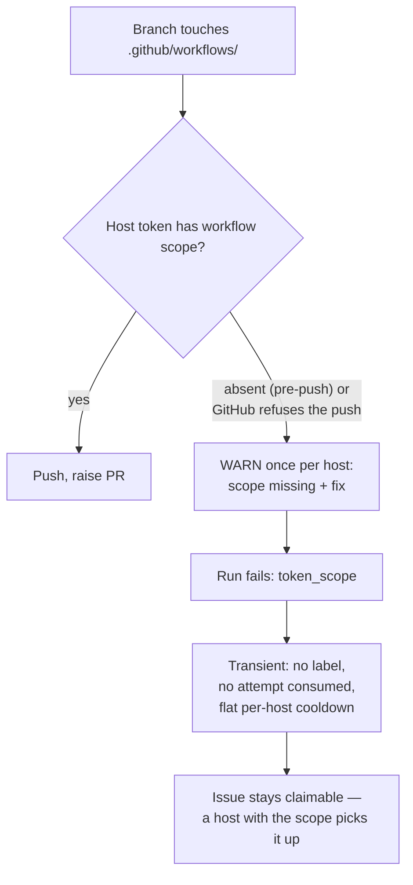

# PR Summary — Issue #2689

## Summary

A push that fails because the host's token lacks the `workflow` OAuth scope is
now treated as a gap in that host, not a fault in the issue. The issue is
released with no `failed-once`, no `failed` and no `needs-human`, so a host
whose token has the scope can claim it. Closes #2689.

GRQ#4939 changed `.github/workflows/quality.yml`. The claiming host's token
could not push that file, so the issue went through the failure ladder and was
parked for a human, even though another host in the fleet could have pushed it.

- **`lib/coding_failure_ladder.ts`**: `token-scope` joins
  `TRANSIENT_FAILURE_CLASSES` as a third group, "host capability". A transient
  failure consumes no attempt, never reaches `handleIssueFailure`, and gets the
  flat per-host cooldown.
- **`lib/label_failure.ts`**: `handleIssueFailure` returns early for
  `token_scope` without adding any label, just as it does for
  `scheduled_release`. This covers any other path into the ladder.
- **`lib/workflow_scope.ts`**: `createMissingScopeWarner()` returns a warner
  that logs, once, a WARNING naming the missing scope and the fix.
  `warnMissingWorkflowScopeOnce` is the process-wide instance.
- **`lib/issue_worker_wiring.ts`**: the warner is injected through
  `InfrastructureDeps.warnMissingWorkflowScope`. Mock deps get a fresh warner
  each time, so no test depends on module state.
- **`lib/phases/completion_phase.ts`**: both scope-refusal sites call the
  warner. These are the pre-push check (scope recorded `absent`) and GitHub's
  own push refusal. Each refusal is still logged at INFO with its reason, and
  the run still returns failure.
- **Docs**: `docs/USAGE.md` and `docs/SETUP.md` now describe the release. They
  replace the old failure path with "Release, no label — a capable host claims
  it".

- [x] `token-scope` classified transient
- [x] Label-free early return in `handleIssueFailure`
- [x] Injected warn-once WARNING at both refusal sites
- [x] Regression tests and completion-phase tests
- [x] Docs (`USAGE.md`, `SETUP.md`)
- [x] Spec and standards reviews
- [x] Quality gate

## Evidence

- `worker/deno/tests/token_scope_release_2689_test.ts` (6 tests). Each uses
  both the pre-push reason and GitHub's own refusal wording:
  - `classifyCodingFailure` returns `token-scope`, transient, with no
    `cooldownKind`.
  - `planCodingFailure` never applies the ladder.
  - `applyCodingFailureLadder` never calls `handleIssueFailure`.
  - **Regression test for #2689.** `handleIssueFailure` adds no label, not even
    for an issue that already carries `failed-once`. On the unfixed code this
    test fails, because the issue was marked `failed` and `needs-human` was
    added.
  - Control test: an ordinary quality failure still enters the ladder.
  - `createMissingScopeWarner` warns once, names the scope, the release and the
    fix, and each fresh warner has its own latch.
- `worker/deno/tests/completion_phase_workflow_refusal_1952_test.ts`:
  - A push refusal logs exactly one scope WARNING.
  - A second pre-push refusal on the same warner (the same host) logs none.

## Acceptance Criteria

<!-- vibe-spec-review inputs="diff+issue-body" -->

- **met** — A `token-scope` refusal releases the issue with no `failed-once`, no `failed` and no `needs-human`, so a capable host claims it — evidence: `worker/deno/lib/coding_failure_ladder.ts:110`, `worker/deno/lib/label_failure.ts:456`, `tests/token_scope_release_2689_test.ts::handleIssueFailure - a missing workflow scope adds no failed-once, failed or needs-human label (Issue #2689)`, `tests/token_scope_release_2689_test.ts::applyCodingFailureLadder - a missing workflow scope never calls handleIssueFailure (Issue #2689)` — reviewer: met
- **met** — The host logs which scope it lacks, once, as a WARNING — evidence: `worker/deno/lib/workflow_scope.ts:227`, `worker/deno/lib/phases/completion_phase.ts:1275`, `worker/deno/lib/phases/completion_phase.ts:1307`, `tests/token_scope_release_2689_test.ts::createMissingScopeWarner - names the missing scope once per process (Issue #2689)` — reviewer: met
- **met** — Tests for both — evidence: `tests/token_scope_release_2689_test.ts` (6 tests), `tests/completion_phase_workflow_refusal_1952_test.ts::completion - GitHub's workflow-scope refusal fails once, with no rebase recovery (Issue #1952)`, `tests/completion_phase_workflow_refusal_1952_test.ts::completion - an unreadable diff falls back to the commit list, so the scope check still fires (Issue #1952)` — reviewer: met
- **met** (review follow-up) — Ideally, skip claiming workflow-touching issues on a host whose token lacks the scope — evidence: the refusing install records the issue (`worker/deno/lib/cooldown_state.ts:367`, keyed on the install uuid and scope verdict) and the claim scan skips it beside the #1475 gate (`worker/deno/lib/new_work_eligibility.ts:291`, `worker/deno/lib/collect_work_on_candidates.ts:503`); the fleet-wide bound parks it for hosts without the scope after three consecutive `token-scope` releases (`worker/deno/lib/token_scope_fleet_bound.ts:149`) — tests: `tests/token_scope_refusal_bound_2689_test.ts` (10 tests).
- **unrequested** — The per-refusal `logger.error` became `logger.info` (`worker/deno/lib/phases/completion_phase.ts:1308`) — reviewer: unrequested — reason: follows from AC2; the single WARNING carries the action and every refusal is still logged.
- **unrequested** — `docs/USAGE.md` and `docs/SETUP.md` updates — reviewer: unrequested — reason: they document this change; both described the old failure path.

## Standards Review

<!-- vibe-standards-review inputs="diff+CODING-STANDARDS.md" -->

- **violation** — Log levels: a WARNING that repeats an earlier one — evidence: `worker/deno/lib/phases/completion_phase.ts:1275` — reason: when the start-up verdict is `absent`, `run_worker.ts:474` has already warned about the missing scope, so the first pre-push refusal warns again. The reviewer rated it minor and non-blocking because each warning fires only once per process. Not changed here; the push-refusal path does need the WARNING.
- **violation** — KISS nit: `MissingScopeWarner` returns a `boolean` that only tests read — evidence: `worker/deno/lib/workflow_scope.ts:228` — reason: harmless; left as is.
- **violation** — Docs wording nit: an older `docs/SETUP.md` line says a push refusal "fails **once**", which can now be misread as the `failed-once` label — evidence: `docs/SETUP.md` (Issue #1952 bullet) — reason: the line predates this change; the reviewer's suggested rewording is optional, and it was left as is.
- **clean** — Australian English; DRY (reuses `WORKFLOWS_DIR`, `WORKFLOW_SCOPE_REMEDIATION`, the `scheduled_release` early return and `TRANSIENT_FAILURE_CLASSES`); KISS / no over-engineering; TDD with a regression test that fails on the unfixed code; tests use real code, not source text; parallel-safe injected warner via `InfrastructureDeps`; no wall-clock thresholds; fail loud (the run still returns failure); Deno/TypeScript conventions; docs updated with code. `deno fmt --check` and `deno lint` pass on the changed files.

## Test Plan

- `deno task test:unit tests/token_scope_release_2689_test.ts
  tests/completion_phase_workflow_refusal_1952_test.ts
  tests/completion_phase_workflow_scope_1475_test.ts` passes (12/12).
- `deno check` and `deno lint` pass on the touched files.
- `./quality.sh` was run on a clean checkout of the branch head. It ran there
  because the primary worktree has pre-existing, unrelated deletions under
  `.claude/skills/review-fleet-prs/`.
