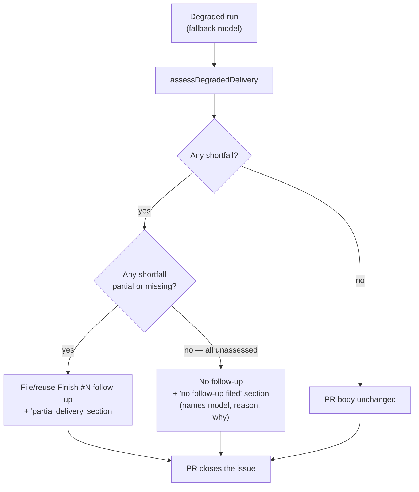

# PR Summary — Issue #2695

## Summary

A degraded run (served by a fallback model) now files a `Finish #N`
follow-up only when at least one accepted-scope shortfall is `partial` or
`missing`. When every shortfall is `unassessed`, either because the issue
states no acceptance criteria or because the PR summary assessed none of them,
nothing is filed or reused. The PR still opens with a
`Degraded run — no follow-up filed` section. That section names the served
model and reason, says why nothing was filed, and references no follow-up
number. The PR closes the issue as a non-degraded PR would.

- `degradedNeedsFollowUp(verdict)` decides whether a follow-up is filed.
- `buildDegradedNoFollowUpSection(verdict)` builds the note. It throws if
  called for a verdict that needs a follow-up or has no shortfalls.
- `completion_phase.ts` gates the follow-up on `degradedNeedsFollowUp` and
  prepends the note otherwise.

Closes #2695

- [x] Gate the follow-up on a `partial` or `missing` shortfall
- [x] Add the degraded note naming the model, the reason and why nothing was
      filed
- [x] Keep today's behaviour (with unassessed items listed alongside) when a
      partial or missing shortfall exists
- [x] Tests (a) no stated criteria, (b) stated criteria all unassessed, (c)
      one `partial` files a follow-up
- [x] Docs: module header, and the Mermaid chart and prose in
      `docs/workflows/issue-processing.md`
- [x] Spec and standards reviews, with their fixes applied

## Evidence

This is a backend-only change with no visual surface, so the evidence is
the unit and composition tests below.



- `worker/deno/tests/degraded_delivery_test.ts`, "Follow-up gating (Issue
  #2695)":
  - `degradedNeedsFollowUp` for (a), (b), (c), missing, and healthy or empty
    verdicts;
  - `buildDegradedNoFollowUpSection` for (a), (b) and a verdict with no
    reason, asserting no `#N` reference;
  - error paths that throw for partial or missing shortfalls and for empty
    shortfalls. Both fail against the unguarded code;
  - `buildDegradedPrSection` (c), which lists unassessed items alongside
    the partial one.
- `worker/deno/tests/completion_phase_degraded_delivery_test.ts` composes the
  whole completion phase:
  - (a) no stated criteria: no issue created, and the note says "the issue
    states no acceptance criteria";
  - (b) the #2543 reproduction: no issue created, the note names `haiku`
    and says "no acceptance criterion was assessed", there is no `#900`,
    the body ends with the healthy body and `#518` is kept;
  - (c) one partial and one met: one follow-up is created, the section is
    "Degraded run — partial delivery" with `#900`, and the partial item is
    listed.

```text
deno task test:unit tests/degraded_delivery_test.ts tests/completion_phase_degraded_delivery_test.ts
ok | 35 passed | 0 failed
```

`./quality.sh` passed in a clean worktree. The s1 worktree carries
unrelated, unstaged `.claude/skills/review-fleet-prs/*` deletions that are not
part of this change.

## Acceptance Criteria

<!-- vibe-spec-review inputs="diff+issue-body" -->

- **A degraded run files a follow-up only when at least one shortfall is
  `partial` or `missing`.** `completion_phase.ts` gates on
  `degradedNeedsFollowUp`. Tested in (a), (b) and (c). — reviewer: met
- **All-unassessed (the `UNSTATED_SCOPE_ITEM` case, or stated criteria not
  assessed) creates or reuses no `Finish #N`.** The composition tests
  (a) and (b) assert zero issue creates. — reviewer: met
- **The PR still starts with a degraded section naming the served model
  and reason and why nothing was filed, using one of the two exact
  phrasings.** `buildDegradedNoFollowUpSection`. Tested in (a) and (b),
  including `haiku` in the reason. — reviewer: met
- **The section references no follow-up number, and the PR closes the issue
  as a non-degraded PR would.** Tests assert that there is no `#\d` or
  `#900`, and that the body ends with the healthy body. — reviewer: met
- **When a partial or missing shortfall exists, behaviour stays as today,
  with unassessed items listed alongside.** Tested by the composition
  test (c) and `buildDegradedPrSection` (c). — reviewer: met
- **Tests cover (a), (b) and (c).** See Evidence. — reviewer: met
- **The #2543 composition test was rewritten, not removed.** It asserted
  a `#900` follow-up for an all-unassessed run, which contradicts the new
  rule. It now asserts the no-follow-up note. — reviewer: unrequested,
  reason: its old assertion contradicts the accepted scope
- **`logger.warn` on the no-follow-up branch.** — reviewer: unrequested,
  reason: logging only, so an operator can see why nothing was filed
- **Docs and module-header update.** — reviewer: unrequested, reason: keeps
  the documented flow accurate (a code change owes a docs change)

`docs/RELEASE-NOTES.md` is deliberately unchanged, because it records past
releases.

## Standards Review

<!-- vibe-standards-review inputs="diff+CODING-STANDARDS.md" -->

The standards review passed with nits. All were fixed:

- `buildDegradedNoFollowUpSection` now fails loud. It throws when given a
  verdict that needs a follow-up or has no shortfalls, and error-path tests
  cover both cases.
- The rationale is no longer repeated three times. The completion-phase
  comment is now one line that points at `degradedNeedsFollowUp`.
- The "restated whole issues" wording is corrected in the lib and the doc.
- The completion fixture is renamed `SUMMARY_PARTIAL_AND_MET`, which
  matches its content.
- The changed #2543 test is documented above.

Also confirmed:

- Australian English is used throughout.
- There are no new dependencies.
- No test was removed or commented out.
- The Mermaid diagrams render.

Pre-PR security self-check:

- [x] Input validation: the new functions take an internal verdict, and the
      precondition is enforced by a throw.
- [x] Secrets: nothing is staged beyond the changed source, test and doc
      files.
- [x] Injection surface: there are no new shell, SQL, filesystem or HTTP
      calls.
- [x] Output encoding: the note interpolates the worker's own reason text
      and the criterion lines built by the existing `shortfallLines`.
- [x] Authentication and authorisation: unchanged. No new endpoints or
      privileged operations.
- [x] Error handling: nothing internal leaks. The throw is a programmer-error
      guard.
- [x] Dependencies: none added.

## Test Plan

- [x] `deno fmt`, `deno lint` and `deno check` on the changed TypeScript files
- [x] `deno task test:unit tests/degraded_delivery_test.ts tests/completion_phase_degraded_delivery_test.ts`
- [x] The new error-path tests fail without the guard
- [x] `markdownlint-cli2` on `docs/workflows/issue-processing.md`
- [x] `./quality.sh < /dev/null` in a clean worktree
