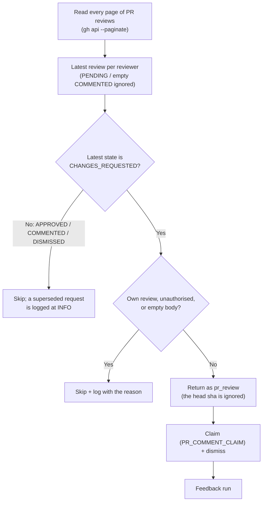

# PR Summary — Issue #2697

## Summary

Closes #2697.

PR Feedback silently dropped a `CHANGES_REQUESTED` review once the PR head
moved. Update PR Branches (Priority 1.6) and the auto-merge sweep (1.65) both
run before PR Feedback, and either one moves the head. `findPrCommentsToFix`
then skipped the review because `commit_id !== headRefOid`, so the review was
never claimed or acted on.

The scan now follows the reviewer's own rule: **each reviewer's latest review
decides**, whichever commit it was left on.

- **New `lib/pr_review_outstanding.ts`:**
  - `selectOutstandingReviews` picks the latest review per reviewer (by
    `submitted_at`, falling back to list order; logins compared
    case-insensitively).
  - It keeps a reviewer only when that latest review is `CHANGES_REQUESTED`.
    A dismissed review, or a later `APPROVED` or non-empty `COMMENTED` review,
    retires the request.
  - `PENDING` drafts and empty-bodied `COMMENTED` inline-reply containers are
    ignored.
  - `parsePrReviewPages` reads every page and throws on a malformed payload.
- **`lib/pr_maintenance.ts`:**
  - The stale-head skip is removed.
  - Reviews are read with `gh api --paginate`.
  - Each skipped change request is logged at INFO with its reason:
    superseded, the host's own review, or no body.
  - An unreadable review list now warns instead of passing silently.
- **`lib/claim_pr_comment.ts`:** dismissal is now the only thing that stops a
  review being rediscovered, so a failed claim-time dismissal is logged.

**Not done: optional item 4.** Leaving a PR alone in Update Branches and
auto-merge while a change request is outstanding is not implemented. With the
head check gone it is no longer needed for correctness, and it can be a
follow-up if wanted.

## Evidence

This is backend work, so the tests are the evidence. The related suites pass
(`pr_maintenance*`, `pr_feedback*`, `claim_pr_comment*`, `pr_comments*`,
`pr_review_outstanding`, `lib_sweep_coverage`): **340 passed, 0 failed**.

Regression tests (each fails against the old code):

- `tests/pr_maintenance_review_head_moved_test.ts`:
  - "a review on an issue branch survives a head move";
  - "a review on a milestone branch survives a merge-from-base".

## Acceptance Criteria

<!-- vibe-spec-review inputs="diff+issue-body" -->

- **partial** — Issue-branch PR, head moved A→B: the review is returned and
  claimed.
  - Evidence: `pr_maintenance_review_head_moved_test.ts` "a review on an issue
    branch survives a head move". The claim half is covered by
    `claim_pr_comment_review_test.ts` "a pr_review with no competitor is
    claimed and dismissed".
  - reviewer: partial.
  - reason: scan and claim are tested separately, not chained. The claim path
    never reads the head sha, so the separate claim test covers the moved-head
    case.
- **partial** — Milestone roll-up PR, head moved by a merge-from-base: the
  review is returned and claimed.
  - Evidence: "a review on a milestone branch survives a merge-from-base", with
    `branchName` asserted.
  - reviewer: partial.
  - reason: as above. The head move is modelled as a changed sha, which is all
    the fixed scan can observe.
- **met** — A dismissed review, or one followed by the same reviewer's
  `APPROVED`/`COMMENTED` review, is not returned.
  - Evidence: "a dismissed review is not returned"; "a later APPROVED/COMMENTED
    review supersedes…"; the unit tests in `pr_review_outstanding_test.ts`.
  - reviewer: met.
- **met** — A review already claimed by a live worker is not claimed twice.
  - Evidence: `claim_pr_comment_review_test.ts` "a sibling's earlier claim on
    the same review wins" (`claimed: false`, the rival wins).
  - reviewer: met.
- **met** — A skipped `CHANGES_REQUESTED` review is logged at INFO with the
  reason.
  - Evidence: `logReviewSkip` in `lib/pr_maintenance.ts:641`, used for the
    superseded, own-review and empty-body cases, and asserted by three tests.
  - reviewer: partial.
  - reason: the reviewer flagged two paths. The unauthorised skip keeps its
    existing `UNAUTHORISED_REVIEW_SKIPPED` security log, which is louder than
    INFO and deliberately unchanged. A dismissed review is no longer in the
    `CHANGES_REQUESTED` state, so it is not a skipped change request.
- **met** — No test pinning "commit_id ≠ head ⇒ skip" is kept.
  - Evidence: no test on `main` pinned it. The `pr_maintenance_test.ts`
    fixtures only gained `state: "CHANGES_REQUESTED"`.
  - reviewer: met.
- **missing (optional)** — Fix item 4: Update Branches and auto-merge leave a PR
  alone while a change request is outstanding.
  - reviewer: missing.
  - reason: the issue marks it optional. It is not needed once the head check
    is gone; it can be a follow-up.
- **unrequested** — `--paginate` and `parsePrReviewPages`.
  - reviewer: unrequested.
  - reason: needed for the fix. "Latest review per reviewer" is wrong if later
    reviews sit past page 1.
- **unrequested** — The unreadable review list now warns (it was a silent
  `catch {}`).
  - reviewer: unrequested.
  - reason: required by the fail-loud standard on a line this change rewrote.
- **unrequested** — A failed claim-time dismissal is now logged
  (`claim_pr_comment.ts:491`).
  - reviewer: unrequested.
  - reason: with the head check gone, dismissal is the only retirement marker,
    so a silent failure would re-queue the review.
- **unrequested** — `PENDING` and empty `COMMENTED` reviews are ignored; logins
  are compared case-insensitively; `user: null` rows are dropped.
  - reviewer: unrequested.
  - reason: needed for "latest review" to be correct. An inline reply creates
    an empty `COMMENTED` review that must not withdraw the request.
- **unrequested** — `ReviewEntry` removed from `pr_maintenance.ts`.
  - reviewer: unrequested.
  - reason: replaced by `PrReview`; it has no importers left.
- **unrequested** — Docs (`pr-feedback.md` with a Mermaid flowchart,
  `INTERNALS.md`) and the lib sweep ledger entry.
  - reviewer: unrequested.
  - reason: required by the docs-with-code rule and by the manifest
    completeness check.

## Standards Review

<!-- vibe-standards-review inputs="diff+CODING-STANDARDS.md" -->

Violations raised by the reviewer, and how each was handled:

- **Fixed** — `docs/INTERNALS.md:1933`: the "Staleness check" paragraph still
  described the removed skip. It is rewritten as "Latest review wins".
- **Fixed** — `tests/pr_maintenance_review_head_moved_test.ts`: the test
  asserted that the request contained `--paginate`. The fake now serves two
  pages with the review on page two, and the test asserts the review is found.
- **Kept, with reason** — `lib/claim_pr_comment.ts:491`: the reviewer suggested
  declining the claim when the dismissal fails.
  - A permanent dismissal failure (for example, missing permission) would then
    stop the review ever being acted on.
  - Logging on every cycle keeps the fault visible without losing the work.
  - The `PR_COMMENT_CLAIM` marker still stops concurrent double-claims.
- **Kept, with reason** — the test logger duplicates `makeRecordingLogger`.
  - That helper records every level into one list.
  - These tests must tell INFO from WARN.
- **Kept, with reason** — `PR_REVIEWS_JQ` is not exercised by the tests.
  - `gh` applies the projection. The fakes serve the projected shape, as every
    other `gh --jq` scan test in the repo does.
- **Kept, with reason** — `claim_pr_comment_review_test.ts` asserts the
  dismissal `PUT` call.
  - The dismissal is the external side effect under test, and the fake has no
    other state that records it.
- **Kept, with reason** — `lib/pr_maintenance.ts` grows by about 65 lines.
  - The selection logic moved out to the new module.
  - What remains is the scan's I/O and logging, which belongs with the scan.
- **Advisory** — one malformed row drops the whole review list for that scan.
  - This is deliberate: it logs a WARN and fails loud, rather than acting on a
    partial list, where a missed later review could wrongly leave a request
    outstanding.

Clean: Australian English; tests call real functions (no source grepping); the
regression tests fail on the unfixed code; the new module has its own unit
tests; the tests are parallel-safe; log levels are appropriate; the Result
pattern is used; KISS (standard library only, no new dependencies); the docs
are updated with Mermaid; the lib sweep ledger is updated; lint and fmt are
clean; the commits cite #2697; no secrets or hidden files are staged.

## Test Plan

- [x] `deno test` on the related suites: 340 passed, 0 failed.
- [x] `deno fmt --check`, `deno lint` and `deno check` on the touched TS files.
- [x] `deno task check:manifests`: 690 passed. It first failed because the new
      module was missing from the lib sweep ledger; registering it was fix
      cycle 1 of 3.
- [ ] Full `./quality.sh`: every stage passed except the full test stage, which
      exceeded the 900 s cap (exit 124). CI runs the full suite.
